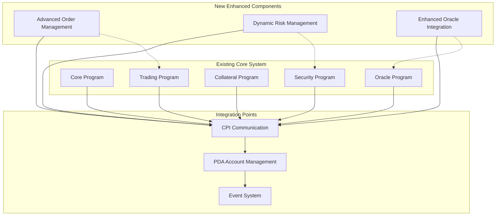

# Component Architecture

## New Components

### Advanced Order Management
**Responsibility:** Enhanced order types and execution strategies
**Integration Points:** Extends existing `order_management.rs` module

**Key Interfaces:**
- `execute_advanced_order()` - New order execution patterns
- `manage_order_lifecycle()` - Enhanced order state management

**Dependencies:**
- **Existing Components:** `Market`, `Order`, `Position` systems
- **New Components:** Enhanced security and oracle systems

**Technology Stack:** Rust/Anchor, existing instruction patterns

### Dynamic Risk Management
**Responsibility:** Adaptive risk parameters and real-time adjustments
**Integration Points:** Integrates with existing security and market systems

**Key Interfaces:**
- `calculate_dynamic_risk()` - Real-time risk assessment
- `adjust_margin_requirements()` - Dynamic margin management

**Dependencies:**
- **Existing Components:** `SecurityCircuitBreaker`, `Market`, `UserAccount`
- **New Components:** Enhanced oracle integration

**Technology Stack:** Rust/Anchor, existing security patterns

### Enhanced Oracle Integration
**Responsibility:** Multi-source price validation and emergency fallbacks
**Integration Points:** Extends existing `oracle.rs` module

**Key Interfaces:**
- `validate_multi_source_prices()` - Cross-oracle validation
- `emergency_price_fallback()` - Enhanced emergency procedures

**Dependencies:**
- **Existing Components:** `OracleStalenessProtection`, `Market`
- **New Components:** Advanced security validation

**Technology Stack:** Rust/Anchor, Pyth/Switchboard integration

## Component Interaction Diagram

---
