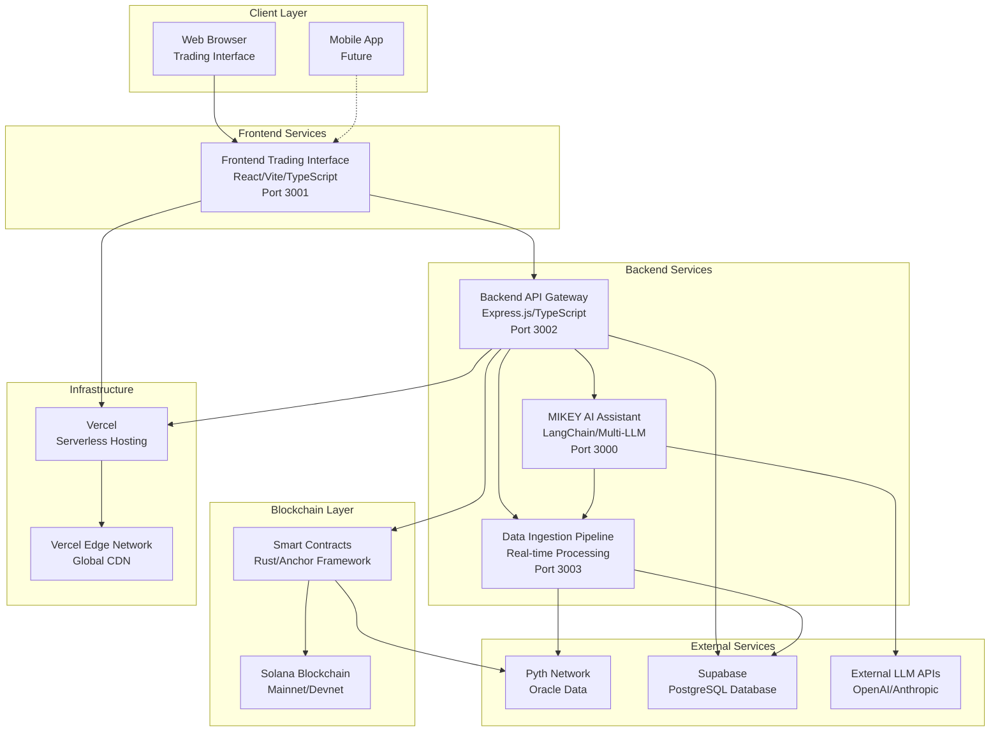
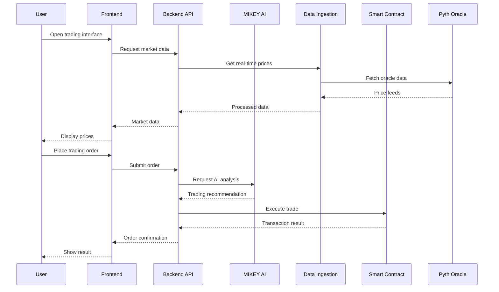

# Components

## Backend API Gateway

**Responsibility:** Central orchestration layer providing unified API access, authentication, rate limiting, and request routing to all backend services

**Key Interfaces:**
- REST API endpoints for trading operations (`/api/trading/*`)
- User authentication and authorization (`/api/auth/*`)
- Portfolio and position management (`/api/portfolio/*`)
- Market data aggregation (`/api/market/*`)
- AI analysis integration (`/api/ai/*`)

**Dependencies:** Supabase Database, MIKEY AI Service, Data Ingestion Service, Smart Contracts

**Technology Stack:** Node.js 20+, Express.js, TypeScript, Supabase client, Solana Web3.js

## Frontend Trading Interface

**Responsibility:** Professional trading terminal providing real-time market data visualization, order management, portfolio tracking, and AI-powered trading assistance

**Key Interfaces:**
- Trading dashboard with real-time price feeds
- Order placement and management interface
- Portfolio performance visualization
- MIKEY AI chat interface for trading assistance
- Risk management and position monitoring

**Dependencies:** Backend API Gateway, WebSocket connections for real-time data

**Technology Stack:** React 18, Vite, TypeScript, Tailwind CSS, WebSocket client, Chart.js/D3.js

## MIKEY AI Assistant

**Responsibility:** AI-powered trading intelligence providing market analysis, trading recommendations, risk assessment, and automated trading assistance

**Key Interfaces:**
- LangChain multi-LLM routing for analysis
- Real-time market data processing
- Trading signal generation
- User interaction via chat interface
- Integration with Backend API for order execution

**Dependencies:** Backend API Gateway, Data Ingestion Service, External LLM APIs

**Technology Stack:** LangChain, TypeScript, Node.js, Multi-LLM routing, WebSocket connections

## Data Ingestion Pipeline

**Responsibility:** Real-time market data collection, processing, and distribution from Pyth Network oracle and other external data sources

**Key Interfaces:**
- Pyth Network oracle integration
- Real-time price feed processing
- Data validation and staleness detection
- WebSocket data distribution to services
- Historical data storage and retrieval

**Dependencies:** Pyth Network, Supabase Database, Backend API Gateway

**Technology Stack:** Node.js, TypeScript, WebSocket server, Pyth SDK, Supabase client

## Smart Contract Layer

**Responsibility:** Solana blockchain program handling perpetual trading logic, position management, margin calculations, and settlement

**Key Interfaces:**
- Perpetual trading program instructions
- Position opening/closing operations
- Margin and liquidation logic
- Oracle price validation
- Cross-program invocations for token operations

**Dependencies:** Solana blockchain, Pyth Network oracle, SPL Token program

**Technology Stack:** Rust, Anchor Framework, Solana program library, Pyth integration

## Database Service Layer

**Responsibility:** Data persistence, query optimization, real-time subscriptions, and data consistency across all services

**Key Interfaces:**
- PostgreSQL database operations
- Real-time data subscriptions
- User authentication and session management
- Data backup and recovery
- Query performance optimization

**Dependencies:** Supabase Cloud, All application services

**Technology Stack:** PostgreSQL 15+, Supabase, Row Level Security, Real-time subscriptions

## Component Diagrams

**C4 Container Diagram:**

**Trading Flow Sequence Diagram:**

