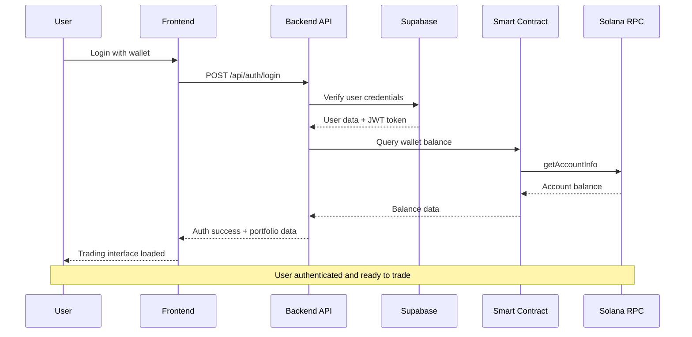
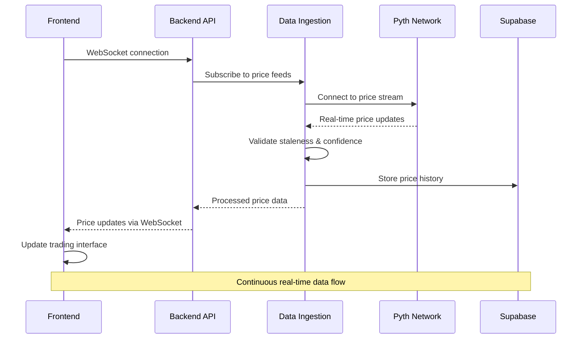
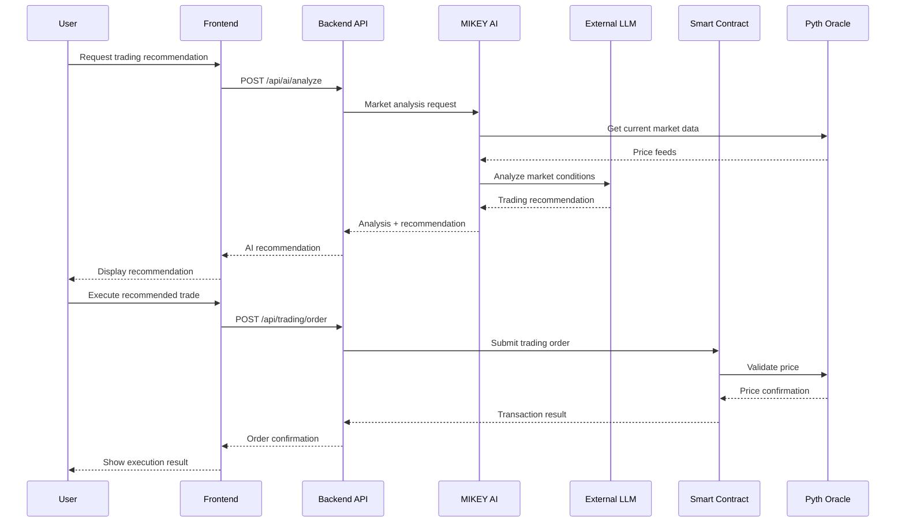
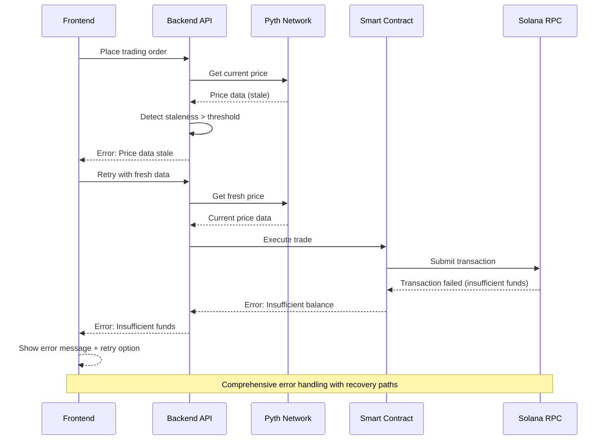
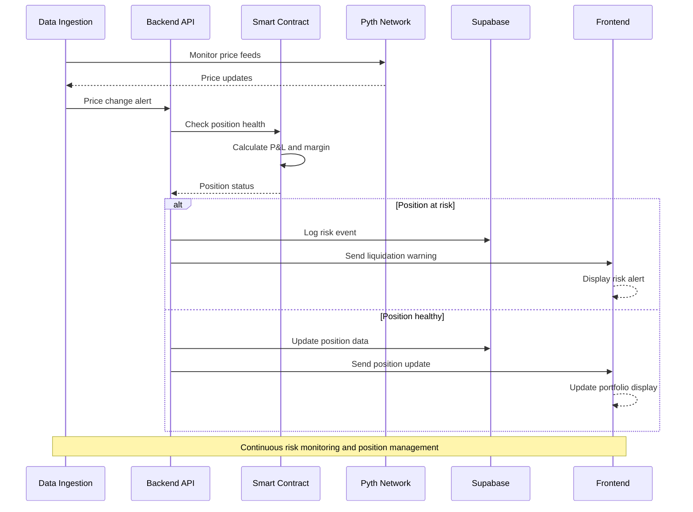

# Core Workflows

## User Authentication and Trading Session Workflow

## Real-Time Market Data Flow

## AI-Assisted Trading Order Workflow

## Error Handling and Recovery Workflow

## Position Management and Risk Monitoring

