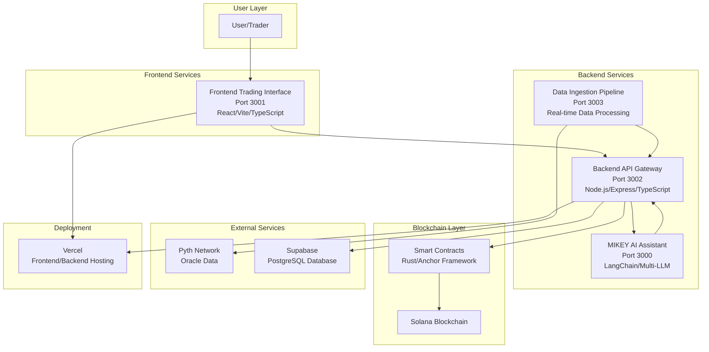

# High Level Architecture

## Technical Summary

QuantDesk employs a **multi-service microservices architecture** built on Solana blockchain infrastructure, featuring four core services orchestrated through a backend API gateway. The system leverages **event-driven communication** with real-time data ingestion, **AI-powered trading assistance** via LangChain multi-LLM routing, and **enterprise-grade security** with comprehensive monitoring. Built on **Node.js/TypeScript** backend services, **React/Vite** frontend, and **Rust/Anchor** smart contracts, the architecture supports **sub-100ms order execution** with **95/100 validated security score**, enabling institutional-quality perpetual trading capabilities.

## High Level Overview

**Architectural Style:** **Microservices with Event-Driven Communication**
- Four distinct services (Backend API Gateway, Frontend Trading Interface, MIKEY AI Assistant, Data Ingestion Pipeline)
- Service-to-service communication via REST APIs and real-time data streams
- Event-driven architecture for market data processing and AI analysis

**Repository Structure:** **Monorepo** (confirmed from project structure)
- Single repository with multiple service packages
- Shared utilities and types across services
- Centralized dependency management with pnpm workspaces

**Service Architecture:** **Distributed Microservices**
- Each service runs on dedicated ports (3000-3003)
- Backend serves as API gateway and orchestration layer
- Independent deployment and scaling capabilities

**Primary User Interaction Flow:**
1. **User** → Frontend Trading Interface (Port 3001)
2. **Frontend** → Backend API Gateway (Port 3002) 
3. **Backend** → Smart Contracts (Solana blockchain)
4. **Backend** → MIKEY AI (Port 3000) for trading assistance
5. **Data Ingestion** (Port 3003) → Real-time market data → All services

**Key Architectural Decisions:**
- **Solana-native**: Optimized for blockchain performance and low latency
- **AI-integrated**: MIKEY AI provides real-time trading intelligence
- **Security-first**: Enterprise-grade security with comprehensive audit trails
- **Real-time data**: Advanced ingestion pipeline for market data processing

## High Level Project Diagram

## Architectural and Design Patterns

**Event-Driven Architecture:** Using real-time data streams and event processing for market data - _Rationale:_ Enables responsive trading decisions and AI analysis with minimal latency

**API Gateway Pattern:** Backend service acts as single entry point for all client requests - _Rationale:_ Centralizes authentication, rate limiting, and request routing while maintaining service independence

**Repository Pattern:** Abstract data access logic through Supabase service layer - _Rationale:_ Enables testing, future database migration flexibility, and consistent data access patterns

**Microservices Architecture:** Four independent services with clear boundaries - _Rationale:_ Supports independent scaling, deployment, and technology evolution while maintaining system resilience

**Circuit Breaker Pattern:** For external API calls to Pyth Network and other services - _Rationale:_ Ensures system stability during external service failures and prevents cascade failures

**CQRS (Command Query Responsibility Segregation):** Separate read/write operations for trading data - _Rationale:_ Optimizes performance for high-frequency trading operations and enables independent scaling of read/write workloads
