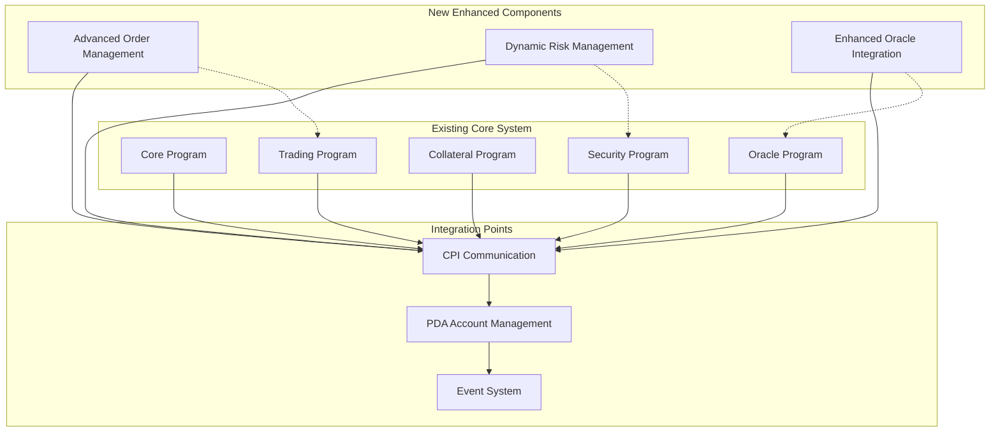

# QuantDesk Contracts Brownfield Enhancement Architecture

**Version:** 2.0  
**Date:** January 2025  
**Author:** Winston (Architect Agent)

---

## Introduction

This document outlines the architectural approach for enhancing QuantDesk's smart contracts system. Its primary goal is to serve as the guiding architectural blueprint for AI-driven development of new features while ensuring seamless integration with the existing sophisticated multi-program architecture.

**Relationship to Existing Architecture:**
This document supplements the existing QuantDesk contracts architecture by defining how new components will integrate with the current CPI-based multi-program system. Where conflicts arise between new and existing patterns, this document provides guidance on maintaining consistency while implementing enhancements.

### Existing Project Analysis

**Current Project State:**
- **Primary Purpose:** Sophisticated Solana-based perpetual DEX with multi-program architecture
- **Current Tech Stack:** Rust/Anchor Framework 0.32.1, Solana 2.1.0, CPI-based modular design
- **Architecture Style:** Multi-program CPI architecture with specialized programs (Core, Trading, Collateral, Security, Oracle)
- **Deployment Method:** Anchor-based deployment with program splitting strategy

**Available Documentation:**
- Comprehensive CPI architecture documentation
- Expert-validated security module implementation
- Detailed struct guides for all major components
- Program splitting strategy documentation
- Security circuit breaker implementation
- Cross-collateralization system design

**Identified Constraints:**
- Anchor framework limitation with embedded Cargo 1.79.0 (affecting `edition2024` features)
- Stack overflow mitigation through program splitting
- Gas optimization requirements for Solana execution
- Multi-program coordination complexity
- Security-first architecture with circuit breakers

### Change Log

| Change | Date | Version | Description | Author |
|--------|------|---------|-------------|---------|
| Initial Creation | Jan 2025 | 2.0 | Brownfield architecture for QuantDesk contracts enhancement | Winston |

---

## Enhancement Scope and Integration Strategy

### Enhancement Overview

**Enhancement Type:** Smart Contract System Enhancements
**Scope:** Modular additions to existing CPI-based multi-program architecture
**Integration Impact:** Medium - New components will integrate through existing CPI patterns and PDA structures

### Integration Approach

**Code Integration Strategy:** 
- Follow existing CPI patterns for inter-program communication
- Maintain modular instruction organization by domain (market_management, position_management, etc.)
- Extend existing state modules rather than creating parallel structures
- Preserve security-first architecture with circuit breaker integration

**Database Integration:**
- Extend existing PDA-based account structures
- Maintain compatibility with current state management patterns
- Follow established bump seed and space allocation conventions
- Preserve existing account derivation patterns

**API Integration:**
- Maintain existing Anchor instruction patterns
- Follow established error handling and validation approaches
- Preserve existing event emission patterns
- Extend current admin function patterns

**UI Integration:**
- Maintain existing instruction interfaces for frontend compatibility
- Preserve current account structure patterns for UI data binding
- Follow established event patterns for real-time updates

### Compatibility Requirements

- **Existing API Compatibility:** All new instructions must follow existing Anchor patterns and maintain backward compatibility
- **Database Schema Compatibility:** New accounts must follow existing PDA patterns and space allocation conventions
- **UI/UX Consistency:** New features must integrate seamlessly with existing frontend patterns
- **Performance Impact:** Must maintain gas optimization standards and not exceed existing compute limits

---

## Tech Stack

### Existing Technology Stack

| Category | Current Technology | Version | Usage in Enhancement | Notes |
|----------|-------------------|---------|---------------------|-------|
| **Smart Contract Framework** | Anchor | 0.32.1 | Primary framework for all enhancements | Embedded Cargo limitation noted |
| **Blockchain Platform** | Solana | 2.1.0 | Target deployment platform | Latest stable version |
| **Programming Language** | Rust | 1.90.0 | Core development language | System version available |
| **Build System** | Cargo | 1.90.0 | Dependency management | System version vs Anchor embedded |
| **Testing Framework** | Anchor Test | Latest | Unit and integration testing | Maintain existing patterns |
| **Deployment** | Anchor CLI | 0.32.1 | Program deployment | Multi-program coordination |
| **Oracle Integration** | Pyth Network | Latest | Price feed integration | Existing integration patterns |
| **Security** | Custom Circuit Breakers | Production | Multi-layer protection | Extend existing patterns |

### New Technology Additions

*No new technologies required - all enhancements will use existing stack*

---

## Data Models and Schema Changes

### New Data Models

#### Enhanced Market Configuration
**Purpose:** Extend existing market management with advanced features
**Integration:** Extends existing `Market` struct in `state/market.rs`

**Key Attributes:**
- `advanced_order_types`: `Vec<OrderType>` - Support for new order types
- `risk_parameters`: `RiskParameters` - Enhanced risk management
- `liquidity_pools`: `Vec<LiquidityPool>` - JIT liquidity integration

**Relationships:**
- **With Existing:** Extends `Market` struct, integrates with `Position` and `Order` systems
- **With New:** Connects to enhanced security and oracle systems

#### Cross-Collateral Enhancement
**Purpose:** Extend existing cross-collateral system with advanced features
**Integration:** Builds upon existing `CrossCollateralAccount` in `state/advanced.rs`

**Key Attributes:**
- `dynamic_weights`: `DynamicWeightConfig` - Adaptive collateral weights
- `risk_adjustment`: `RiskAdjustmentFactor` - Dynamic risk management
- `liquidation_buffer`: `LiquidationBuffer` - Enhanced liquidation protection

**Relationships:**
- **With Existing:** Extends `CollateralAccount` and `UserAccount` systems
- **With New:** Integrates with enhanced security and oracle systems

### Schema Integration Strategy

**Database Changes Required:**
- **New Tables:** Enhanced market configurations, advanced collateral settings
- **Modified Tables:** Extend existing `Market`, `UserAccount`, `CollateralAccount` structs
- **New Indexes:** Performance optimization for new query patterns
- **Migration Strategy:** Incremental updates preserving existing data

**Backward Compatibility:**
- All existing account structures remain unchanged
- New fields added with default values
- Existing instructions maintain full compatibility

---

## Component Architecture

### New Components

#### Advanced Order Management
**Responsibility:** Enhanced order types and execution strategies
**Integration Points:** Extends existing `order_management.rs` module

**Key Interfaces:**
- `execute_advanced_order()` - New order execution patterns
- `manage_order_lifecycle()` - Enhanced order state management

**Dependencies:**
- **Existing Components:** `Market`, `Order`, `Position` systems
- **New Components:** Enhanced security and oracle systems

**Technology Stack:** Rust/Anchor, existing instruction patterns

#### Dynamic Risk Management
**Responsibility:** Adaptive risk parameters and real-time adjustments
**Integration Points:** Integrates with existing security and market systems

**Key Interfaces:**
- `calculate_dynamic_risk()` - Real-time risk assessment
- `adjust_margin_requirements()` - Dynamic margin management

**Dependencies:**
- **Existing Components:** `SecurityCircuitBreaker`, `Market`, `UserAccount`
- **New Components:** Enhanced oracle integration

**Technology Stack:** Rust/Anchor, existing security patterns

#### Enhanced Oracle Integration
**Responsibility:** Multi-source price validation and emergency fallbacks
**Integration Points:** Extends existing `oracle.rs` module

**Key Interfaces:**
- `validate_multi_source_prices()` - Cross-oracle validation
- `emergency_price_fallback()` - Enhanced emergency procedures

**Dependencies:**
- **Existing Components:** `OracleStalenessProtection`, `Market`
- **New Components:** Advanced security validation

**Technology Stack:** Rust/Anchor, Pyth/Switchboard integration

### Component Interaction Diagram



---

## API Design and Integration

### API Integration Strategy

**API Integration Strategy:** Extend existing Anchor instruction patterns
**Authentication:** Maintain existing authority-based authentication
**Versioning:** Incremental versioning preserving backward compatibility

### New API Endpoints

#### Enhanced Market Operations
- **Method:** POST
- **Endpoint:** `enhanced_market_operations`
- **Purpose:** Advanced market configuration and management
- **Integration:** Extends existing market management instructions

**Request:**
```json
{
  "instruction": "configure_advanced_market",
  "market": "string",
  "risk_parameters": {
    "dynamic_leverage": "boolean",
    "adaptive_margins": "boolean"
  },
  "liquidity_config": {
    "jit_enabled": "boolean",
    "pool_configuration": "object"
  }
}
```

**Response:**
```json
{
  "success": "boolean",
  "market_state": "object",
  "risk_adjustments": "object",
  "events": ["array"]
}
```

#### Dynamic Risk Adjustment
- **Method:** POST
- **Endpoint:** `dynamic_risk_adjustment`
- **Purpose:** Real-time risk parameter updates
- **Integration:** Integrates with existing security systems

**Request:**
```json
{
  "instruction": "adjust_risk_parameters",
  "user_account": "string",
  "risk_factors": {
    "volatility_adjustment": "number",
    "liquidity_factor": "number"
  },
  "margin_requirements": {
    "initial_margin": "number",
    "maintenance_margin": "number"
  }
}
```

**Response:**
```json
{
  "success": "boolean",
  "updated_parameters": "object",
  "risk_assessment": "object",
  "compliance_status": "string"
}
```

---

## External API Integration

### Pyth Network Enhancement
- **Purpose:** Enhanced price feed integration with multi-source validation
- **Documentation:** https://pyth.network/
- **Base URL:** Pyth Network on-chain programs
- **Authentication:** On-chain program interaction
- **Integration Method:** Direct CPI calls with enhanced validation

**Key Endpoints Used:**
- `get_price()` - Enhanced price retrieval with staleness checks
- `validate_price()` - Cross-oracle price validation

**Error Handling:** Graceful fallback to emergency price mechanisms

### Switchboard Oracle Integration
- **Purpose:** Secondary oracle for price validation and redundancy
- **Documentation:** https://switchboard.xyz/
- **Base URL:** Switchboard on-chain programs
- **Authentication:** On-chain program interaction
- **Integration Method:** CPI integration with existing oracle system

**Key Endpoints Used:**
- `get_aggregated_price()` - Aggregated price from multiple sources
- `validate_price_deviation()` - Cross-oracle deviation checking

**Error Handling:** Integration with existing circuit breaker system

---

## Source Tree

### Existing Project Structure
```
contracts/
├── programs/
│   └── quantdesk-perp-dex/
│       ├── src/
│       │   ├── instructions/
│       │   │   ├── market_management.rs
│       │   │   ├── position_management.rs
│       │   │   ├── order_management.rs
│       │   │   ├── collateral_management.rs
│       │   │   ├── security_management.rs
│       │   │   └── ...
│       │   ├── state/
│       │   │   ├── market.rs
│       │   │   ├── position.rs
│       │   │   ├── order.rs
│       │   │   ├── user_account.rs
│       │   │   └── ...
│       │   ├── security.rs
│       │   ├── oracle.rs
│       │   └── lib.rs
│       └── Cargo.toml
├── tests/
├── Anchor.toml
└── Cargo.toml
```

### New File Organization
```
contracts/
├── programs/
│   └── quantdesk-perp-dex/
│       ├── src/
│       │   ├── instructions/
│       │   │   ├── market_management.rs       # Existing file
│       │   │   ├── position_management.rs     # Existing file
│       │   │   ├── order_management.rs         # Existing file
│       │   │   ├── collateral_management.rs   # Existing file
│       │   │   ├── security_management.rs      # Existing file
│       │   │   ├── enhanced_orders.rs          # New: Advanced order types
│       │   │   ├── dynamic_risk.rs             # New: Dynamic risk management
│       │   │   └── oracle_enhancement.rs       # New: Enhanced oracle integration
│       │   ├── state/
│       │   │   ├── market.rs                   # Existing file
│       │   │   ├── position.rs                 # Existing file
│       │   │   ├── order.rs                    # Existing file
│       │   │   ├── user_account.rs             # Existing file
│       │   │   ├── enhanced_market.rs          # New: Enhanced market state
│       │   │   ├── dynamic_risk.rs             # New: Dynamic risk state
│       │   │   └── oracle_config.rs            # New: Oracle configuration
│       │   ├── security.rs                     # Existing file
│       │   ├── oracle.rs                       # Existing file
│       │   ├── enhanced_security.rs            # New: Enhanced security features
│       │   └── lib.rs                          # Existing file (updated)
│       └── Cargo.toml                          # Existing file
├── tests/
│   ├── enhanced_orders_test.ts                 # New: Advanced order testing
│   ├── dynamic_risk_test.ts                    # New: Risk management testing
│   └── oracle_enhancement_test.ts              # New: Oracle testing
├── Anchor.toml                                 # Existing file
└── Cargo.toml                                  # Existing file
```

### Integration Guidelines

- **File Naming:** Follow existing snake_case convention for Rust files
- **Folder Organization:** Maintain existing modular structure by domain
- **Import/Export Patterns:** Follow existing Anchor module patterns and re-exports

---

## Infrastructure and Deployment Integration

### Existing Infrastructure

**Current Deployment:** Anchor-based deployment with multi-program coordination
**Infrastructure Tools:** Anchor CLI, Solana CLI, Cargo build system
**Environments:** Localnet, Devnet, Testnet with consistent program IDs

### Enhancement Deployment Strategy

**Deployment Approach:** Incremental deployment preserving existing functionality
**Infrastructure Changes:** Minimal - uses existing Anchor deployment pipeline
**Pipeline Integration:** Extends existing build and test processes

### Rollback Strategy

**Rollback Method:** Anchor program upgrade with previous version restoration
**Risk Mitigation:** Comprehensive testing on devnet before mainnet deployment
**Monitoring:** Enhanced logging and event monitoring for new features

---

## Coding Standards

### Existing Standards Compliance

**Code Style:** Rust standard formatting with Anchor conventions
**Linting Rules:** Standard Rust clippy with Anchor-specific rules
**Testing Patterns:** Anchor test framework with comprehensive coverage
**Documentation Style:** Rust doc comments with Anchor instruction documentation

### Enhancement-Specific Standards

- **CPI Integration:** Follow existing CPI patterns for inter-program communication
- **PDA Management:** Maintain existing PDA derivation and management patterns
- **Security Integration:** Extend existing security patterns rather than replacing them
- **Gas Optimization:** Maintain existing gas efficiency standards

### Critical Integration Rules

- **Existing API Compatibility:** All new instructions must maintain backward compatibility
- **Database Integration:** New accounts must follow existing PDA patterns
- **Error Handling:** Extend existing error handling patterns and codes
- **Logging Consistency:** Follow existing event emission and logging patterns

---

## Testing Strategy

### Integration with Existing Tests

**Existing Test Framework:** Anchor test framework with TypeScript integration
**Test Organization:** Domain-based test organization matching instruction modules
**Coverage Requirements:** Comprehensive coverage of all instruction paths

### New Testing Requirements

#### Unit Tests for New Components
- **Framework:** Anchor test framework
- **Location:** `tests/` directory with domain-specific test files
- **Coverage Target:** 100% instruction coverage for new features
- **Integration with Existing:** Extends existing test patterns and utilities

#### Integration Tests
- **Scope:** Cross-program CPI communication testing
- **Existing System Verification:** Comprehensive regression testing
- **New Feature Testing:** End-to-end testing of enhanced features

#### Regression Tests
- **Existing Feature Verification:** Automated testing of all existing functionality
- **Automated Regression Suite:** Continuous integration testing
- **Manual Testing Requirements:** User acceptance testing for enhanced features

---

## Security Integration

### Existing Security Measures

**Authentication:** Authority-based authentication with PDA validation
**Authorization:** Role-based access control with keeper authorization
**Data Protection:** PDA-based account isolation with secure state management
**Security Tools:** Multi-layer circuit breaker system with oracle staleness protection

### Enhancement Security Requirements

**New Security Measures:** Enhanced oracle validation, dynamic risk monitoring
**Integration Points:** Seamless integration with existing circuit breaker system
**Compliance Requirements:** Maintain existing security standards and add enhanced monitoring

### Security Testing

**Existing Security Tests:** Comprehensive security test suite in `security_tests.rs`
**New Security Test Requirements:** Enhanced oracle testing, dynamic risk validation
**Penetration Testing:** Enhanced security validation for new features

---

## Checklist Results Report

*Architect checklist execution would be performed here, focusing on brownfield-specific validation*

---

## Next Steps

### Story Manager Handoff

**Reference:** This architecture document provides the foundation for QuantDesk contracts enhancement
**Key Integration Requirements:** 
- Maintain CPI-based multi-program architecture
- Preserve existing security-first design patterns
- Follow established PDA and state management conventions
- Integrate with existing circuit breaker and oracle systems

**First Story Implementation:** Begin with enhanced order management system, ensuring seamless integration with existing `order_management.rs` module and maintaining full backward compatibility.

**Integration Checkpoints:**
- Verify CPI communication patterns work correctly
- Validate PDA account creation and management
- Test security integration with existing circuit breakers
- Confirm oracle integration maintains existing patterns

### Developer Handoff

**Reference:** This architecture document and existing coding standards from QuantDesk contracts analysis
**Integration Requirements:** 
- Follow existing Anchor instruction patterns and module organization
- Maintain existing error handling and validation approaches
- Preserve existing event emission and logging patterns
- Extend existing security patterns rather than replacing them

**Key Technical Decisions:** 
- Use existing CPI patterns for inter-program communication
- Extend existing state modules rather than creating parallel systems
- Maintain gas optimization standards established in existing codebase
- Follow existing PDA derivation and management patterns

**Existing System Compatibility:** 
- All new instructions must maintain backward compatibility
- New accounts must follow existing PDA patterns and space allocation
- Enhanced features must integrate with existing security and oracle systems
- Performance must not exceed existing compute limits

**Implementation Sequencing:** 
1. Enhanced order management (extends existing order system)
2. Dynamic risk management (integrates with existing security)
3. Enhanced oracle integration (extends existing oracle system)
4. Comprehensive testing and validation

**Risk Mitigation:** 
- Incremental development with continuous testing
- Comprehensive devnet testing before mainnet deployment
- Rollback procedures using Anchor program upgrade mechanisms
- Enhanced monitoring and logging for new features

---

*This brownfield architecture document provides a comprehensive blueprint for enhancing the QuantDesk contracts system while maintaining the sophisticated multi-program CPI architecture and security-first design patterns that make the system production-ready.*