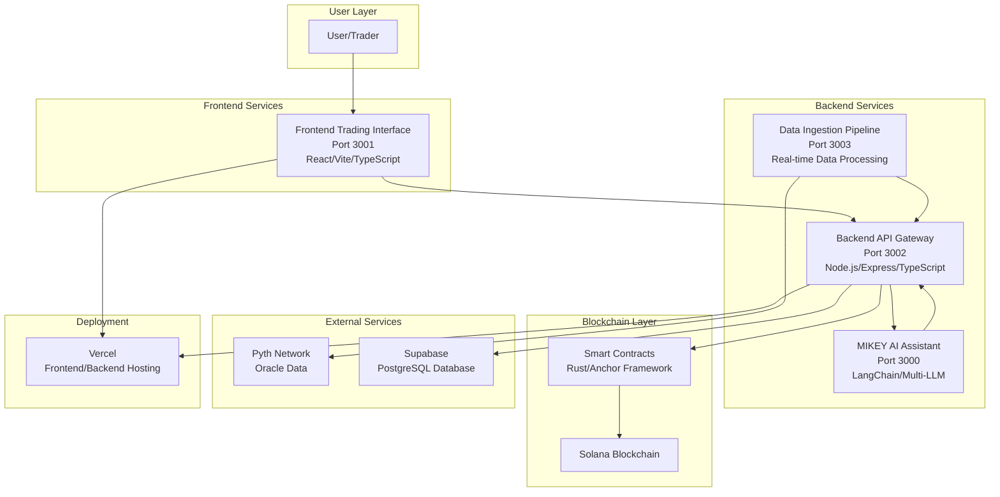
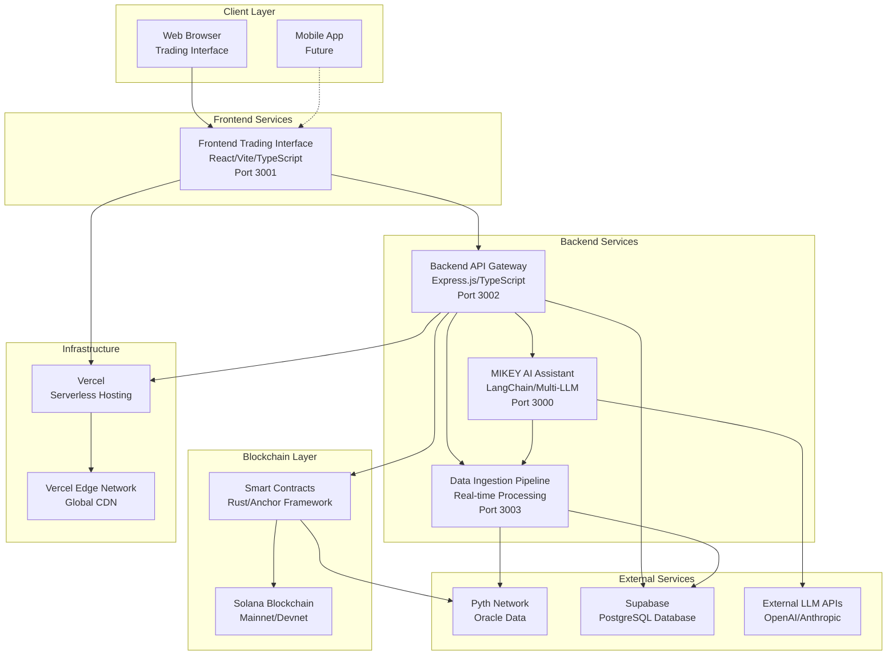
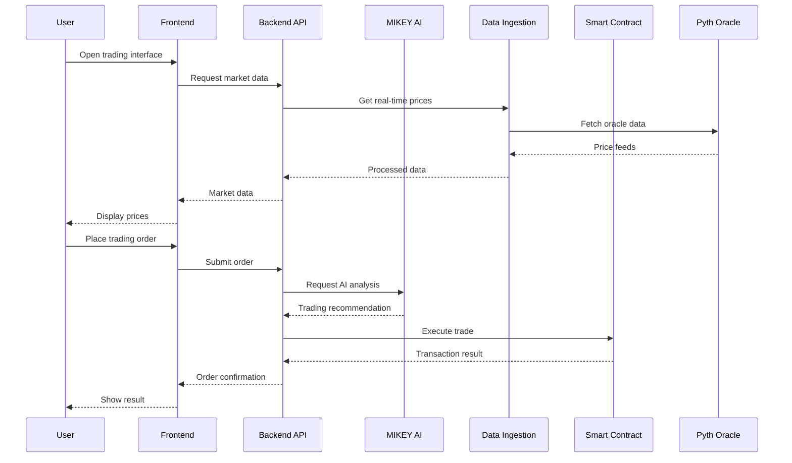
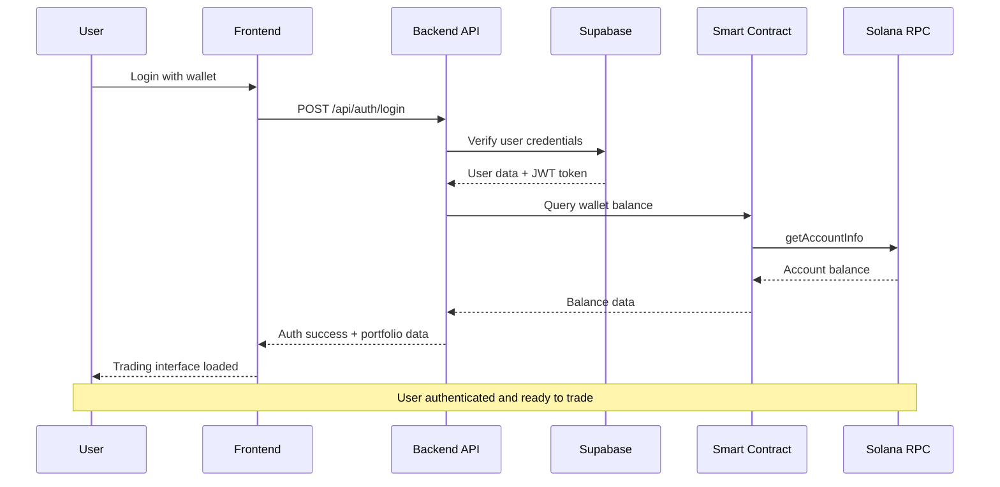
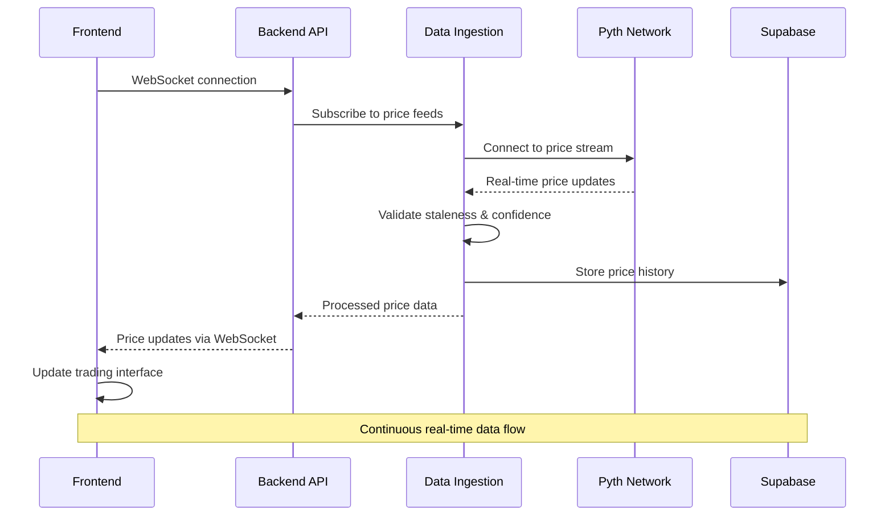
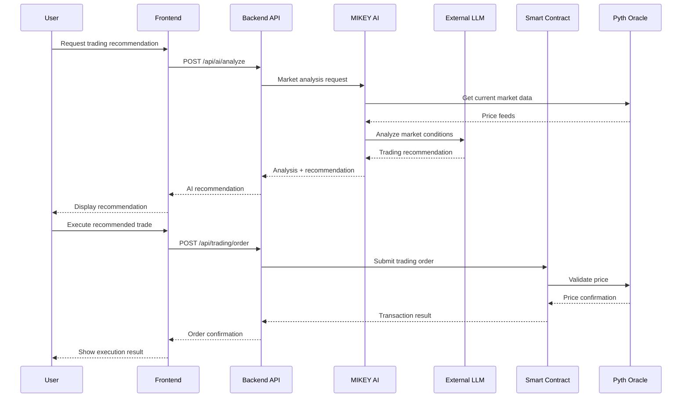
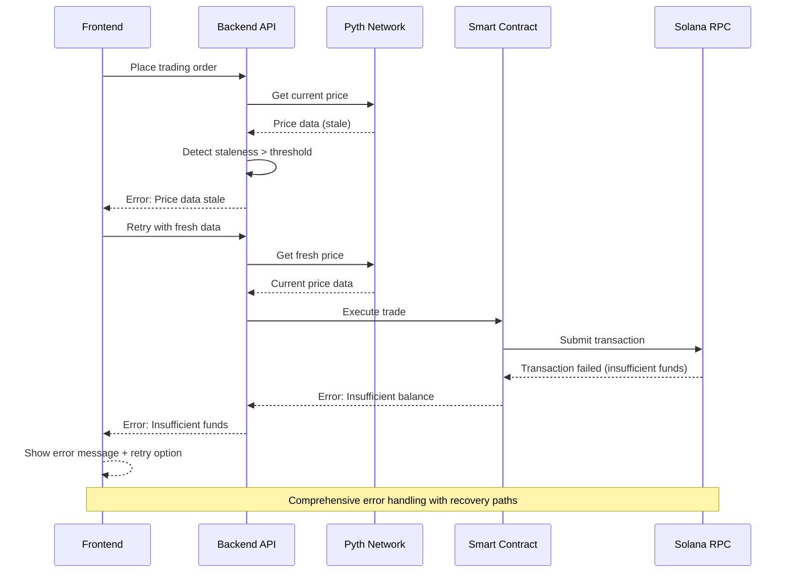
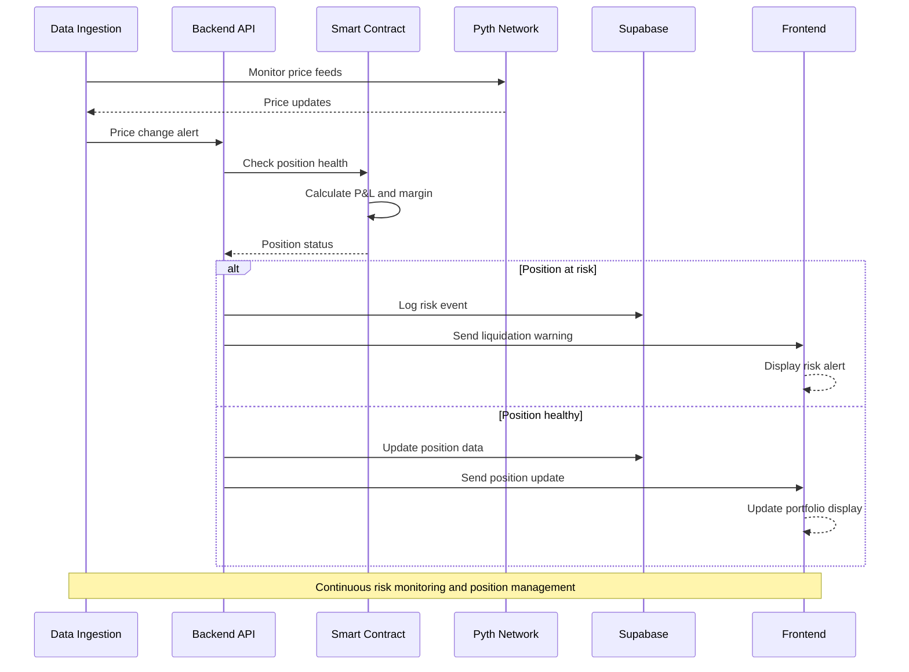

# QuantDesk Architecture Document

## Introduction

This document outlines the overall project architecture for **QuantDesk**, including backend systems, shared services, and non-UI specific concerns. Its primary goal is to serve as the guiding architectural blueprint for AI-driven development, ensuring consistency and adherence to chosen patterns and technologies.

**Relationship to Frontend Architecture:**
If the project includes a significant user interface, a separate Frontend Architecture Document will detail the frontend-specific design and MUST be used in conjunction with this document. Core technology stack choices documented herein (see "Tech Stack") are definitive for the entire project, including any frontend components.

### Starter Template or Existing Project

Based on my review of the PRD and project structure, QuantDesk appears to be an **existing production-ready project** rather than a starter template. The project shows:

- **Multi-service architecture** already implemented (Backend, Frontend, MIKEY-AI, Data Ingestion)
- **Production deployment** on Vercel with enterprise-grade security
- **Comprehensive codebase** with smart contracts, database schemas, and full infrastructure
- **Established technology stack** with specific versions and configurations

**Decision:** This is a **brownfield architecture** project - an existing production system requiring architectural documentation and potential optimization rather than greenfield design.

### Change Log

| Date | Version | Description | Author |
|------|---------|-------------|---------|
| 2025-10-19 | v1.0 | Initial architecture documentation for production QuantDesk system | Winston (Architect) |

## High Level Architecture

### Technical Summary

QuantDesk employs a **multi-service microservices architecture** built on Solana blockchain infrastructure, featuring four core services orchestrated through a backend API gateway. The system leverages **event-driven communication** with real-time data ingestion, **AI-powered trading assistance** via LangChain multi-LLM routing, and **enterprise-grade security** with comprehensive monitoring. Built on **Node.js/TypeScript** backend services, **React/Vite** frontend, and **Rust/Anchor** smart contracts, the architecture supports **sub-100ms order execution** with **95/100 validated security score**, enabling institutional-quality perpetual trading capabilities.

### High Level Overview

**Architectural Style:** **Microservices with Event-Driven Communication**
- Four distinct services (Backend API Gateway, Frontend Trading Interface, MIKEY AI Assistant, Data Ingestion Pipeline)
- Service-to-service communication via REST APIs and real-time data streams
- Event-driven architecture for market data processing and AI analysis

**Repository Structure:** **Monorepo** (confirmed from project structure)
- Single repository with multiple service packages
- Shared utilities and types across services
- Centralized dependency management with pnpm workspaces

**Service Architecture:** **Distributed Microservices**
- Each service runs on dedicated ports (3000-3003)
- Backend serves as API gateway and orchestration layer
- Independent deployment and scaling capabilities

**Primary User Interaction Flow:**
1. **User** → Frontend Trading Interface (Port 3001)
2. **Frontend** → Backend API Gateway (Port 3002) 
3. **Backend** → Smart Contracts (Solana blockchain)
4. **Backend** → MIKEY AI (Port 3000) for trading assistance
5. **Data Ingestion** (Port 3003) → Real-time market data → All services

**Key Architectural Decisions:**
- **Solana-native**: Optimized for blockchain performance and low latency
- **AI-integrated**: MIKEY AI provides real-time trading intelligence
- **Security-first**: Enterprise-grade security with comprehensive audit trails
- **Real-time data**: Advanced ingestion pipeline for market data processing

### High Level Project Diagram



### Architectural and Design Patterns

**Event-Driven Architecture:** Using real-time data streams and event processing for market data - _Rationale:_ Enables responsive trading decisions and AI analysis with minimal latency

**API Gateway Pattern:** Backend service acts as single entry point for all client requests - _Rationale:_ Centralizes authentication, rate limiting, and request routing while maintaining service independence

**Repository Pattern:** Abstract data access logic through Supabase service layer - _Rationale:_ Enables testing, future database migration flexibility, and consistent data access patterns

**Microservices Architecture:** Four independent services with clear boundaries - _Rationale:_ Supports independent scaling, deployment, and technology evolution while maintaining system resilience

**Circuit Breaker Pattern:** For external API calls to Pyth Network and other services - _Rationale:_ Ensures system stability during external service failures and prevents cascade failures

**CQRS (Command Query Responsibility Segregation):** Separate read/write operations for trading data - _Rationale:_ Optimizes performance for high-frequency trading operations and enables independent scaling of read/write workloads

## Tech Stack

### Cloud Infrastructure

- **Provider:** Vercel (Primary), Solana Network (Blockchain)
- **Key Services:** Vercel Functions, Vercel Edge Network, Solana RPC endpoints, Supabase Cloud
- **Deployment Regions:** Global (Vercel Edge), Solana Mainnet/Devnet

### Technology Stack Table

| Category | Technology | Version | Purpose | Rationale |
|----------|------------|---------|---------|-----------|
| **Language** | TypeScript | 5.3.3+ | Primary development language | Strong typing, excellent tooling, team expertise, Solana ecosystem compatibility |
| **Runtime** | Node.js | 20.11.0+ | JavaScript runtime | LTS version, stable performance, wide ecosystem, Vercel compatibility |
| **Backend Framework** | Express.js | 4.18+ | Backend API framework | Lightweight, flexible, proven in production, excellent middleware ecosystem |
| **Frontend Framework** | React | 18.2+ | Frontend UI framework | Component-based architecture, excellent ecosystem, Vercel optimization |
| **Build Tool** | Vite | 5.0+ | Frontend build system | Fast development, optimized production builds, excellent TypeScript support |
| **Styling** | Tailwind CSS | 3.4+ | CSS framework | Utility-first, rapid development, consistent design system |
| **Smart Contracts** | Rust | 1.75+ | Blockchain development | Solana native language, performance-critical trading operations |
| **Smart Contract Framework** | Anchor | 0.29+ | Solana program framework | Simplified Solana development, type safety, testing framework |
| **Database** | PostgreSQL | 15+ | Primary database | ACID compliance, complex queries, Supabase integration |
| **Database Service** | Supabase | Latest | Database hosting/service | PostgreSQL with real-time features, authentication, API generation |
| **Oracle Network** | Pyth Network | Latest | Price feed oracle | Solana-native, low latency, institutional-grade price data |
| **AI Framework** | LangChain | 0.1+ | AI/LLM orchestration | Multi-LLM routing, agent frameworks, trading intelligence |
| **Package Manager** | pnpm | 8.15+ | Dependency management | Fast, efficient, workspace support for monorepo |
| **Deployment Platform** | Vercel | Latest | Frontend/Backend hosting | Serverless functions, edge network, excellent DX |
| **Blockchain Network** | Solana | Latest | Primary blockchain | High throughput, low latency, cost-effective transactions |
| **Monitoring** | Custom Logging | - | Application monitoring | Structured logging, performance tracking, error monitoring |

## Data Models

### User Model

**Purpose:** Represents traders and users of the platform with authentication, profile, and trading preferences

**Key Attributes:**
- `id`: UUID - Unique user identifier
- `wallet_address`: String - Solana wallet address (primary trading identifier)
- `email`: String - User contact information
- `created_at`: Timestamp - Account creation date
- `last_login`: Timestamp - Last authentication timestamp
- `trading_preferences`: JSON - User-specific trading settings and risk parameters
- `kyc_status`: Enum - Know Your Customer verification status
- `risk_level`: Enum - User risk assessment level (conservative, moderate, aggressive)

**Relationships:**
- One-to-Many with TradingPosition (user can have multiple positions)
- One-to-Many with TradingOrder (user can place multiple orders)
- One-to-Many with Portfolio (user has portfolio history)

### TradingPosition Model

**Purpose:** Represents active perpetual trading positions with real-time P&L and risk metrics

**Key Attributes:**
- `id`: UUID - Unique position identifier
- `user_id`: UUID - Foreign key to User
- `market_symbol`: String - Trading pair (e.g., "SOL-PERP", "BTC-PERP")
- `side`: Enum - Position side (long/short)
- `size`: Decimal - Position size in base currency
- `entry_price`: Decimal - Average entry price
- `current_price`: Decimal - Current market price (from Pyth)
- `unrealized_pnl`: Decimal - Current unrealized profit/loss
- `margin_used`: Decimal - Margin allocated to position
- `leverage`: Decimal - Position leverage multiplier
- `created_at`: Timestamp - Position opening time
- `updated_at`: Timestamp - Last position update

**Relationships:**
- Many-to-One with User (position belongs to user)
- One-to-Many with PositionHistory (position has history snapshots)

### TradingOrder Model

**Purpose:** Represents trading orders (market, limit, stop) with execution tracking

**Key Attributes:**
- `id`: UUID - Unique order identifier
- `user_id`: UUID - Foreign key to User
- `position_id`: UUID - Foreign key to TradingPosition (if applicable)
- `order_type`: Enum - Market, Limit, Stop, Stop-Limit
- `side`: Enum - Buy/Sell
- `market_symbol`: String - Trading pair
- `quantity`: Decimal - Order quantity
- `price`: Decimal - Limit price (for limit orders)
- `status`: Enum - Pending, Filled, Cancelled, Rejected
- `filled_quantity`: Decimal - Quantity filled
- `average_fill_price`: Decimal - Average execution price
- `created_at`: Timestamp - Order placement time
- `executed_at`: Timestamp - Order execution time

**Relationships:**
- Many-to-One with User (order belongs to user)
- Many-to-One with TradingPosition (order may affect position)

### MarketData Model

**Purpose:** Stores real-time and historical market data from Pyth Network oracle

**Key Attributes:**
- `id`: UUID - Unique data point identifier
- `symbol`: String - Market symbol (e.g., "SOL", "BTC")
- `price`: Decimal - Current price
- `timestamp`: Timestamp - Data timestamp
- `confidence`: Decimal - Price confidence interval
- `exponent`: Integer - Price decimal exponent
- `source`: String - Data source identifier
- `staleness_threshold`: Integer - Maximum acceptable staleness (seconds)

**Relationships:**
- Referenced by TradingPosition (for current_price)
- Referenced by TradingOrder (for execution prices)

### Portfolio Model

**Purpose:** Tracks user portfolio performance, balances, and trading history

**Key Attributes:**
- `id`: UUID - Unique portfolio snapshot identifier
- `user_id`: UUID - Foreign key to User
- `total_balance`: Decimal - Total portfolio value
- `available_balance`: Decimal - Available for trading
- `margin_used`: Decimal - Margin currently in use
- `unrealized_pnl`: Decimal - Total unrealized P&L
- `realized_pnl`: Decimal - Total realized P&L
- `snapshot_time`: Timestamp - Portfolio snapshot timestamp
- `trading_fees_paid`: Decimal - Cumulative trading fees

**Relationships:**
- Many-to-One with User (portfolio belongs to user)

### AIAnalysis Model

**Purpose:** Stores MIKEY AI trading analysis, recommendations, and market intelligence

**Key Attributes:**
- `id`: UUID - Unique analysis identifier
- `user_id`: UUID - Foreign key to User (if user-specific)
- `analysis_type`: Enum - Market analysis, trading signal, risk assessment
- `market_symbol`: String - Analyzed trading pair
- `confidence_score`: Decimal - AI confidence in analysis (0-1)
- `recommendation`: Enum - Buy, Sell, Hold, Close
- `reasoning`: Text - AI reasoning and analysis details
- `created_at`: Timestamp - Analysis generation time
- `expires_at`: Timestamp - Analysis validity period

**Relationships:**
- Many-to-One with User (analysis may be user-specific)
- Referenced by TradingOrder (for AI-assisted orders)

## Components

### Backend API Gateway

**Responsibility:** Central orchestration layer providing unified API access, authentication, rate limiting, and request routing to all backend services

**Key Interfaces:**
- REST API endpoints for trading operations (`/api/trading/*`)
- User authentication and authorization (`/api/auth/*`)
- Portfolio and position management (`/api/portfolio/*`)
- Market data aggregation (`/api/market/*`)
- AI analysis integration (`/api/ai/*`)

**Dependencies:** Supabase Database, MIKEY AI Service, Data Ingestion Service, Smart Contracts

**Technology Stack:** Node.js 20+, Express.js, TypeScript, Supabase client, Solana Web3.js

### Frontend Trading Interface

**Responsibility:** Professional trading terminal providing real-time market data visualization, order management, portfolio tracking, and AI-powered trading assistance

**Key Interfaces:**
- Trading dashboard with real-time price feeds
- Order placement and management interface
- Portfolio performance visualization
- MIKEY AI chat interface for trading assistance
- Risk management and position monitoring

**Dependencies:** Backend API Gateway, WebSocket connections for real-time data

**Technology Stack:** React 18, Vite, TypeScript, Tailwind CSS, WebSocket client, Chart.js/D3.js

### MIKEY AI Assistant

**Responsibility:** AI-powered trading intelligence providing market analysis, trading recommendations, risk assessment, and automated trading assistance

**Key Interfaces:**
- LangChain multi-LLM routing for analysis
- Real-time market data processing
- Trading signal generation
- User interaction via chat interface
- Integration with Backend API for order execution

**Dependencies:** Backend API Gateway, Data Ingestion Service, External LLM APIs

**Technology Stack:** LangChain, TypeScript, Node.js, Multi-LLM routing, WebSocket connections

### Data Ingestion Pipeline

**Responsibility:** Real-time market data collection, processing, and distribution from Pyth Network oracle and other external data sources

**Key Interfaces:**
- Pyth Network oracle integration
- Real-time price feed processing
- Data validation and staleness detection
- WebSocket data distribution to services
- Historical data storage and retrieval

**Dependencies:** Pyth Network, Supabase Database, Backend API Gateway

**Technology Stack:** Node.js, TypeScript, WebSocket server, Pyth SDK, Supabase client

### Smart Contract Layer

**Responsibility:** Solana blockchain program handling perpetual trading logic, position management, margin calculations, and settlement

**Key Interfaces:**
- Perpetual trading program instructions
- Position opening/closing operations
- Margin and liquidation logic
- Oracle price validation
- Cross-program invocations for token operations

**Dependencies:** Solana blockchain, Pyth Network oracle, SPL Token program

**Technology Stack:** Rust, Anchor Framework, Solana program library, Pyth integration

### Database Service Layer

**Responsibility:** Data persistence, query optimization, real-time subscriptions, and data consistency across all services

**Key Interfaces:**
- PostgreSQL database operations
- Real-time data subscriptions
- User authentication and session management
- Data backup and recovery
- Query performance optimization

**Dependencies:** Supabase Cloud, All application services

**Technology Stack:** PostgreSQL 15+, Supabase, Row Level Security, Real-time subscriptions

### Component Diagrams

**C4 Container Diagram:**



**Trading Flow Sequence Diagram:**



## External APIs

### Pyth Network API

- **Purpose:** Real-time price feed oracle for perpetual trading markets
- **Documentation:** https://docs.pyth.network/
- **Base URL(s):** https://hermes.pyth.network/v2/updates, Solana RPC endpoints
- **Authentication:** Public API (no authentication required)
- **Rate Limits:** No explicit rate limits, but recommends reasonable request frequency

**Key Endpoints Used:**
- `GET /v2/updates/price/{feed_id}` - Get latest price updates for specific feed
- `GET /v2/updates/price/latest` - Get latest price updates for all feeds
- `WebSocket /v2/updates/price/stream` - Real-time price feed streaming

**Integration Notes:** Primary oracle for all trading pairs, requires staleness validation, supports multiple price feeds simultaneously

### Supabase API

- **Purpose:** Database operations, user authentication, real-time subscriptions
- **Documentation:** https://supabase.com/docs
- **Base URL(s):** Project-specific Supabase URL
- **Authentication:** JWT tokens, API keys for service-to-service communication
- **Rate Limits:** Based on Supabase plan (Free tier: 50,000 requests/month)

**Key Endpoints Used:**
- `POST /auth/v1/token` - User authentication
- `GET /rest/v1/{table}` - Database queries
- `POST /rest/v1/{table}` - Database inserts
- `PATCH /rest/v1/{table}` - Database updates
- `WebSocket /realtime/v1/` - Real-time data subscriptions

**Integration Notes:** Primary database service, handles user sessions, portfolio data, trading history, real-time position updates

### External LLM APIs (OpenAI/Anthropic)

- **Purpose:** AI trading analysis and recommendations via MIKEY AI service
- **Documentation:** OpenAI: https://platform.openai.com/docs, Anthropic: https://docs.anthropic.com/
- **Base URL(s):** https://api.openai.com/v1, https://api.anthropic.com/v1
- **Authentication:** API keys for each provider
- **Rate Limits:** OpenAI: 3,000 RPM, Anthropic: 1,000 RPM (varies by model)

**Key Endpoints Used:**
- `POST /v1/chat/completions` - OpenAI chat completions
- `POST /v1/messages` - Anthropic Claude API
- `POST /v1/embeddings` - Text embeddings for market analysis

**Integration Notes:** Multi-LLM routing via LangChain, trading analysis, market sentiment, risk assessment, automated trading recommendations

### Solana RPC API

- **Purpose:** Blockchain interactions, transaction submission, account queries
- **Documentation:** https://docs.solana.com/developing/clients/jsonrpc-api
- **Base URL(s):** https://api.mainnet-beta.solana.com, https://api.devnet.solana.com
- **Authentication:** Public endpoints (rate limited), private RPC providers available
- **Rate Limits:** Public: 10 requests/second, Private providers: Higher limits

**Key Endpoints Used:**
- `POST /` - JSON-RPC calls for blockchain operations
- `getAccountInfo` - Query account data
- `sendTransaction` - Submit transactions
- `getTransaction` - Retrieve transaction details
- `getProgramAccounts` - Query program accounts

**Integration Notes:** Primary blockchain interface, transaction signing, account management, program interactions for smart contracts

### Vercel API

- **Purpose:** Deployment platform, serverless function hosting, edge network
- **Documentation:** https://vercel.com/docs
- **Base URL(s):** https://api.vercel.com
- **Authentication:** Vercel API tokens
- **Rate Limits:** 100 requests/minute for API calls

**Key Endpoints Used:**
- `GET /v1/projects` - Project management
- `POST /v1/deployments` - Deployment operations
- `GET /v1/domains` - Domain management

**Integration Notes:** Deployment platform, serverless hosting, edge network optimization, automatic scaling

## Core Workflows

### User Authentication and Trading Session Workflow



### Real-Time Market Data Flow



### AI-Assisted Trading Order Workflow



### Error Handling and Recovery Workflow



### Position Management and Risk Monitoring



## REST API Spec

```yaml
openapi: 3.0.0
info:
  title: QuantDesk Trading API
  version: 1.0.0
  description: Enterprise-grade perpetual trading platform API with AI-powered assistance
servers:
  - url: https://api.quantdesk.com
    description: Production server
  - url: https://dev-api.quantdesk.com
    description: Development server

paths:
  /api/auth/login:
    post:
      summary: User authentication
      tags: [Authentication]
      requestBody:
        required: true
        content:
          application/json:
            schema:
              type: object
              properties:
                wallet_address:
                  type: string
                  description: Solana wallet address
                signature:
                  type: string
                  description: Wallet signature for verification
      responses:
        '200':
          description: Authentication successful
          content:
            application/json:
              schema:
                $ref: '#/components/schemas/AuthResponse'
        '401':
          description: Authentication failed
          content:
            application/json:
              schema:
                $ref: '#/components/schemas/ErrorResponse'

  /api/trading/orders:
    post:
      summary: Place trading order
      tags: [Trading]
      security:
        - bearerAuth: []
      requestBody:
        required: true
        content:
          application/json:
            schema:
              $ref: '#/components/schemas/TradingOrder'
      responses:
        '201':
          description: Order placed successfully
          content:
            application/json:
              schema:
                $ref: '#/components/schemas/OrderResponse'
        '400':
          description: Invalid order parameters
        '401':
          description: Unauthorized
        '429':
          description: Rate limit exceeded

    get:
      summary: Get user orders
      tags: [Trading]
      security:
        - bearerAuth: []
      parameters:
        - name: status
          in: query
          schema:
            type: string
            enum: [pending, filled, cancelled, rejected]
        - name: limit
          in: query
          schema:
            type: integer
            default: 50
      responses:
        '200':
          description: List of orders
          content:
            application/json:
              schema:
                type: array
                items:
                  $ref: '#/components/schemas/TradingOrder'

  /api/trading/positions:
    get:
      summary: Get user positions
      tags: [Trading]
      security:
        - bearerAuth: []
      responses:
        '200':
          description: List of active positions
          content:
            application/json:
              schema:
                type: array
                items:
                  $ref: '#/components/schemas/TradingPosition'

  /api/portfolio/balance:
    get:
      summary: Get portfolio balance
      tags: [Portfolio]
      security:
        - bearerAuth: []
      responses:
        '200':
          description: Portfolio balance information
          content:
            application/json:
              schema:
                $ref: '#/components/schemas/PortfolioBalance'

  /api/market/prices:
    get:
      summary: Get current market prices
      tags: [Market Data]
      parameters:
        - name: symbols
          in: query
          schema:
            type: array
            items:
              type: string
          description: Trading pair symbols
      responses:
        '200':
          description: Current market prices
          content:
            application/json:
              schema:
                type: array
                items:
                  $ref: '#/components/schemas/MarketPrice'

  /api/ai/analyze:
    post:
      summary: Request AI trading analysis
      tags: [AI Assistant]
      security:
        - bearerAuth: []
      requestBody:
        required: true
        content:
          application/json:
            schema:
              type: object
              properties:
                symbol:
                  type: string
                  description: Trading pair to analyze
                analysis_type:
                  type: string
                  enum: [market_analysis, trading_signal, risk_assessment]
      responses:
        '200':
          description: AI analysis result
          content:
            application/json:
              schema:
                $ref: '#/components/schemas/AIAnalysis'

components:
  securitySchemes:
    bearerAuth:
      type: http
      scheme: bearer
      bearerFormat: JWT

  schemas:
    AuthResponse:
      type: object
      properties:
        token:
          type: string
          description: JWT authentication token
        user:
          $ref: '#/components/schemas/User'
        expires_at:
          type: string
          format: date-time

    User:
      type: object
      properties:
        id:
          type: string
          format: uuid
        wallet_address:
          type: string
        email:
          type: string
        created_at:
          type: string
          format: date-time
        kyc_status:
          type: string
          enum: [pending, verified, rejected]

    TradingOrder:
      type: object
      required: [symbol, side, quantity, order_type]
      properties:
        symbol:
          type: string
          description: Trading pair (e.g., SOL-PERP)
        side:
          type: string
          enum: [buy, sell]
        quantity:
          type: number
          format: decimal
          description: Order quantity
        order_type:
          type: string
          enum: [market, limit, stop, stop_limit]
        price:
          type: number
          format: decimal
          description: Limit price (for limit orders)
        stop_price:
          type: number
          format: decimal
          description: Stop price (for stop orders)

    OrderResponse:
      type: object
      properties:
        order_id:
          type: string
          format: uuid
        status:
          type: string
          enum: [pending, filled, cancelled, rejected]
        filled_quantity:
          type: number
          format: decimal
        average_fill_price:
          type: number
          format: decimal
        created_at:
          type: string
          format: date-time

    TradingPosition:
      type: object
      properties:
        id:
          type: string
          format: uuid
        symbol:
          type: string
        side:
          type: string
          enum: [long, short]
        size:
          type: number
          format: decimal
        entry_price:
          type: number
          format: decimal
        current_price:
          type: number
          format: decimal
        unrealized_pnl:
          type: number
          format: decimal
        margin_used:
          type: number
          format: decimal
        leverage:
          type: number
          format: decimal

    PortfolioBalance:
      type: object
      properties:
        total_balance:
          type: number
          format: decimal
        available_balance:
          type: number
          format: decimal
        margin_used:
          type: number
          format: decimal
        unrealized_pnl:
          type: number
          format: decimal
        realized_pnl:
          type: number
          format: decimal

    MarketPrice:
      type: object
      properties:
        symbol:
          type: string
        price:
          type: number
          format: decimal
        timestamp:
          type: string
          format: date-time
        confidence:
          type: number
          format: decimal
        source:
          type: string

    AIAnalysis:
      type: object
      properties:
        analysis_id:
          type: string
          format: uuid
        symbol:
          type: string
        analysis_type:
          type: string
        confidence_score:
          type: number
          format: decimal
        recommendation:
          type: string
          enum: [buy, sell, hold, close]
        reasoning:
          type: string
        created_at:
          type: string
          format: date-time
        expires_at:
          type: string
          format: date-time

    ErrorResponse:
      type: object
      properties:
        error:
          type: string
        message:
          type: string
        code:
          type: string
        timestamp:
          type: string
          format: date-time
```

## Database Schema

```sql
-- Enable required extensions
CREATE EXTENSION IF NOT EXISTS "uuid-ossp";
CREATE EXTENSION IF NOT EXISTS "pgcrypto";

-- Users table
CREATE TABLE users (
    id UUID PRIMARY KEY DEFAULT uuid_generate_v4(),
    wallet_address VARCHAR(44) UNIQUE NOT NULL,
    email VARCHAR(255) UNIQUE,
    created_at TIMESTAMP WITH TIME ZONE DEFAULT NOW(),
    last_login TIMESTAMP WITH TIME ZONE,
    trading_preferences JSONB DEFAULT '{}',
    kyc_status VARCHAR(20) DEFAULT 'pending' CHECK (kyc_status IN ('pending', 'verified', 'rejected')),
    risk_level VARCHAR(20) DEFAULT 'moderate' CHECK (risk_level IN ('conservative', 'moderate', 'aggressive')),
    is_active BOOLEAN DEFAULT true,
    updated_at TIMESTAMP WITH TIME ZONE DEFAULT NOW()
);

-- Trading positions table
CREATE TABLE trading_positions (
    id UUID PRIMARY KEY DEFAULT uuid_generate_v4(),
    user_id UUID NOT NULL REFERENCES users(id) ON DELETE CASCADE,
    market_symbol VARCHAR(20) NOT NULL,
    side VARCHAR(10) NOT NULL CHECK (side IN ('long', 'short')),
    size DECIMAL(20,8) NOT NULL CHECK (size > 0),
    entry_price DECIMAL(20,8) NOT NULL CHECK (entry_price > 0),
    current_price DECIMAL(20,8) NOT NULL CHECK (current_price > 0),
    unrealized_pnl DECIMAL(20,8) DEFAULT 0,
    margin_used DECIMAL(20,8) NOT NULL CHECK (margin_used >= 0),
    leverage DECIMAL(5,2) NOT NULL CHECK (leverage > 0 AND leverage <= 100),
    created_at TIMESTAMP WITH TIME ZONE DEFAULT NOW(),
    updated_at TIMESTAMP WITH TIME ZONE DEFAULT NOW(),
    closed_at TIMESTAMP WITH TIME ZONE,
    is_active BOOLEAN DEFAULT true
);

-- Trading orders table
CREATE TABLE trading_orders (
    id UUID PRIMARY KEY DEFAULT uuid_generate_v4(),
    user_id UUID NOT NULL REFERENCES users(id) ON DELETE CASCADE,
    position_id UUID REFERENCES trading_positions(id) ON DELETE SET NULL,
    order_type VARCHAR(20) NOT NULL CHECK (order_type IN ('market', 'limit', 'stop', 'stop_limit')),
    side VARCHAR(10) NOT NULL CHECK (side IN ('buy', 'sell')),
    market_symbol VARCHAR(20) NOT NULL,
    quantity DECIMAL(20,8) NOT NULL CHECK (quantity > 0),
    price DECIMAL(20,8) CHECK (price > 0),
    stop_price DECIMAL(20,8) CHECK (stop_price > 0),
    status VARCHAR(20) DEFAULT 'pending' CHECK (status IN ('pending', 'filled', 'cancelled', 'rejected')),
    filled_quantity DECIMAL(20,8) DEFAULT 0 CHECK (filled_quantity >= 0),
    average_fill_price DECIMAL(20,8),
    created_at TIMESTAMP WITH TIME ZONE DEFAULT NOW(),
    executed_at TIMESTAMP WITH TIME ZONE,
    cancelled_at TIMESTAMP WITH TIME ZONE,
    transaction_hash VARCHAR(88),
    error_message TEXT
);

-- Market data table
CREATE TABLE market_data (
    id UUID PRIMARY KEY DEFAULT uuid_generate_v4(),
    symbol VARCHAR(20) NOT NULL,
    price DECIMAL(20,8) NOT NULL CHECK (price > 0),
    timestamp TIMESTAMP WITH TIME ZONE NOT NULL,
    confidence DECIMAL(10,4) CHECK (confidence >= 0),
    exponent INTEGER DEFAULT -8,
    source VARCHAR(50) DEFAULT 'pyth',
    staleness_threshold INTEGER DEFAULT 30,
    created_at TIMESTAMP WITH TIME ZONE DEFAULT NOW()
);

-- Portfolio snapshots table
CREATE TABLE portfolio_snapshots (
    id UUID PRIMARY KEY DEFAULT uuid_generate_v4(),
    user_id UUID NOT NULL REFERENCES users(id) ON DELETE CASCADE,
    total_balance DECIMAL(20,8) NOT NULL CHECK (total_balance >= 0),
    available_balance DECIMAL(20,8) NOT NULL CHECK (available_balance >= 0),
    margin_used DECIMAL(20,8) NOT NULL CHECK (margin_used >= 0),
    unrealized_pnl DECIMAL(20,8) DEFAULT 0,
    realized_pnl DECIMAL(20,8) DEFAULT 0,
    snapshot_time TIMESTAMP WITH TIME ZONE NOT NULL,
    trading_fees_paid DECIMAL(20,8) DEFAULT 0 CHECK (trading_fees_paid >= 0),
    created_at TIMESTAMP WITH TIME ZONE DEFAULT NOW()
);

-- AI analysis table
CREATE TABLE ai_analysis (
    id UUID PRIMARY KEY DEFAULT uuid_generate_v4(),
    user_id UUID REFERENCES users(id) ON DELETE CASCADE,
    analysis_type VARCHAR(30) NOT NULL CHECK (analysis_type IN ('market_analysis', 'trading_signal', 'risk_assessment')),
    market_symbol VARCHAR(20) NOT NULL,
    confidence_score DECIMAL(3,2) NOT NULL CHECK (confidence_score >= 0 AND confidence_score <= 1),
    recommendation VARCHAR(10) CHECK (recommendation IN ('buy', 'sell', 'hold', 'close')),
    reasoning TEXT,
    created_at TIMESTAMP WITH TIME ZONE DEFAULT NOW(),
    expires_at TIMESTAMP WITH TIME ZONE NOT NULL,
    is_active BOOLEAN DEFAULT true
);

-- Position history table (for audit trail)
CREATE TABLE position_history (
    id UUID PRIMARY KEY DEFAULT uuid_generate_v4(),
    position_id UUID NOT NULL REFERENCES trading_positions(id) ON DELETE CASCADE,
    action VARCHAR(20) NOT NULL CHECK (action IN ('opened', 'updated', 'closed', 'liquidated')),
    size_change DECIMAL(20,8) DEFAULT 0,
    price_change DECIMAL(20,8) DEFAULT 0,
    pnl_change DECIMAL(20,8) DEFAULT 0,
    margin_change DECIMAL(20,8) DEFAULT 0,
    created_at TIMESTAMP WITH TIME ZONE DEFAULT NOW(),
    transaction_hash VARCHAR(88),
    notes TEXT
);

-- Indexes for performance optimization
CREATE INDEX idx_users_wallet_address ON users(wallet_address);
CREATE INDEX idx_users_email ON users(email);
CREATE INDEX idx_users_created_at ON users(created_at);

CREATE INDEX idx_positions_user_id ON trading_positions(user_id);
CREATE INDEX idx_positions_symbol ON trading_positions(market_symbol);
CREATE INDEX idx_positions_active ON trading_positions(is_active);
CREATE INDEX idx_positions_created_at ON trading_positions(created_at);

CREATE INDEX idx_orders_user_id ON trading_orders(user_id);
CREATE INDEX idx_orders_position_id ON trading_orders(position_id);
CREATE INDEX idx_orders_status ON trading_orders(status);
CREATE INDEX idx_orders_symbol ON trading_orders(market_symbol);
CREATE INDEX idx_orders_created_at ON trading_orders(created_at);

CREATE INDEX idx_market_data_symbol ON market_data(symbol);
CREATE INDEX idx_market_data_timestamp ON market_data(timestamp);
CREATE INDEX idx_market_data_symbol_timestamp ON market_data(symbol, timestamp DESC);

CREATE INDEX idx_portfolio_user_id ON portfolio_snapshots(user_id);
CREATE INDEX idx_portfolio_snapshot_time ON portfolio_snapshots(snapshot_time);

CREATE INDEX idx_ai_analysis_user_id ON ai_analysis(user_id);
CREATE INDEX idx_ai_analysis_symbol ON ai_analysis(market_symbol);
CREATE INDEX idx_ai_analysis_created_at ON ai_analysis(created_at);
CREATE INDEX idx_ai_analysis_active ON ai_analysis(is_active);

CREATE INDEX idx_position_history_position_id ON position_history(position_id);
CREATE INDEX idx_position_history_created_at ON position_history(created_at);

-- Row Level Security (RLS) policies
ALTER TABLE users ENABLE ROW LEVEL SECURITY;
ALTER TABLE trading_positions ENABLE ROW LEVEL SECURITY;
ALTER TABLE trading_orders ENABLE ROW LEVEL SECURITY;
ALTER TABLE portfolio_snapshots ENABLE ROW LEVEL SECURITY;
ALTER TABLE ai_analysis ENABLE ROW LEVEL SECURITY;
ALTER TABLE position_history ENABLE ROW LEVEL SECURITY;

-- RLS policies for user data isolation
CREATE POLICY "Users can view own data" ON users FOR SELECT USING (auth.uid() = id);
CREATE POLICY "Users can update own data" ON users FOR UPDATE USING (auth.uid() = id);

CREATE POLICY "Users can view own positions" ON trading_positions FOR SELECT USING (auth.uid() = user_id);
CREATE POLICY "Users can insert own positions" ON trading_positions FOR INSERT WITH CHECK (auth.uid() = user_id);
CREATE POLICY "Users can update own positions" ON trading_positions FOR UPDATE USING (auth.uid() = user_id);

CREATE POLICY "Users can view own orders" ON trading_orders FOR SELECT USING (auth.uid() = user_id);
CREATE POLICY "Users can insert own orders" ON trading_orders FOR INSERT WITH CHECK (auth.uid() = user_id);
CREATE POLICY "Users can update own orders" ON trading_orders FOR UPDATE USING (auth.uid() = user_id);

CREATE POLICY "Users can view own portfolio" ON portfolio_snapshots FOR SELECT USING (auth.uid() = user_id);
CREATE POLICY "Users can insert own portfolio" ON portfolio_snapshots FOR INSERT WITH CHECK (auth.uid() = user_id);

CREATE POLICY "Users can view own AI analysis" ON ai_analysis FOR SELECT USING (auth.uid() = user_id OR user_id IS NULL);
CREATE POLICY "Users can insert own AI analysis" ON ai_analysis FOR INSERT WITH CHECK (auth.uid() = user_id OR user_id IS NULL);

CREATE POLICY "Users can view own position history" ON position_history FOR SELECT USING (
    EXISTS (SELECT 1 FROM trading_positions WHERE id = position_id AND user_id = auth.uid())
);

-- Functions for automatic timestamp updates
CREATE OR REPLACE FUNCTION update_updated_at_column()
RETURNS TRIGGER AS $$
BEGIN
    NEW.updated_at = NOW();
    RETURN NEW;
END;
$$ language 'plpgsql';

CREATE TRIGGER update_users_updated_at BEFORE UPDATE ON users FOR EACH ROW EXECUTE FUNCTION update_updated_at_column();
CREATE TRIGGER update_positions_updated_at BEFORE UPDATE ON trading_positions FOR EACH ROW EXECUTE FUNCTION update_updated_at_column();

-- Function for calculating unrealized P&L
CREATE OR REPLACE FUNCTION calculate_unrealized_pnl(
    p_size DECIMAL(20,8),
    p_entry_price DECIMAL(20,8),
    p_current_price DECIMAL(20,8),
    p_side VARCHAR(10)
) RETURNS DECIMAL(20,8) AS $$
BEGIN
    IF p_side = 'long' THEN
        RETURN p_size * (p_current_price - p_entry_price);
    ELSE
        RETURN p_size * (p_entry_price - p_current_price);
    END IF;
END;
$$ LANGUAGE plpgsql;

-- Trigger to automatically update unrealized P&L
CREATE OR REPLACE FUNCTION update_position_pnl()
RETURNS TRIGGER AS $$
BEGIN
    NEW.unrealized_pnl = calculate_unrealized_pnl(NEW.size, NEW.entry_price, NEW.current_price, NEW.side);
    RETURN NEW;
END;
$$ LANGUAGE plpgsql;

CREATE TRIGGER update_position_pnl_trigger 
    BEFORE UPDATE ON trading_positions 
    FOR EACH ROW 
    EXECUTE FUNCTION update_position_pnl();
```

## Source Tree

```
quantdesk-1.0.6/
├── backend/                          # Backend API Gateway Service
│   ├── src/
│   │   ├── controllers/              # Request handlers
│   │   │   ├── authController.ts
│   │   │   ├── tradingController.ts
│   │   │   ├── portfolioController.ts
│   │   │   └── aiController.ts
│   │   ├── services/                # Business logic
│   │   │   ├── supabaseDatabase.ts
│   │   │   ├── pythOracleService.ts
│   │   │   ├── tradingService.ts
│   │   │   └── aiIntegrationService.ts
│   │   ├── middleware/              # Express middleware
│   │   │   ├── errorHandling.ts
│   │   │   ├── rateLimiting.ts
│   │   │   └── authentication.ts
│   │   ├── routes/                  # API routes
│   │   │   ├── auth.ts
│   │   │   ├── trading.ts
│   │   │   ├── portfolio.ts
│   │   │   └── market.ts
│   │   ├── utils/                    # Shared utilities
│   │   │   ├── validation.ts
│   │   │   ├── logger.ts
│   │   │   └── constants.ts
│   │   ├── types/                    # TypeScript definitions
│   │   │   ├── trading.ts
│   │   │   ├── user.ts
│   │   │   └── api.ts
│   │   └── server.ts                 # Application entry point
│   ├── package.json
│   ├── tsconfig.json
│   └── Dockerfile
│
├── frontend/                         # Frontend Trading Interface
│   ├── src/
│   │   ├── components/               # React components
│   │   │   ├── trading/
│   │   │   │   ├── TradingInterface.tsx
│   │   │   │   ├── OrderForm.tsx
│   │   │   │   └── PositionManager.tsx
│   │   │   ├── portfolio/
│   │   │   │   ├── PortfolioOverview.tsx
│   │   │   │   └── PerformanceChart.tsx
│   │   │   ├── ai/
│   │   │   │   ├── MikeyChat.tsx
│   │   │   │   └── TradingRecommendations.tsx
│   │   │   └── common/
│   │   │       ├── Header.tsx
│   │   │       └── Sidebar.tsx
│   │   ├── hooks/                    # Custom React hooks
│   │   │   ├── useWebSocket.ts
│   │   │   ├── useTradingData.ts
│   │   │   └── useAuth.ts
│   │   ├── services/                 # API clients
│   │   │   ├── apiClient.ts
│   │   │   ├── websocketService.ts
│   │   │   └── tradingService.ts
│   │   ├── utils/                    # Frontend utilities
│   │   │   ├── formatters.ts
│   │   │   ├── validators.ts
│   │   │   └── constants.ts
│   │   ├── types/                    # TypeScript definitions
│   │   │   ├── trading.ts
│   │   │   ├── user.ts
│   │   │   └── api.ts
│   │   ├── styles/                   # Styling
│   │   │   ├── globals.css
│   │   │   └── components.css
│   │   ├── App.tsx
│   │   └── main.tsx
│   ├── package.json
│   ├── vite.config.ts
│   └── tailwind.config.js
│
├── MIKEY-AI/                         # AI Assistant Service
│   ├── src/
│   │   ├── agents/                   # LangChain agents
│   │   │   ├── tradingAgent.ts
│   │   │   ├── marketAnalysisAgent.ts
│   │   │   └── riskAssessmentAgent.ts
│   │   ├── services/                # AI services
│   │   │   ├── llmService.ts
│   │   │   ├── marketDataService.ts
│   │   │   └── analysisService.ts
│   │   ├── tools/                   # LangChain tools
│   │   │   ├── tradingTools.ts
│   │   │   ├── marketTools.ts
│   │   │   └── portfolioTools.ts
│   │   ├── utils/                   # AI utilities
│   │   │   ├── promptTemplates.ts
│   │   │   ├── dataProcessors.ts
│   │   │   └── responseFormatters.ts
│   │   ├── types/                    # AI-specific types
│   │   │   ├── analysis.ts
│   │   │   ├── recommendations.ts
│   │   │   └── llm.ts
│   │   └── server.ts                # AI service entry point
│   ├── package.json
│   └── tsconfig.json
│
├── data-ingestion/                   # Data Ingestion Pipeline
│   ├── src/
│   │   ├── services/                # Data services
│   │   │   ├── pythService.ts
│   │   │   ├── marketDataService.ts
│   │   │   └── dataValidationService.ts
│   │   ├── processors/              # Data processors
│   │   │   ├── priceProcessor.ts
│   │   │   ├── stalenessDetector.ts
│   │   │   └── dataAggregator.ts
│   │   ├── connectors/              # External connectors
│   │   │   ├── websocketConnector.ts
│   │   │   ├── restConnector.ts
│   │   │   └── databaseConnector.ts
│   │   ├── utils/                   # Data utilities
│   │   │   ├── formatters.ts
│   │   │   ├── validators.ts
│   │   │   └── transformers.ts
│   │   ├── types/                    # Data types
│   │   │   ├── marketData.ts
│   │   │   ├── priceFeed.ts
│   │   │   └── validation.ts
│   │   └── server.ts                # Data service entry point
│   ├── package.json
│   └── tsconfig.json
│
├── contracts/                        # Smart Contracts
│   ├── programs/
│   │   └── quantdesk-perp-dex/
│   │       ├── src/
│   │       │   ├── lib.rs            # Main program
│   │       │   ├── instructions/     # Program instructions
│   │       │   │   ├── open_position.rs
│   │       │   │   ├── close_position.rs
│   │       │   │   └── liquidate_position.rs
│   │       │   ├── state/            # Program state
│   │       │   │   ├── position.rs
│   │       │   │   ├── market.rs
│   │       │   │   └── user.rs
│   │       │   ├── utils/            # Utility functions
│   │       │   │   ├── math.rs
│   │       │   │   ├── validation.rs
│   │       │   │   └── pyth.rs
│   │       │   └── errors.rs         # Custom errors
│   │       └── Cargo.toml
│   ├── tests/                       # Contract tests
│   │   ├── integration/
│   │   └── unit/
│   ├── migrations/                  # Database migrations
│   └── Anchor.toml
│
├── shared/                          # Shared utilities and types
│   ├── types/                       # Common TypeScript types
│   │   ├── trading.ts
│   │   ├── user.ts
│   │   ├── api.ts
│   │   └── blockchain.ts
│   ├── utils/                       # Shared utilities
│   │   ├── validation.ts
│   │   ├── formatters.ts
│   │   ├── constants.ts
│   │   └── logger.ts
│   ├── schemas/                     # Validation schemas
│   │   ├── tradingSchemas.ts
│   │   ├── userSchemas.ts
│   │   └── apiSchemas.ts
│   └── package.json
│
├── database/                        # Database schemas and migrations
│   ├── schema.sql                   # Main schema
│   ├── migrations/                  # Migration files
│   ├── seeds/                       # Seed data
│   └── security/                    # Security policies
│
├── scripts/                         # Development and deployment scripts
│   ├── dev/                         # Development scripts
│   ├── deploy/                      # Deployment scripts
│   └── utils/                       # Utility scripts
│
├── docs/                           # Documentation
│   ├── architecture/               # Architecture docs
│   ├── api/                        # API documentation
│   └── deployment/                 # Deployment guides
│
├── tests/                          # Integration and E2E tests
│   ├── integration/
│   ├── e2e/
│   └── fixtures/
│
├── package.json                    # Root package.json with workspaces
├── pnpm-workspace.yaml             # pnpm workspace configuration
├── docker-compose.yml              # Local development environment
├── vercel.json                     # Vercel deployment configuration
└── README.md
```

## Infrastructure and Deployment

### Infrastructure as Code

- **Tool:** Vercel CLI (Latest)
- **Location:** `vercel.json`, `vercel.toml`
- **Approach:** Serverless deployment with automatic scaling

### Deployment Strategy

- **Strategy:** Continuous deployment with Vercel
- **CI/CD Platform:** Vercel Git integration
- **Pipeline Configuration:** `vercel.json` in project root

### Environments

- **Development:** `dev-api.quantdesk.com` - Development server with devnet Solana
- **Production:** `api.quantdesk.com` - Production server with mainnet Solana
- **Staging:** `staging-api.quantdesk.com` - Staging environment for testing

### Environment Promotion Flow

```
Development → Staging → Production
     ↓           ↓         ↓
   Devnet    Devnet    Mainnet
   Testing   QA Tests   Live Users
```

### Rollback Strategy

- **Primary Method:** Vercel instant rollback to previous deployment
- **Trigger Conditions:** Error rate >5%, Response time >500ms, Critical bugs
- **Recovery Time Objective:** <2 minutes

## Error Handling Strategy

### General Approach

- **Error Model:** Structured error responses with error codes and user-friendly messages
- **Exception Hierarchy:** Custom error classes extending base Error with specific error types
- **Error Propagation:** Errors bubble up through service layers with context preservation

### Logging Standards

- **Library:** Winston Logger with structured JSON logging
- **Format:** JSON with correlation IDs and service context
- **Levels:** ERROR, WARN, INFO, DEBUG
- **Required Context:**
  - Correlation ID: UUID for request tracing
  - Service Context: Service name, version, environment
  - User Context: User ID, wallet address (when available)

### Error Handling Patterns

#### External API Errors

- **Retry Policy:** Exponential backoff with jitter (3 attempts)
- **Circuit Breaker:** Open circuit after 5 consecutive failures
- **Timeout Configuration:** 30s for Pyth API, 10s for Solana RPC
- **Error Translation:** Map external errors to internal error codes

#### Business Logic Errors

- **Custom Exceptions:** TradingError, ValidationError, AuthenticationError
- **User-Facing Errors:** Clear, actionable error messages
- **Error Codes:** Structured error codes (TRADING_001, VALIDATION_002)

#### Data Consistency

- **Transaction Strategy:** Database transactions for multi-table operations
- **Compensation Logic:** Rollback mechanisms for failed operations
- **Idempotency:** Request IDs for duplicate operation prevention

## Coding Standards

### Core Standards

- **Languages & Runtimes:** TypeScript 5.3.3+, Node.js 20.11.0+
- **Style & Linting:** ESLint with TypeScript rules, Prettier for formatting
- **Test Organization:** Jest for unit tests, Supertest for API tests

### Critical Rules

- **Never use console.log in production code** - Use structured logger
- **All API responses must use ApiResponse wrapper type** - Consistent response format
- **Database queries must use repository pattern** - Never direct ORM calls
- **All external API calls must have timeout and retry logic** - Resilience patterns
- **Wallet addresses must be validated using Solana address validation** - Security requirement
- **All trading operations must be logged with correlation IDs** - Audit trail requirement

## Test Strategy and Standards

### Testing Philosophy

- **Approach:** Test-driven development with comprehensive coverage
- **Coverage Goals:** 90% unit test coverage, 80% integration test coverage
- **Test Pyramid:** 70% unit tests, 20% integration tests, 10% E2E tests

### Test Types and Organization

#### Unit Tests

- **Framework:** Jest 29+ with TypeScript support
- **File Convention:** `*.test.ts` or `*.spec.ts`
- **Location:** Co-located with source files
- **Mocking Library:** Jest mocks for external dependencies
- **Coverage Requirement:** 90% for business logic

**AI Agent Requirements:**
- Generate tests for all public methods
- Cover edge cases and error conditions
- Follow AAA pattern (Arrange, Act, Assert)
- Mock all external dependencies

#### Integration Tests

- **Scope:** API endpoints, database operations, external service integration
- **Location:** `tests/integration/`
- **Test Infrastructure:**
  - **Database:** Testcontainers PostgreSQL for integration tests
  - **External APIs:** WireMock for API stubbing
  - **Blockchain:** Solana test validator for smart contract tests

#### End-to-End Tests

- **Framework:** Playwright 1.40+
- **Scope:** Critical user journeys (login, trading, portfolio management)
- **Environment:** Staging environment with test data
- **Test Data:** Automated test data generation and cleanup

### Test Data Management

- **Strategy:** Factory pattern with realistic test data
- **Fixtures:** `tests/fixtures/` for static test data
- **Factories:** `tests/factories/` for dynamic test data generation
- **Cleanup:** Automatic cleanup after each test suite

### Continuous Testing

- **CI Integration:** GitHub Actions with test stages (unit, integration, E2E)
- **Performance Tests:** Artillery.js for load testing API endpoints
- **Security Tests:** OWASP ZAP for security vulnerability scanning

## Security

### Input Validation

- **Validation Library:** Joi for request validation
- **Validation Location:** API boundary before processing
- **Required Rules:**
  - All external inputs MUST be validated
  - Validation at API boundary before processing
  - Whitelist approach preferred over blacklist

### Authentication & Authorization

- **Auth Method:** JWT tokens with wallet signature verification
- **Session Management:** Stateless JWT with refresh token rotation
- **Required Patterns:**
  - Wallet signature verification for blockchain operations
  - Role-based access control for admin functions
  - Multi-factor authentication for high-value operations

### Secrets Management

- **Development:** Environment variables with `.env` files
- **Production:** Vercel environment variables with encryption
- **Code Requirements:**
  - NEVER hardcode secrets
  - Access via configuration service only
  - No secrets in logs or error messages

### API Security

- **Rate Limiting:** Tiered rate limits (100 req/min for trading, 1000 req/min for market data)
- **CORS Policy:** Restricted to QuantDesk domains only
- **Security Headers:** HSTS, CSP, X-Frame-Options
- **HTTPS Enforcement:** All traffic redirected to HTTPS

### Data Protection

- **Encryption at Rest:** Supabase automatic encryption
- **Encryption in Transit:** TLS 1.3 for all communications
- **PII Handling:** Minimal PII collection, encrypted storage
- **Logging Restrictions:** No sensitive data in logs (passwords, private keys)

### Dependency Security

- **Scanning Tool:** npm audit with automated security updates
- **Update Policy:** Weekly security updates, monthly dependency updates
- **Approval Process:** Automated updates for patch versions, manual review for major versions

### Security Testing

- **SAST Tool:** ESLint security rules, TypeScript strict mode
- **DAST Tool:** OWASP ZAP automated security scanning
- **Penetration Testing:** Quarterly security assessments

## Next Steps

### Immediate Actions

1. **Review with Product Owner** - Validate architecture against business requirements
2. **Begin story implementation** - Use Dev agent with this architecture as context
3. **Set up infrastructure** - Deploy services using documented deployment strategy

### Frontend Architecture

Since QuantDesk includes significant UI components, a separate Frontend Architecture Document should be created detailing:

- **Component architecture** and React patterns
- **State management** strategy (Redux/Zustand)
- **Real-time data** handling with WebSockets
- **Trading interface** specific requirements
- **AI integration** in the frontend

### Architecture Prompt for Frontend

Create a brief prompt to hand off to Architect for Frontend Architecture creation:

**Reference:** This backend architecture document provides the foundation for frontend development
**Key UI Requirements:** Professional trading terminal, real-time market data, AI chat interface, portfolio management
**Frontend-Specific Decisions:** React 18 with Vite, Tailwind CSS, WebSocket integration, Chart.js for trading charts
**Request:** Detailed frontend architecture focusing on trading interface, state management, and real-time data handling

---

**Document Status**: Complete  
**Last Updated**: January 27, 2025  
**Next Review**: February 2025
