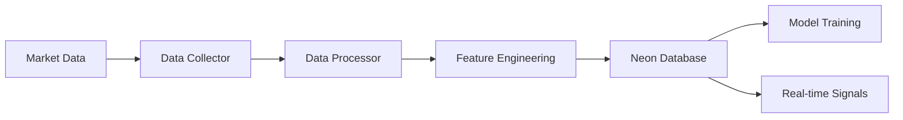

# 🔄 Neon Data Pipeline

*What is this doc?*  
This guide explains how the data pipeline collects, processes, and stores trading data using Neon PostgreSQL. It's for anyone working with data ingestion, feature engineering, or database integration.

[ML Model](ML_MODEL.md) | [Model Training](MODEL_TRAINING.md) | [Troubleshooting](TROUBLESHOOTING.md) | [Project README](../README.md)

## Overview
Our data pipeline integrates with Neon's PostgreSQL database to efficiently collect, process, and store cryptocurrency trading data. This document explains the pipeline architecture and usage.

## Table of Contents
1. [Data Flow](#data-flow)
2. [Database Schema](#database-schema)
3. [Pipeline Components](#pipeline-components)
4. [Usage Examples](#usage-examples)
5. [Performance Optimization](#performance-optimization)

## Data Flow



### Process Steps
1. **Data Collection**: Fetch OHLCV data from exchanges
2. **Processing**: Clean and normalize data
3. **Feature Engineering**: Calculate technical indicators
4. **Storage**: Store in Neon database
5. **Retrieval**: Efficient data access for training/inference

## Database Schema

### Price Data Table
```sql
CREATE TABLE price_data (
    id SERIAL PRIMARY KEY,
    symbol VARCHAR(20) NOT NULL,
    timestamp TIMESTAMP NOT NULL,
    open DECIMAL(20,8) NOT NULL,
    high DECIMAL(20,8) NOT NULL,
    low DECIMAL(20,8) NOT NULL,
    close DECIMAL(20,8) NOT NULL,
    volume DECIMAL(20,8) NOT NULL,
    UNIQUE(symbol, timestamp)
);
```

### Model Predictions Table
```sql
CREATE TABLE model_predictions (
    id SERIAL PRIMARY KEY,
    timestamp TIMESTAMP NOT NULL,
    symbol VARCHAR(20) NOT NULL,
    prediction DECIMAL(10,6) NOT NULL,
    confidence DECIMAL(5,4) NOT NULL,
    model_version VARCHAR(50) NOT NULL,
    FOREIGN KEY (symbol, timestamp) REFERENCES price_data(symbol, timestamp)
);
```

### Trading Signals Table
```sql
CREATE TABLE trading_signals (
    id SERIAL PRIMARY KEY,
    timestamp TIMESTAMP NOT NULL,
    symbol VARCHAR(20) NOT NULL,
    signal INTEGER NOT NULL,  -- -1 (sell), 0 (neutral), 1 (buy)
    strength DECIMAL(5,4) NOT NULL,
    source VARCHAR(50) NOT NULL,
    FOREIGN KEY (symbol, timestamp) REFERENCES price_data(symbol, timestamp)
);
```

## Pipeline Components

### 1. Data Collector
```python
from src.data.pipeline.neon_collector import NeonDataCollector

class NeonDataCollector:
    def __init__(self, connection_string):
        self.conn = create_connection(connection_string)
        
    async def collect_historical(self, symbol, start_date, end_date):
        """Collect historical data for a given symbol and date range"""
        pass
        
    async def collect_realtime(self, symbol):
        """Stream real-time data for a given symbol"""
        pass
```

### 2. Data Processor
```python
class DataProcessor:
    def clean_data(self, df):
        """Remove outliers and handle missing values"""
        pass
        
    def normalize_features(self, df):
        """Normalize feature values"""
        pass
```

### 3. Feature Calculator
```python
class FeatureCalculator:
    def calculate_features(self, df):
        """Calculate technical indicators and features"""
        pass
        
    def store_features(self, features):
        """Store calculated features in database"""
        pass
```

## Usage Examples

### Historical Data Collection
```python
# Initialize collector
collector = NeonDataCollector(connection_string)

# Collect 30 days of BTC/USD data
await collector.collect_historical(
    symbol='BTC/USD',
    start_date='2024-01-01',
    end_date='2024-01-30'
)
```

### Real-time Processing
```python
# Initialize pipeline components
collector = NeonDataCollector(connection_string)
processor = DataProcessor()
calculator = FeatureCalculator()

# Start real-time processing
async def process_realtime():
    async for data in collector.collect_realtime('BTC/USD'):
        cleaned_data = processor.clean_data(data)
        features = calculator.calculate_features(cleaned_data)
        await calculator.store_features(features)
```

## Performance Optimization

### 1. Batch Processing
```python
def batch_insert(self, data, batch_size=1000):
    """Insert data in batches for better performance"""
    for i in range(0, len(data), batch_size):
        batch = data[i:i + batch_size]
        self.insert_batch(batch)
```

### 2. Indexing Strategy
```sql
-- Create indexes for common queries
CREATE INDEX idx_price_data_symbol_timestamp 
ON price_data(symbol, timestamp);

CREATE INDEX idx_predictions_timestamp 
ON model_predictions(timestamp);
```

### 3. Query Optimization
```python
def get_training_data(self, symbol, timeframe):
    """Optimized query for training data retrieval"""
    query = """
        SELECT p.*, m.prediction, t.signal
        FROM price_data p
        LEFT JOIN model_predictions m 
            ON p.symbol = m.symbol 
            AND p.timestamp = m.timestamp
        LEFT JOIN trading_signals t 
            ON p.symbol = t.symbol 
            AND p.timestamp = t.timestamp
        WHERE p.symbol = %s 
        AND p.timestamp >= %s
        ORDER BY p.timestamp
    """
    return self.execute_query(query, (symbol, timeframe))
```

## Monitoring and Maintenance

### 1. Data Quality Checks
```python
def validate_data(self, df):
    """Perform data quality validation"""
    checks = {
        'missing_values': df.isnull().sum(),
        'duplicates': df.duplicated().sum(),
        'price_range': df['close'].between(df['low'], df['high']).all(),
        'volume_positive': (df['volume'] >= 0).all()
    }
    return checks
```

### 2. Performance Metrics
```python
def monitor_pipeline_performance(self):
    """Monitor pipeline performance metrics"""
    metrics = {
        'insertion_rate': self.calculate_insertion_rate(),
        'query_latency': self.measure_query_latency(),
        'data_freshness': self.check_data_freshness()
    }
    return metrics
```

### 3. WebSocket Connection Management
```python
def handle_websocket_connection(self):
    """Properly manage WebSocket connections"""
    # Initialize WebSocket with proper callbacks
    self.ws = websocket.WebSocketApp(
        "wss://stream.binance.com:9443/ws/solusdt@kline_1m",
        on_message=self.on_message,
        on_error=self.on_error,
        on_close=self.on_close,
        on_open=self.on_open,
        on_ping=self.on_ping
    )
    
    # Implement ping/pong for connection maintenance
    def on_ping(self, wsapp, message):
        """Handle ping frames by responding with pong"""
        wsapp.send(message, websocket.ABNF.OPCODE_PONG)

    # Implement reconnection with backoff
    def reconnect(self):
        """Reconnect with exponential backoff"""
        attempts = 0
        while attempts < self.max_reconnect_attempts:
            time.sleep(min(60, 2 ** attempts))
            try:
                self.start_websocket()
                return True
            except Exception as e:
                logging.error(f"Reconnection attempt {attempts+1} failed: {e}")
                attempts += 1
        return False
```

### 4. Error Handling
```python
class PipelineError(Exception):
    """Custom exception for pipeline errors"""
    pass

def handle_pipeline_error(self, error):
    """Handle pipeline errors gracefully"""
    if isinstance(error, ConnectionError):
        self.reconnect()
    elif isinstance(error, DataValidationError):
        self.log_validation_error(error)
    else:
        raise PipelineError(f"Unhandled error: {error}")
```

---

*This documentation provides a comprehensive overview of our Neon data pipeline implementation. For specific questions or issues, please refer to the relevant sections or contact the development team.* 

## See Also
- [Project README](../README.md) — Project overview and structure
- [ML Model Architecture](ML_MODEL.md) — How data flows into the model
- [Model Training Guide](MODEL_TRAINING.md) — Using the pipeline for training
- [Troubleshooting Guide](TROUBLESHOOTING.md) — Database and connection issues
- [src/data/pipeline/neon_collector.py](../src/data/pipeline/neon_collector.py) — Main data collector code
- [src/data/processors/](../src/data/processors/) — Data processing code
- [src/features/](../src/features/) — Feature engineering code 