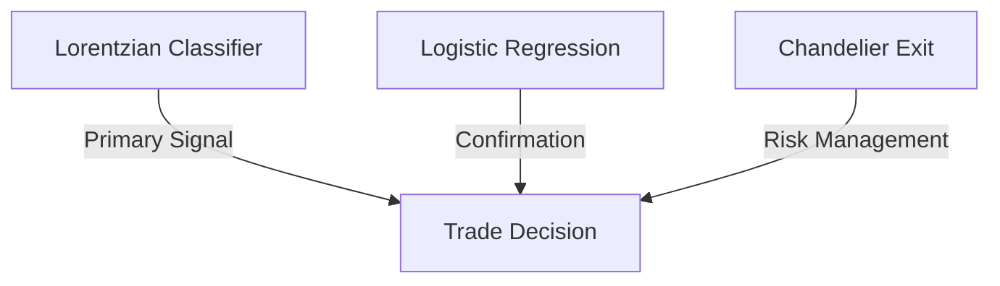

# 🔬 Technical Trading Strategy Implementation

*What is this doc?*  
This document explains how the trading strategy works, how signals are generated, and how risk is managed. It's for anyone who wants to understand or modify the system's decision-making logic.

[Indicators](INDICATORS.md) | [ML Model](ML_MODEL.md) | [Project README](../README.md)

## Table of Contents
1. [Strategy Overview](#strategy-overview)
2. [Core Components](#core-components)
3. [Technical Indicators](#technical-indicators)
4. [Signal Generation](#signal-generation)
5. [Position Management](#position-management)
6. [Implementation Details](#implementation-details)

## Strategy Overview

This strategy combines machine learning with traditional technical analysis to create a robust trading system. The core components work in harmony to identify, validate, and execute trades.

### Signal Hierarchy


## Core Components

### 1. Lorentzian Classification
Primary signal generator using K-Nearest Neighbors with Lorentzian distance metric.

```python
def lorentzian_distance(x1, x2):
    return np.log(1 + np.abs(x1 - x2))

def calculate_lorentzian_score(data_window, neighbors=8):
    distances = np.array([
        lorentzian_distance(data_window[-1], x) 
        for x in data_window[:-1]
    ])
    return np.mean(np.sort(distances)[:neighbors])
```

#### Feature Set
```python
features = {
    'rsi_14_1': {'length': 14, 'smooth': 1},
    'wavetrend': {'channel_length': 10, 'avg_length': 11},
    'cci_20_1': {'length': 20, 'smooth': 1},
    'adx_20_2': {'length': 20, 'smooth': 2},
    'rsi_9_1': {'length': 9, 'smooth': 1}
}
```

### 2. Logistic Regression
Probability-based signal confirmation using enhanced feature set.

```python
class LogisticConfirmation:
    def __init__(self, threshold=0.7):
        self.threshold = threshold
        self.model = LogisticRegression(
            C=1.0,
            class_weight='balanced',
            max_iter=1000
        )
    
    def confirm_signal(self, features, signal):
        prob = self.model.predict_proba(features)[0]
        return (prob > self.threshold and signal > 0) or \
               (prob < (1-self.threshold) and signal < 0)
```

### 3. Chandelier Exit
ATR-based trailing stop system for position management.

```python
def calculate_chandelier_exit(high, low, close, atr_period=22, multiplier=3.0):
    atr = calculate_atr(high, low, close, atr_period)
    
    long_stop = high - (multiplier * atr)
    short_stop = low + (multiplier * atr)
    
    return long_stop, short_stop
```

## Technical Indicators

### 1. Wave Trend
```python
def calculate_wave_trend(close, channel_length=10, avg_length=11):
    esa = ema(close, channel_length)
    d = ema(abs(close - esa), channel_length)
    ci = (close - esa) / (0.015 * d)
    wt1 = ema(ci, avg_length)
    wt2 = sma(wt1, 4)
    
    return wt1, wt2
```

### 2. Enhanced RSI
```python
def calculate_enhanced_rsi(close, length=14, smooth=1):
    rsi = talib.RSI(close, timeperiod=length)
    if smooth > 1:
        rsi = talib.EMA(rsi, timeperiod=smooth)
    return rsi
```

### 3. Custom CCI
```python
def calculate_custom_cci(high, low, close, length=20, smooth=1):
    typical_price = (high + low + close) / 3
    sma_tp = talib.SMA(typical_price, timeperiod=length)
    mean_deviation = mean_dev(typical_price, length)
    cci = (typical_price - sma_tp) / (0.015 * mean_deviation)
    
    if smooth > 1:
        cci = talib.EMA(cci, timeperiod=smooth)
    return cci
```

## Signal Generation

### Feature Calculation
```python
def calculate_features(ohlcv_data):
    features = {}
    
    # Price action features
    features['close_change'] = np.diff(ohlcv_data['close'])
    features['volume_change'] = np.diff(ohlcv_data['volume'])
    
    # Technical indicators
    features['wt1'], features['wt2'] = calculate_wave_trend(
        ohlcv_data['close']
    )
    features['rsi'] = calculate_enhanced_rsi(
        ohlcv_data['close']
    )
    features['cci'] = calculate_custom_cci(
        ohlcv_data['high'],
        ohlcv_data['low'],
        ohlcv_data['close']
    )
    
    return features
```

### Signal Combination
```python
def generate_signal(features, lorentzian_signal, logistic_prob):
    """
    Combine signals from different components
    
    Returns:
        1: Long signal
        -1: Short signal
        0: No trade
    """
    if lorentzian_signal > 0 and logistic_prob > 0.7:
        return 1
    elif lorentzian_signal < 0 and logistic_prob < 0.3:
        return -1
    return 0
```

## Position Management

### 🚨 CRITICAL: Leverage-Based Position Sizing

**ALL STRATEGIES MUST USE THE LEVERAGE-BASED POSITION SIZING SYSTEM**

This is defined in `/configs/leverage_position_sizing_config.yaml` and implemented in `src/utils/position_sizing.py`.

#### Core Philosophy
- **High leverage (25-125x) with small allocations (1-10%)**
- **Never use decreasing capital position sizing**
- **Fixed allocation percentages based on leverage**

#### Implementation Requirements
```python
from src.utils.position_sizing import PositionSizer
from configs.leverage_position_sizing_config import load_config

# REQUIRED: Load leverage configuration
config = load_config('leverage_position_sizing_config.yaml')
sizer = PositionSizer(portfolio_value=500.0)  # $500 USDT

# REQUIRED: Calculate position size based on leverage
leverage = 75  # 75x leverage
market_conditions = MarketConditions(
    volume_ratio=1.2,
    sentiment_score=0.1,
    is_bullish=True
)

min_size, max_size = sizer.calculate_position_size(leverage, market_conditions)
position_size = min_size * portfolio_value  # Use minimum allocation
```

#### Leverage Allocation Rules
```python
# From leverage_position_sizing_config.yaml
leverage_ranges = {
    "50-125x": {"allocation": "1-10%"},   # Ultra high leverage
    "20-49x":  {"allocation": "10-20%"},  # High leverage  
    "1-19x":   {"allocation": "20-100%"}  # Medium leverage
}
```

### Entry Rules
```python
def validate_entry(signal, current_price, volatility, leverage):
    min_volatility = calculate_min_volatility()
    max_volatility = calculate_max_volatility()
    
    volatility_valid = min_volatility <= volatility <= max_volatility
    
    # REQUIRED: Validate leverage is within acceptable range
    leverage_valid = 1 <= leverage <= 125
    
    return signal != 0 and volatility_valid and leverage_valid
```

### Position Sizing (UPDATED)
```python
def calculate_position_size(
    portfolio_value: float,
    leverage: int,
    market_conditions: MarketConditions,
    strategy_type: str = "lorentzian"
):
    """
    REQUIRED: Use leverage-based position sizing
    
    Args:
        portfolio_value: Total portfolio value ($500 USDT)
        leverage: Intended leverage (25-125x)
        market_conditions: Current market conditions
        strategy_type: Strategy name for overrides
    """
    sizer = PositionSizer(portfolio_value)
    min_size, max_size = sizer.calculate_position_size(leverage, market_conditions)
    
    # Apply strategy-specific overrides
    if strategy_type == "lorentzian":
        # Use 2-5% allocation for Lorentzian with 75x leverage
        allocation = min(max_size, 0.05)
    elif strategy_type == "chandelier_exit":
        # Use 1-3% allocation for Chandelier with 100x leverage
        allocation = min(max_size, 0.03)
    
    return portfolio_value * allocation
```

### Stop Loss Management
```python
def update_stops(
    position,
    current_price,
    long_stop,
    short_stop
):
    if position > 0:  # Long position
        return long_stop
    elif position < 0:  # Short position
        return short_stop
    return None
```

## Implementation Details

### Data Pipeline
```python
class TradingPipeline:
    def __init__(self, config):
        self.features = FeatureCalculator(config)
        self.signals = SignalGenerator(config)
        self.risk = RiskManager(config)
        
    def process_data(self, ohlcv):
        # Calculate features
        features = self.features.calculate(ohlcv)
        
        # Generate signals
        signals = self.signals.generate(features)
        
        # Manage risk
        position = self.risk.manage_position(
            signals,
            features
        )
        
        return position
```

### Model Training
```python
def train_models(X_train, y_train, config):
    # Train Lorentzian Classifier
    lorentzian = LorentzianClassifier(
        n_neighbors=config.n_neighbors,
        chronological_split=True
    )
    lorentzian.fit(X_train, y_train)
    
    # Train Logistic Confirmation
    logistic = LogisticConfirmation(
        threshold=config.threshold
    )
    logistic.fit(X_train, y_train)
    
    return lorentzian, logistic
```

### Performance Monitoring
```python
class PerformanceMonitor:
    def __init__(self):
        self.trades = []
        self.metrics = {}
    
    def log_trade(self, trade):
        self.trades.append(trade)
        self.update_metrics()
    
    def update_metrics(self):
        self.metrics['win_rate'] = self.calculate_win_rate()
        self.metrics['profit_factor'] = self.calculate_profit_factor()
        self.metrics['sharpe_ratio'] = self.calculate_sharpe_ratio()
```

## Configuration

### Example config.yaml
```yaml
model:
  lorentzian:
    n_neighbors: 8
    chronological_split: true
    feature_set:
      - rsi_14_1
      - wavetrend
      - cci_20_1
      - adx_20_2
      - rsi_9_1

  logistic:
    threshold: 0.7
    class_weight: balanced
    max_iter: 1000

risk:
  max_position_size: 0.1  # 10% of account
  risk_per_trade: 0.02   # 2% risk per trade
  max_leverage: 125  # UPDATED: Use full leverage capacity
```

---

## 🚨 CRITICAL: Files That MUST Implement Leverage-Based Position Sizing

**The following files MUST be updated to use the leverage-based position sizing system:**

### Core Trading Files
- `src/ml/paper_trading_framework.py` - **CRITICAL**: Main backtesting framework
- `src/ml/strategy_backtest.py` - Strategy backtesting
- `scripts/example_paper_trading.py` - Example paper trading
- `scripts/systematic_multi_timeframe_test.py` - Multi-timeframe testing

### Strategy Implementation Files
- `src/ml/models/strategy/lorentzian_classifier.py` - Lorentzian strategy
- `src/ml/models/strategy/logistic_regression_torch.py` - Logistic regression strategy
- `src/ml/models/strategy/chandelier_exit.py` - Chandelier exit strategy
- `src/ml/models/strategy/lag_based_strategy.py` - Lag-based strategy

### Live Trading Files
- `src/trading/bitget/portfolio.py` - Portfolio management
- `src/cli/trading/lag_live_trader.py` - Live trading CLI
- `src/exchanges/bitget/bitget_trader.py` - Bitget trading interface

### Configuration Files
- `configs/leverage_position_sizing_config.yaml` - **MASTER CONFIG** (already created)
- `configs/automated_trading_config.json` - Needs update
- `configs/lag_strategy_config.yaml` - Needs update

### Required Implementation Steps

1. **Import the position sizing module**:
```python
from src.utils.position_sizing import PositionSizer, MarketConditions
```

2. **Load the configuration**:
```python
import yaml
with open('configs/leverage_position_sizing_config.yaml', 'r') as f:
    config = yaml.safe_load(f)
```

3. **Replace existing position sizing**:
```python
# OLD (BROKEN):
position_size = capital * risk_per_trade

# NEW (REQUIRED):
sizer = PositionSizer(portfolio_value=500.0)
min_size, max_size = sizer.calculate_position_size(leverage, market_conditions)
position_size = min_size * portfolio_value
```

4. **Use realistic fees**:
```python
# OLD (BROKEN):
total_fees = 0.003  # 0.3%

# NEW (REQUIRED):
maker_fee = 0.0002  # 0.02%
taker_fee = 0.0006  # 0.06%
```

### Validation Checklist

Before any backtest or live trading, ensure:
- [ ] Position sizing uses leverage-based allocation
- [ ] Fees are realistic (0.02-0.06%, not 0.3%)
- [ ] Initial capital is $500 USDT
- [ ] Leverage is 25-125x
- [ ] No decreasing capital position sizing
- [ ] Chandelier exit is enabled
- [ ] Liquidation protection is active

## See Also
- [Project README](../README.md) — Project overview and structure
- [ML Model Architecture](ML_MODEL.md) — How the model integrates with the strategy
- [Technical Indicators](INDICATORS.md) — Details on all custom indicators
- [Trading Philosophy](TRADING_PHILOSOPHY.md) — The intuition behind the strategy
- [Leverage Position Sizing Config](../configs/leverage_position_sizing_config.yaml) — **MASTER CONFIG**
- [Position Sizing Module](../src/utils/position_sizing.py) — Implementation details
- [src/models/strategy/](../src/models/strategy/) — Strategy code (e.g., [lorentzian_classifier.py](../src/models/strategy/lorentzian_classifier.py), [logistic_regression_torch.py](../src/models/strategy/logistic_regression_torch.py))
- [src/features/](../src/features/) — Indicator code

*This document provides the technical implementation details of our trading strategy. It serves as a reference for development and maintenance of the trading system.* 