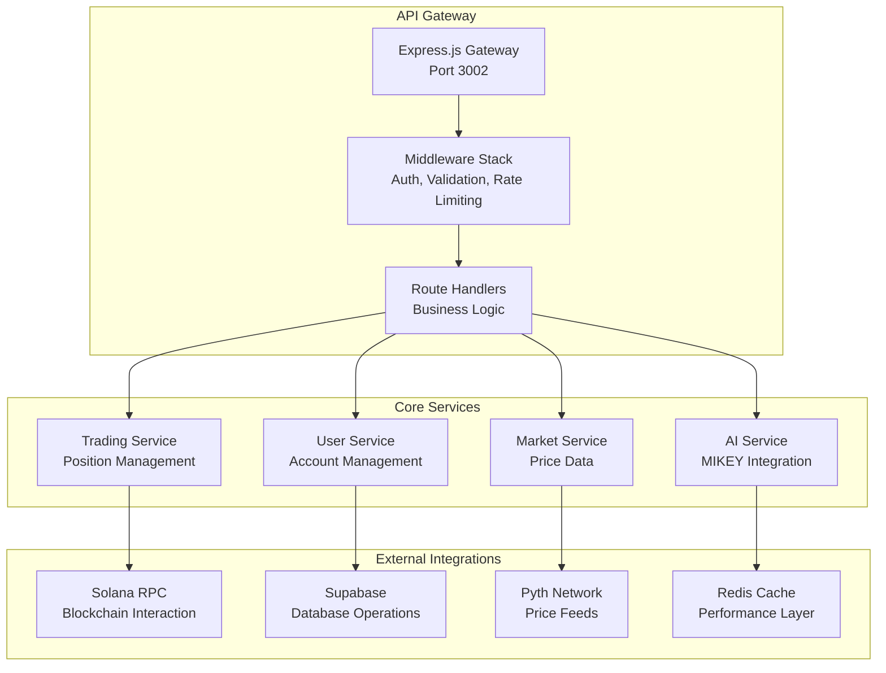

# QuantDesk API Documentation

## 🚀 **Complete API Reference**

This document provides comprehensive API documentation for the QuantDesk perpetual DEX platform, showcasing our complete backend service architecture and integration capabilities.

## 📊 **API Overview**



## 🔐 **Authentication**

### **JWT Token Authentication**
```typescript
// Request headers
{
  "Authorization": "Bearer <jwt_token>",
  "Content-Type": "application/json"
}
```

### **API Key Authentication**
```typescript
// Request headers
{
  "X-API-Key": "<api_key>",
  "Content-Type": "application/json"
}
```

## 📈 **Market Data Endpoints**

### **Get Available Markets**
```http
GET /api/markets
```

**Response:**
```json
{
  "success": true,
  "data": [
    {
      "symbol": "SOL-PERP",
      "name": "Solana Perpetual",
      "baseAsset": "SOL",
      "quoteAsset": "USDC",
      "isActive": true,
      "minSize": 0.01,
      "maxSize": 1000,
      "tickSize": 0.01,
      "stepSize": 0.01
    }
  ]
}
```

### **Get Market Data**
```http
GET /api/markets/{symbol}
```

**Parameters:**
- `symbol` (string): Market symbol (e.g., "SOL-PERP")

**Response:**
```json
{
  "success": true,
  "data": {
    "symbol": "SOL-PERP",
    "price": 100.50,
    "volume": 1250000.75,
    "change24h": 0.025,
    "high24h": 102.30,
    "low24h": 98.75,
    "open24h": 98.00,
    "timestamp": "2024-01-15T10:30:00Z",
    "orderBook": {
      "bids": [
        { "price": 100.49, "size": 1.5 },
        { "price": 100.48, "size": 2.3 }
      ],
      "asks": [
        { "price": 100.51, "size": 1.2 },
        { "price": 100.52, "size": 3.1 }
      ]
    }
  }
}
```

### **Get Historical Data**
```http
GET /api/markets/{symbol}/history
```

**Parameters:**
- `symbol` (string): Market symbol
- `interval` (string): Time interval (1m, 5m, 15m, 1h, 4h, 1d)
- `limit` (number): Number of candles (max 1000)

**Response:**
```json
{
  "success": true,
  "data": [
    {
      "timestamp": "2024-01-15T10:00:00Z",
      "open": 100.00,
      "high": 101.50,
      "low": 99.75,
      "close": 100.50,
      "volume": 1250.75
    }
  ]
}
```

## 💼 **Trading Endpoints**

### **Get Portfolio**
```http
GET /api/portfolio
```

**Response:**
```json
{
  "success": true,
  "data": {
    "totalValue": 10000.50,
    "totalPnL": 250.75,
    "totalPositions": 3,
    "availableBalance": 5000.25,
    "marginUsed": 2000.00,
    "marginAvailable": 3000.25,
    "positions": [
      {
        "id": "pos_123",
        "market": "SOL-PERP",
        "side": "long",
        "size": 1.5,
        "entryPrice": 95.00,
        "currentPrice": 100.50,
        "pnL": 8.25,
        "leverage": 10,
        "margin": 150.00,
        "liquidationPrice": 85.50
      }
    ]
  }
}
```

### **Get Positions**
```http
GET /api/positions
```

**Query Parameters:**
- `market` (string, optional): Filter by market symbol
- `status` (string, optional): Filter by status (open, closed)

**Response:**
```json
{
  "success": true,
  "data": [
    {
      "id": "pos_123",
      "market": "SOL-PERP",
      "side": "long",
      "size": 1.5,
      "entryPrice": 95.00,
      "currentPrice": 100.50,
      "pnL": 8.25,
      "leverage": 10,
      "margin": 150.00,
      "liquidationPrice": 85.50,
      "status": "open",
      "createdAt": "2024-01-15T09:00:00Z",
      "updatedAt": "2024-01-15T10:30:00Z"
    }
  ]
}
```

### **Open Position**
```http
POST /api/positions
```

**Request Body:**
```json
{
  "market": "SOL-PERP",
  "side": "long",
  "size": 1.0,
  "leverage": 10,
  "entryPrice": 100.00,
  "stopLoss": 95.00,
  "takeProfit": 110.00
}
```

**Response:**
```json
{
  "success": true,
  "data": {
    "id": "pos_124",
    "market": "SOL-PERP",
    "side": "long",
    "size": 1.0,
    "entryPrice": 100.00,
    "leverage": 10,
    "margin": 100.00,
    "status": "open",
    "createdAt": "2024-01-15T10:30:00Z"
  }
}
```

### **Close Position**
```http
DELETE /api/positions/{positionId}
```

**Parameters:**
- `positionId` (string): Position ID

**Response:**
```json
{
  "success": true,
  "data": {
    "id": "pos_124",
    "status": "closed",
    "pnL": 5.25,
    "closedAt": "2024-01-15T11:00:00Z"
  }
}
```

## 📝 **Order Management**

### **Place Order**
```http
POST /api/orders
```

**Request Body:**
```json
{
  "market": "SOL-PERP",
  "side": "buy",
  "size": 1.0,
  "price": 99.50,
  "orderType": "limit",
  "timeInForce": "GTC"
}
```

**Response:**
```json
{
  "success": true,
  "data": {
    "id": "ord_456",
    "market": "SOL-PERP",
    "side": "buy",
    "size": 1.0,
    "price": 99.50,
    "orderType": "limit",
    "status": "pending",
    "createdAt": "2024-01-15T10:30:00Z"
  }
}
```

### **Get Orders**
```http
GET /api/orders
```

**Query Parameters:**
- `market` (string, optional): Filter by market
- `status` (string, optional): Filter by status
- `limit` (number, optional): Number of orders (max 100)

**Response:**
```json
{
  "success": true,
  "data": [
    {
      "id": "ord_456",
      "market": "SOL-PERP",
      "side": "buy",
      "size": 1.0,
      "price": 99.50,
      "orderType": "limit",
      "status": "filled",
      "filledSize": 1.0,
      "filledPrice": 99.50,
      "createdAt": "2024-01-15T10:30:00Z",
      "filledAt": "2024-01-15T10:31:00Z"
    }
  ]
}
```

### **Cancel Order**
```http
DELETE /api/orders/{orderId}
```

**Parameters:**
- `orderId` (string): Order ID

**Response:**
```json
{
  "success": true,
  "data": {
    "id": "ord_456",
    "status": "cancelled",
    "cancelledAt": "2024-01-15T10:35:00Z"
  }
}
```

## 🤖 **AI Integration Endpoints**

### **Get AI Analysis**
```http
GET /api/ai/analysis/{market}
```

**Parameters:**
- `market` (string): Market symbol

**Response:**
```json
{
  "success": true,
  "data": {
    "market": "SOL-PERP",
    "sentiment": "bullish",
    "confidence": 0.85,
    "recommendation": "buy",
    "riskLevel": "medium",
    "insights": [
      "Strong upward momentum detected",
      "Volume increasing with price",
      "Support level holding at $95"
    ],
    "technicalIndicators": {
      "rsi": 65.5,
      "macd": "bullish",
      "movingAverage": "above"
    },
    "timestamp": "2024-01-15T10:30:00Z"
  }
}
```

### **Get Trading Signals**
```http
GET /api/ai/signals
```

**Response:**
```json
{
  "success": true,
  "data": [
    {
      "market": "SOL-PERP",
      "action": "buy",
      "strength": "strong",
      "confidence": 0.90,
      "reason": "Breakout above resistance",
      "timestamp": "2024-01-15T10:30:00Z"
    }
  ]
}
```

### **Get Risk Assessment**
```http
GET /api/ai/risk-assessment
```

**Response:**
```json
{
  "success": true,
  "data": {
    "overallRisk": "medium",
    "portfolioRisk": 0.15,
    "marketRisk": 0.25,
    "recommendations": [
      "Consider reducing position sizes",
      "Set stop-loss orders",
      "Monitor market volatility"
    ],
    "timestamp": "2024-01-15T10:30:00Z"
  }
}
```

### **Chat with MIKEY**
```http
POST /api/ai/chat
```

**Request Body:**
```json
{
  "message": "What's your analysis of SOL-PERP?",
  "context": {
    "market": "SOL-PERP",
    "userPositions": ["pos_123"]
  }
}
```

**Response:**
```json
{
  "success": true,
  "data": {
    "response": "Based on my analysis, SOL-PERP shows strong bullish momentum with increasing volume. The price has broken above the key resistance level at $100, suggesting potential for further upside. However, I recommend setting a stop-loss at $95 to manage risk.",
    "confidence": 0.88,
    "sources": [
      "Technical analysis",
      "Volume analysis",
      "Market sentiment"
    ],
    "timestamp": "2024-01-15T10:30:00Z"
  }
}
```

## 👤 **User Management**

### **Get User Profile**
```http
GET /api/user/profile
```

**Response:**
```json
{
  "success": true,
  "data": {
    "id": "user_789",
    "email": "user@example.com",
    "walletAddress": "7xKXtg2CW87d97TXJSDpbD5jBkheTqA83TZRuJosgAsU",
    "tier": "pro",
    "kycStatus": "verified",
    "createdAt": "2024-01-01T00:00:00Z",
    "lastLogin": "2024-01-15T10:30:00Z"
  }
}
```

### **Update User Settings**
```http
PUT /api/user/settings
```

**Request Body:**
```json
{
  "notifications": {
    "email": true,
    "push": false,
    "sms": false
  },
  "trading": {
    "defaultLeverage": 10,
    "riskTolerance": "medium",
    "autoClose": true
  }
}
```

**Response:**
```json
{
  "success": true,
  "data": {
    "message": "Settings updated successfully"
  }
}
```

## 📊 **Analytics Endpoints**

### **Get Trading History**
```http
GET /api/analytics/trading-history
```

**Query Parameters:**
- `startDate` (string): Start date (ISO format)
- `endDate` (string): End date (ISO format)
- `market` (string, optional): Filter by market

**Response:**
```json
{
  "success": true,
  "data": {
    "totalTrades": 150,
    "winningTrades": 95,
    "losingTrades": 55,
    "winRate": 0.633,
    "totalPnL": 1250.75,
    "averageWin": 25.50,
    "averageLoss": -15.25,
    "profitFactor": 1.67,
    "trades": [
      {
        "id": "trade_123",
        "market": "SOL-PERP",
        "side": "long",
        "size": 1.0,
        "entryPrice": 95.00,
        "exitPrice": 100.50,
        "pnL": 5.50,
        "timestamp": "2024-01-15T10:30:00Z"
      }
    ]
  }
}
```

### **Get Performance Metrics**
```http
GET /api/analytics/performance
```

**Response:**
```json
{
  "success": true,
  "data": {
    "totalReturn": 0.125,
    "annualizedReturn": 0.45,
    "sharpeRatio": 1.85,
    "maxDrawdown": 0.08,
    "volatility": 0.25,
    "beta": 1.2,
    "alpha": 0.05,
    "period": "30d"
  }
}
```

## 🔧 **System Endpoints**

### **Health Check**
```http
GET /api/health
```

**Response:**
```json
{
  "success": true,
  "data": {
    "status": "healthy",
    "timestamp": "2024-01-15T10:30:00Z",
    "services": {
      "database": "healthy",
      "redis": "healthy",
      "solana": "healthy",
      "pyth": "healthy"
    },
    "uptime": 86400,
    "version": "1.0.0"
  }
}
```

### **Get System Status**
```http
GET /api/status
```

**Response:**
```json
{
  "success": true,
  "data": {
    "activeUsers": 1250,
    "totalVolume": 5000000.75,
    "openPositions": 3500,
    "systemLoad": 0.45,
    "lastUpdate": "2024-01-15T10:30:00Z"
  }
}
```

## ⚠️ **Error Handling**

### **Error Response Format**
```json
{
  "success": false,
  "error": {
    "code": "INSUFFICIENT_BALANCE",
    "message": "Insufficient balance to open position",
    "details": {
      "required": 1000.00,
      "available": 500.00
    }
  },
  "timestamp": "2024-01-15T10:30:00Z"
}
```

### **Common Error Codes**
- `INSUFFICIENT_BALANCE`: Not enough balance for operation
- `INVALID_MARKET`: Market symbol not found
- `POSITION_SIZE_TOO_LARGE`: Position size exceeds limits
- `MARKET_CLOSED`: Market is currently closed
- `RATE_LIMIT_EXCEEDED`: Too many requests
- `UNAUTHORIZED`: Authentication required
- `FORBIDDEN`: Insufficient permissions

## 📚 **Rate Limiting**

### **Rate Limits**
- **General API**: 1000 requests per hour
- **Trading API**: 100 requests per hour
- **AI API**: 50 requests per hour
- **Analytics API**: 200 requests per hour

### **Rate Limit Headers**
```http
X-RateLimit-Limit: 1000
X-RateLimit-Remaining: 999
X-RateLimit-Reset: 1642248600
```

## 🔒 **Security**

### **HTTPS Only**
All API endpoints require HTTPS encryption.

### **CORS Policy**
```typescript
{
  "origin": ["https://quantdesk.com", "https://app.quantdesk.com"],
  "methods": ["GET", "POST", "PUT", "DELETE"],
  "headers": ["Content-Type", "Authorization", "X-API-Key"]
}
```

### **Input Validation**
All inputs are validated and sanitized before processing.

---

**QuantDesk API Documentation: Complete API reference showcasing our comprehensive backend service architecture with trading, AI integration, and analytics capabilities.**
