# QuantDesk Architecture Documentation

## 🏗️ **Complete Multi-Service Architecture Overview**

QuantDesk implements a sophisticated multi-service architecture designed for high-performance perpetual DEX operations, AI-powered trading assistance, and real-time data processing.

## 📊 **System Architecture Diagram**

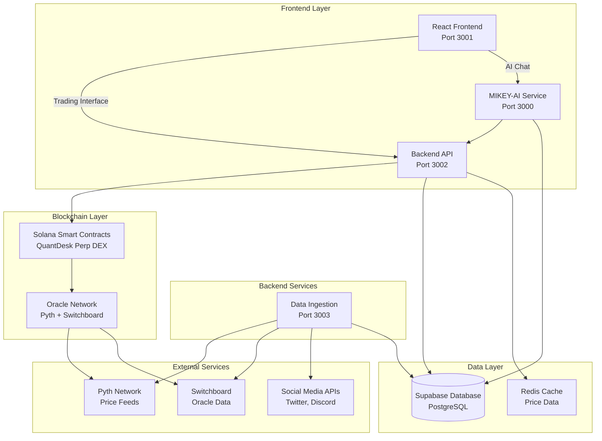

## 🔄 **Data Flow Architecture**

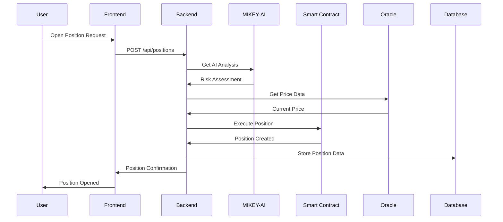

## 🎯 **Service Architecture Details**

### **Frontend Service (Port 3001)**
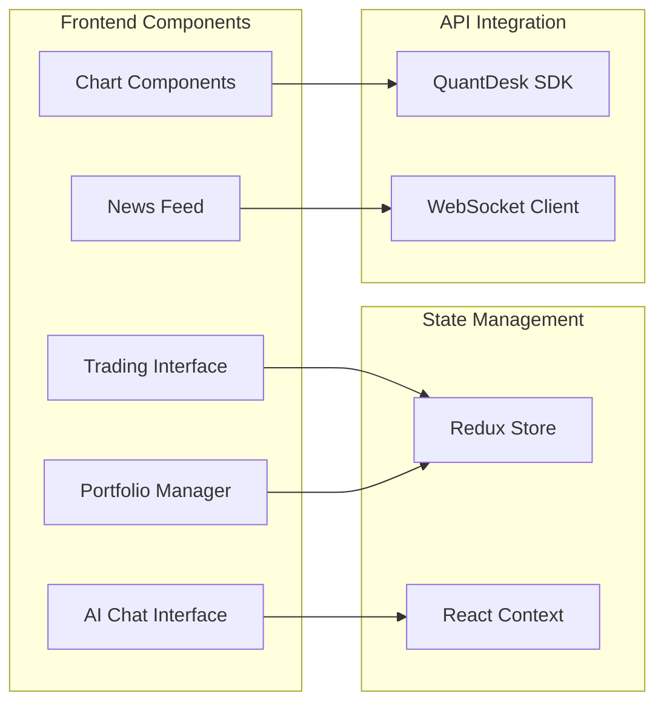

### **Backend Service (Port 3002)**
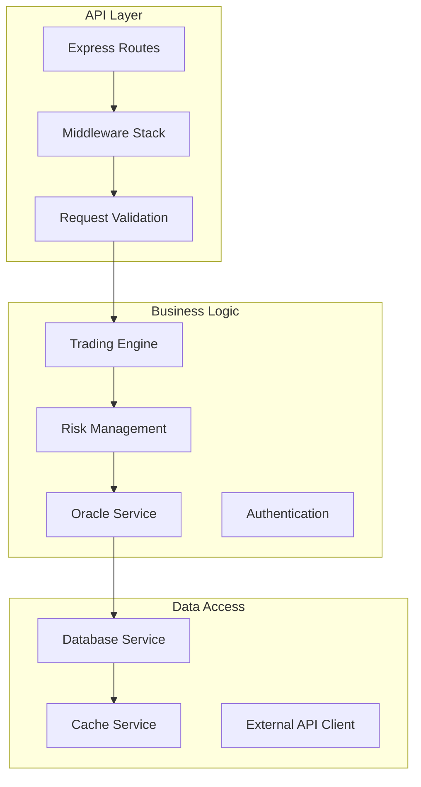

### **MIKEY-AI Service (Port 3000)**
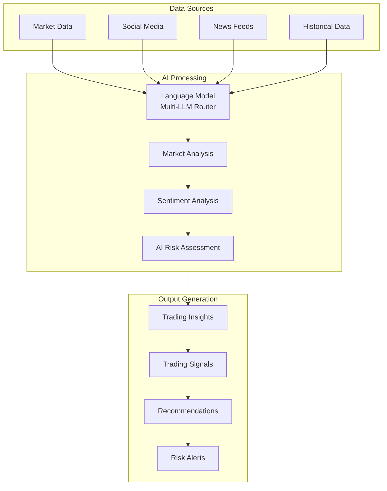

### **Data Ingestion Service (Port 3003)**
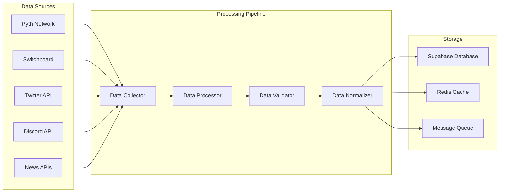

## 🔒 **Security Architecture**

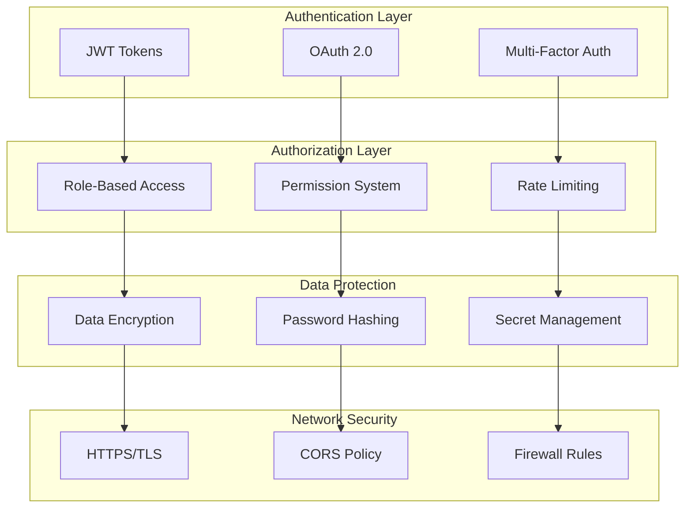

## 📈 **Performance Architecture**

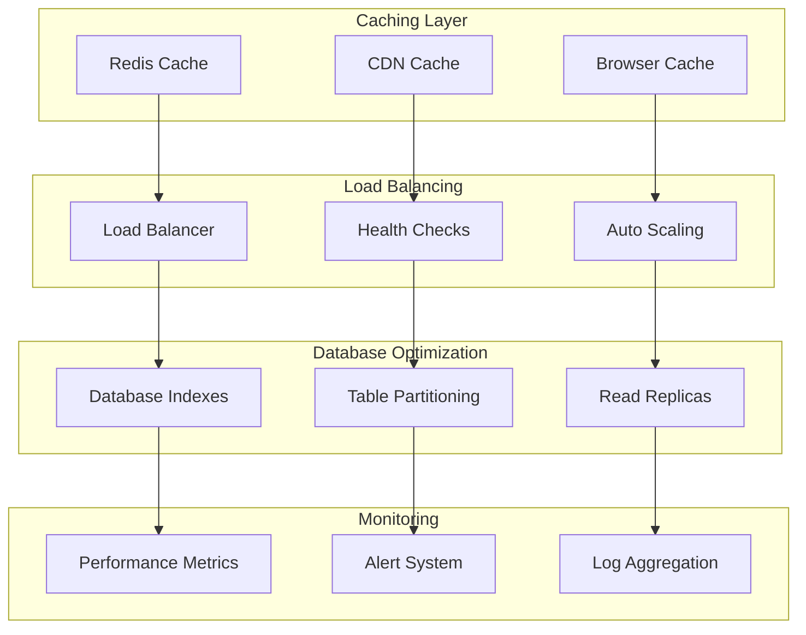

## 🔄 **Smart Contract Integration**

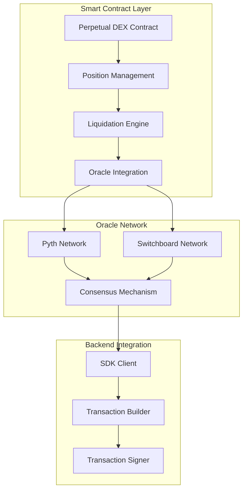

## 🚀 **Deployment Architecture**

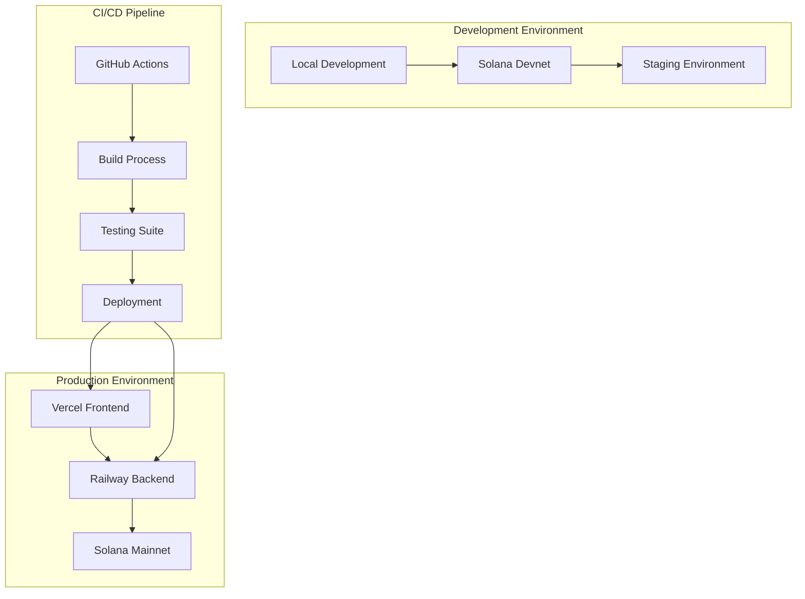

## 📊 **Monitoring & Observability**

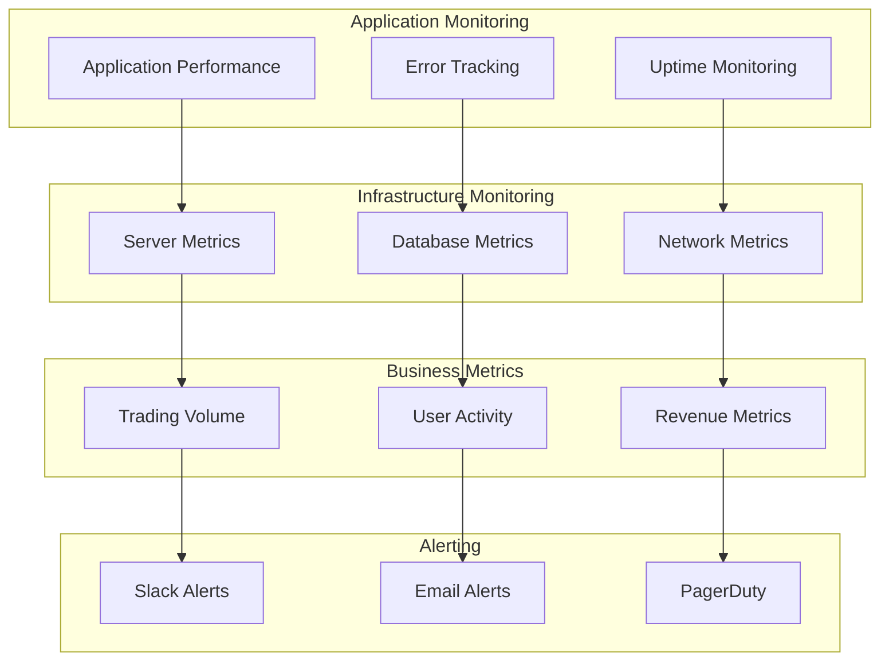

## 🔧 **Development Workflow**

```mermaid
graph LR
    subgraph "Development Process"
        PLAN[Planning]
        CODE[Development]
        TEST[Testing]
        REVIEW[Code Review]
    end
    
    subgraph "Quality Assurance"
        LINT[Linting]
        TYPE_CHECK[Type Checking]
        UNIT_TEST[Unit Tests]
        INTEGRATION[Integration Tests]
    end
    
    subgraph "Deployment"
        BUILD[Build]
        DEPLOY[Deploy]
        MONITOR[Monitor]
        ROLLBACK[Rollback]
    end
    
    PLAN --> CODE
    CODE --> TEST
    TEST --> REVIEW
    REVIEW --> LINT
    LINT --> TYPE_CHECK
    TYPE_CHECK --> UNIT_TEST
    UNIT_TEST --> INTEGRATION
    INTEGRATION --> BUILD
    BUILD --> DEPLOY
    DEPLOY --> MONITOR
    MONITOR --> ROLLBACK
```

## 📚 **Technology Stack Summary**

| Service | Technology | Purpose |
|---------|------------|---------|
| **Frontend** | React 18, TypeScript, Tailwind CSS | Trading interface and user experience |
| **Backend** | Node.js, Express, TypeScript | API gateway and business logic |
| **MIKEY-AI** | LangChain, TypeScript, Multi-LLM | AI-powered trading assistance |
| **Data Ingestion** | Node.js, Pipeline Architecture | Real-time data collection and processing |
| **Smart Contracts** | Rust, Anchor Framework | On-chain trading logic |
| **Database** | Supabase (PostgreSQL) | Data persistence and management |
| **Cache** | Redis | High-performance data caching |
| **Oracle** | Pyth Network, Switchboard | Price feed integration |
| **Deployment** | Vercel, Railway | Cloud deployment and scaling |

## 🎯 **Key Architectural Principles**

1. **Microservices Architecture**: Independent, scalable services
2. **API-First Design**: RESTful APIs with comprehensive documentation
3. **Event-Driven Architecture**: Asynchronous processing and real-time updates
4. **Security by Design**: Multi-layer security implementation
5. **Performance Optimization**: Caching, load balancing, and optimization
6. **Observability**: Comprehensive monitoring and logging
7. **Scalability**: Horizontal scaling and auto-scaling capabilities
8. **Maintainability**: Clean code, documentation, and testing

---

**QuantDesk Architecture: Enterprise-grade multi-service architecture designed for high-performance perpetual DEX operations with AI integration and real-time data processing.**
