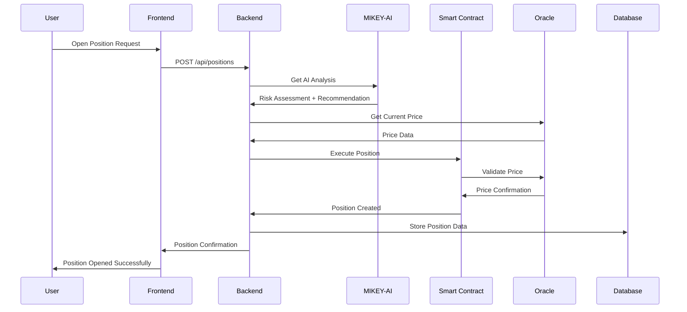
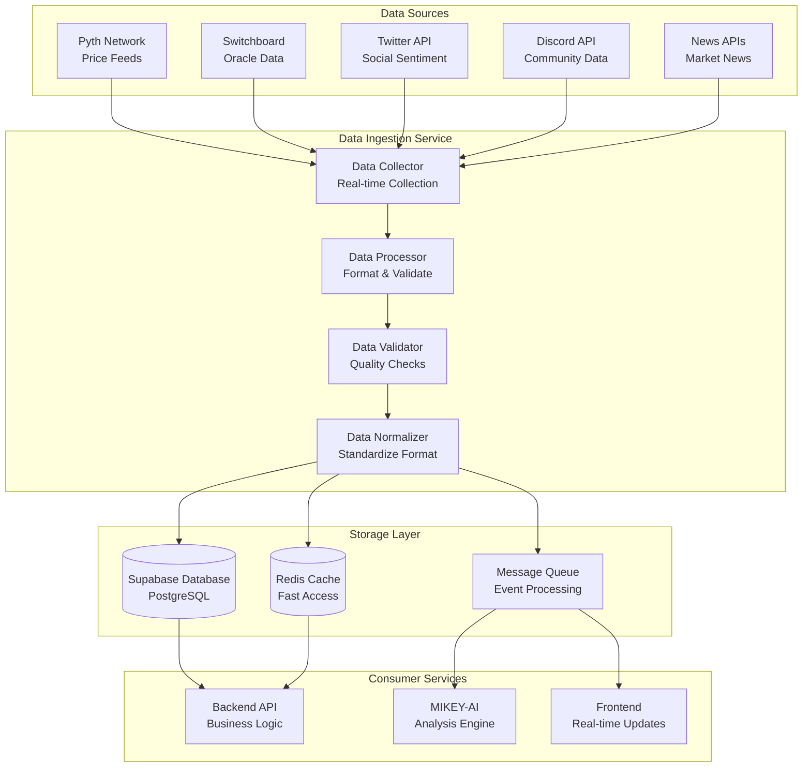
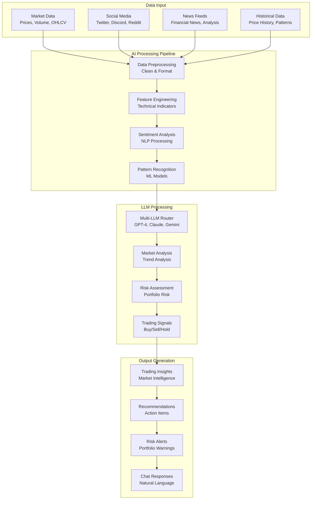
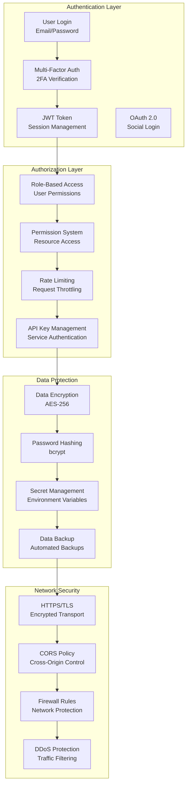
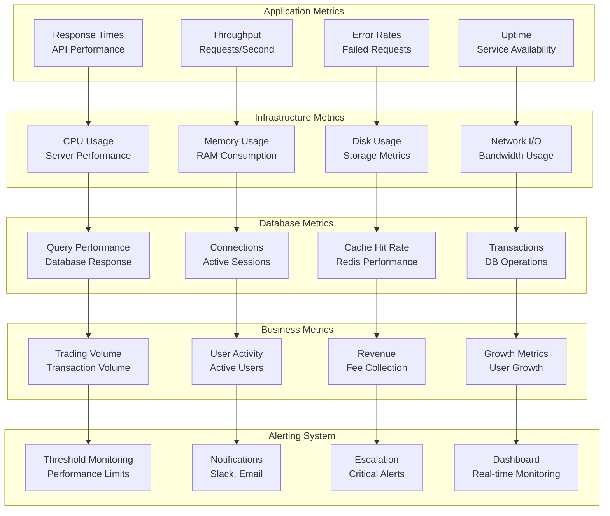
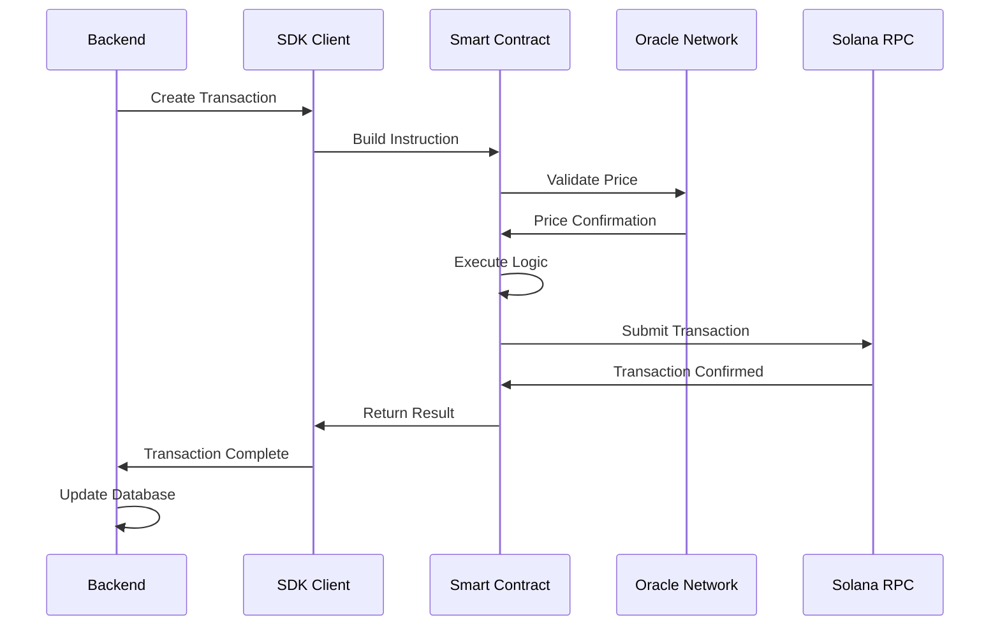
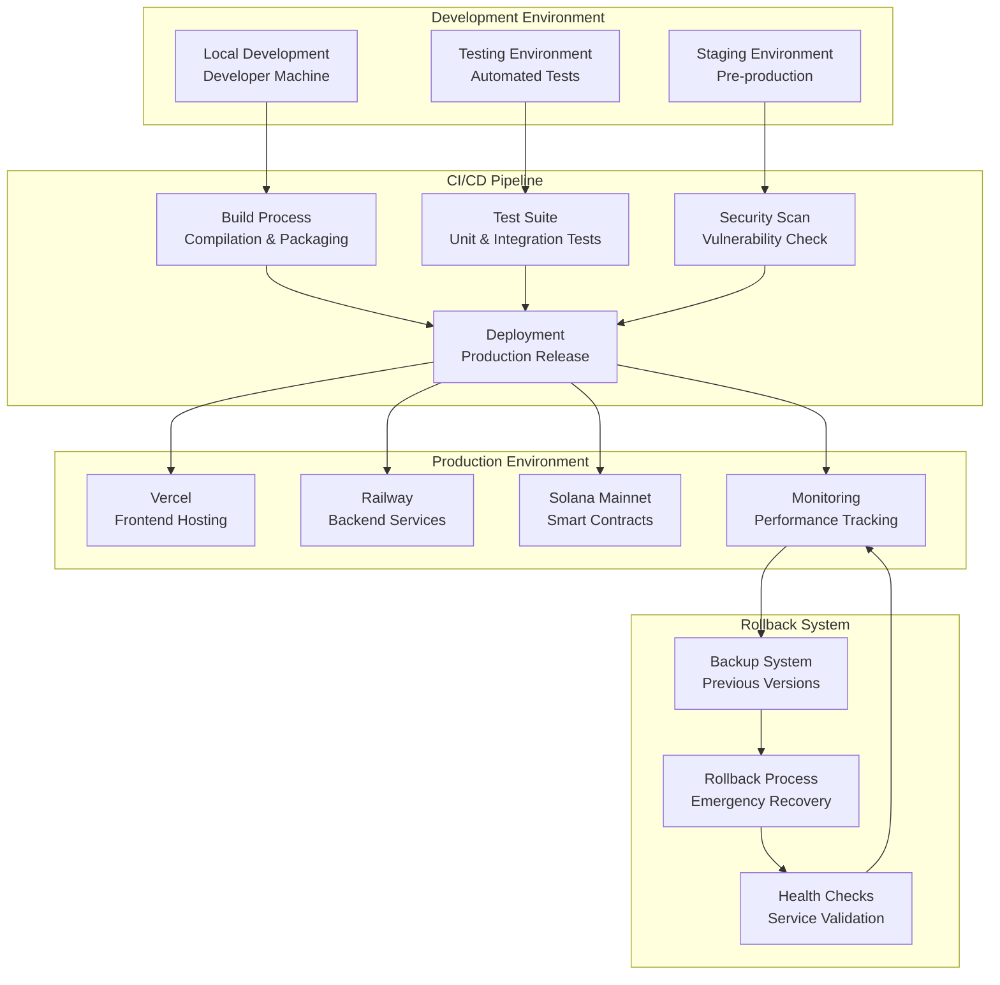
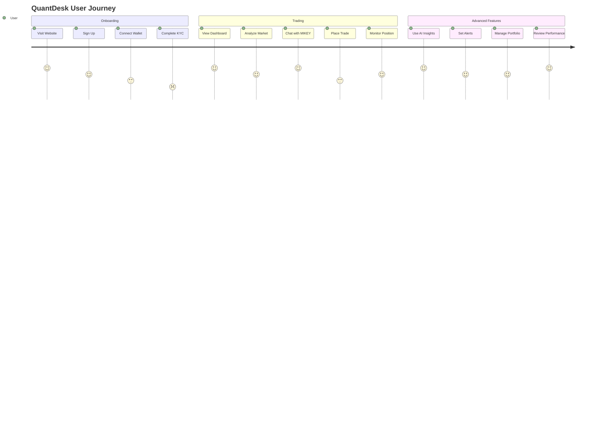
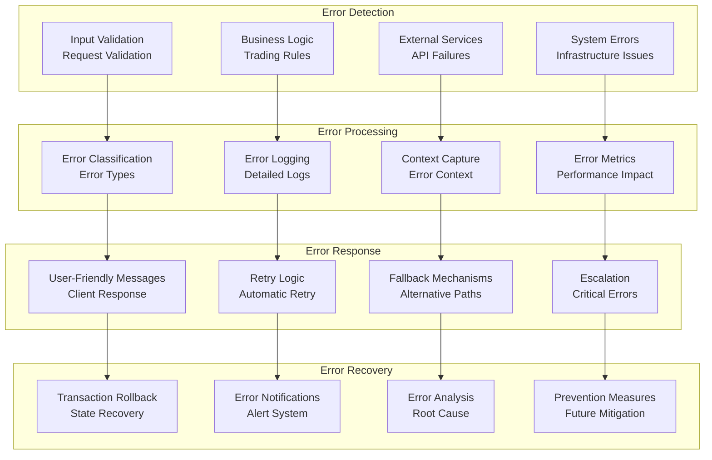
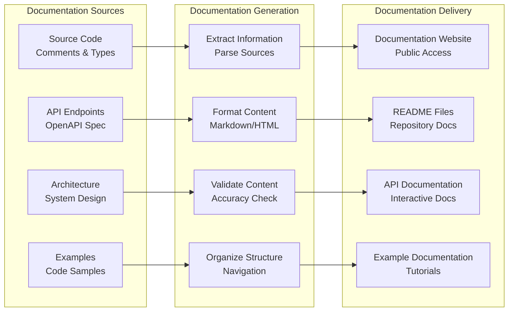

# QuantDesk System Flow Documentation

## 🔄 **Complete System Flow Architecture**

This document provides comprehensive visual documentation of QuantDesk's system flows, data processing pipelines, and service interactions.

## 📊 **Trading Flow Architecture**

## 🔄 **Data Ingestion Flow**

## 🤖 **AI Processing Flow**

## 🔒 **Security Flow Architecture**

## 📈 **Performance Monitoring Flow**

## 🔄 **Smart Contract Integration Flow**

## 🚀 **Deployment Flow Architecture**

## 📊 **User Journey Flow**

## 🔄 **Error Handling Flow**

## 📚 **Documentation Flow**

---

**QuantDesk System Flow Documentation: Comprehensive visual documentation of all system flows, data processing pipelines, and service interactions for complete transparency and developer understanding.**
