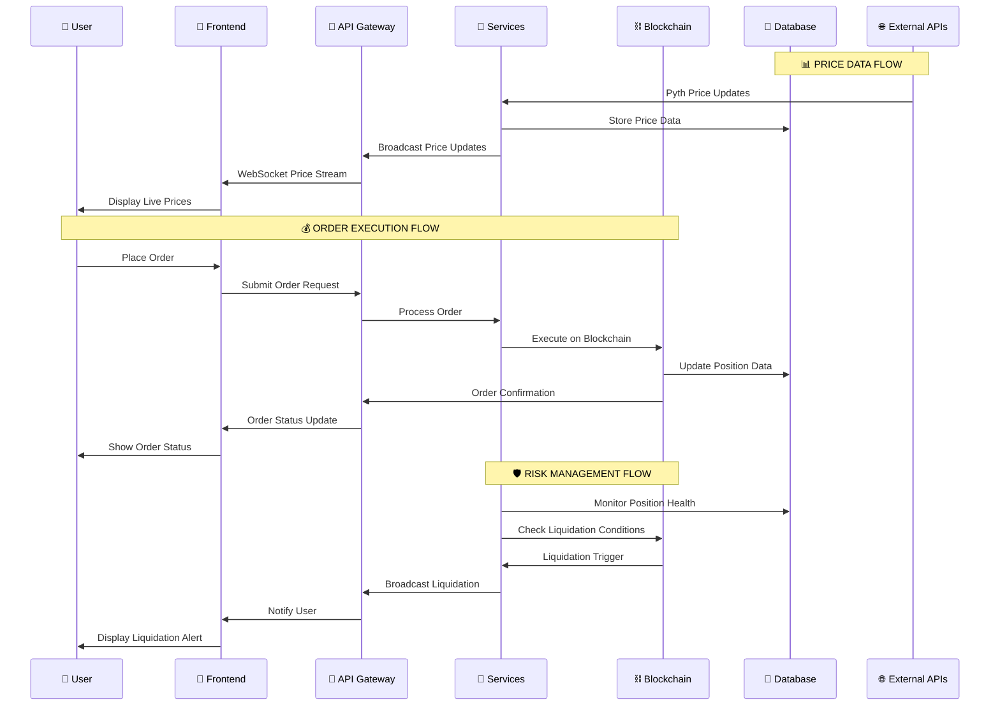

# QuantDesk Perpetual Trading Platform - Complete System Architecture

## 🚀 Professional Visual Architecture

QuantDesk is built with institutional-grade architecture, designed to handle the demands of professional trading with the reliability and performance that institutions expect.

### 🎯 **System Overview Diagram**

```mermaid
graph TB
    %% User Layer
    subgraph "👥 USER LAYER"
        U1[👤 Individual Traders]
        U2[📱 Mobile Apps]
        U3[🖥️ Desktop Apps]
        U4[🏢 Institutional Clients]
    end

    %% Frontend Layer
    subgraph "🎨 FRONTEND LAYER (Port 3001)"
        F1[React Trading Interface]
        F2[TradingView Charts]
        F3[Order Management]
        F4[Portfolio Dashboard]
        F5[WebSocket Client]
        F6[Wallet Integration]
    end

    %% API Gateway
    subgraph "🚀 API GATEWAY (Port 3002)"
        A1[Express.js Server]
        A2[Authentication Middleware]
        A3[Rate Limiting]
        A4[REST API Routes]
        A5[WebSocket Server]
    end

    %% Service Layer
    subgraph "🔧 SERVICE LAYER"
        S1[Pyth Oracle Service]
        S2[Solana Service]
        S3[Database Service]
        S4[Order Service]
        S5[Risk Management]
        S6[JIT Liquidity]
        S7[Metrics & Monitoring]
    end

    %% Blockchain Layer
    subgraph "⛓️ BLOCKCHAIN LAYER"
        B1[Solana Smart Contracts]
        B2[Market Management]
        B3[Position Management]
        B4[Order Management]
        B5[Cross-Collateralization]
        B6[Liquidation Engine]
    end

    %% Data Layer
    subgraph "💾 DATA LAYER"
        D1[Supabase PostgreSQL]
        D2[TimescaleDB]
        D3[User Data]
        D4[Trading History]
        D5[Price Feeds]
        D6[Analytics]
    end

    %% External Integrations
    subgraph "🌐 EXTERNAL INTEGRATIONS"
        E1[Pyth Network]
        E2[CoinGecko API]
        E3[TradingView]
        E4[Solana RPC]
    end

    %% Data Flow Connections
    U1 --> F1
    U2 --> F1
    U3 --> F1
    U4 --> F1

    F1 --> A1
    F2 --> A1
    F3 --> A1
    F4 --> A1
    F5 --> A5
    F6 --> A1

    A1 --> S1
    A1 --> S2
    A1 --> S3
    A1 --> S4
    A1 --> S5
    A1 --> S6
    A1 --> S7

    S1 --> B1
    S2 --> B1
    S4 --> B1
    S5 --> B1
    S6 --> B1

    B1 --> D1
    B2 --> D1
    B3 --> D1
    B4 --> D1
    B5 --> D1
    B6 --> D1

    S1 --> E1
    S1 --> E2
    F2 --> E3
    S2 --> E4

    %% Styling - Terminal Theme
    classDef userLayer fill:#1a1a1a,stroke:#3b82f6,stroke-width:2px,color:#ffffff
    classDef frontendLayer fill:#0a0a0a,stroke:#3b82f6,stroke-width:2px,color:#ffffff
    classDef apiLayer fill:#1a1a1a,stroke:#3b82f6,stroke-width:2px,color:#ffffff
    classDef serviceLayer fill:#0a0a0a,stroke:#3b82f6,stroke-width:2px,color:#ffffff
    classDef blockchainLayer fill:#1a1a1a,stroke:#3b82f6,stroke-width:2px,color:#ffffff
    classDef dataLayer fill:#0a0a0a,stroke:#3b82f6,stroke-width:2px,color:#ffffff
    classDef externalLayer fill:#1a1a1a,stroke:#3b82f6,stroke-width:2px,color:#ffffff

    class U1,U2,U3,U4 userLayer
    class F1,F2,F3,F4,F5,F6 frontendLayer
    class A1,A2,A3,A4,A5 apiLayer
    class S1,S2,S3,S4,S5,S6,S7 serviceLayer
    class B1,B2,B3,B4,B5,B6 blockchainLayer
    class D1,D2,D3,D4,D5,D6 dataLayer
    class E1,E2,E3,E4 externalLayer
```



### 📊 **Data Flow Architecture**



## 🏗️ Architecture Overview

### High-Level Architecture

```
┌─────────────────────────────────────────────────────────────────┐
│                        QuantDesk Platform                      │
├─────────────────────────────────────────────────────────────────┤
│  Frontend (React)     │  Backend (Node.js)    │  Smart Contracts │
│  - Trading Interface   │  - REST APIs          │  - Anchor Programs │
│  - Real-time Updates   │  - WebSocket Server   │  - On-chain Logic  │
│  - Multi-monitor       │  - Business Logic     │  - Risk Management │
│  - Professional UI     │  - Authentication     │  - Order Matching  │
└─────────────────────────────────────────────────────────────────┘
                                │
                                ▼
┌─────────────────────────────────────────────────────────────────┐
│                    Infrastructure Layer                        │
├─────────────────────────────────────────────────────────────────┤
│  Supabase (PostgreSQL) │  Grafana (Monitoring) │  Solana Network │
│  - User Data            │  - Real-time Metrics  │  - Blockchain    │
│  - Trading History      │  - Performance Data    │  - Smart Contracts│
│  - Risk Data            │  - System Health      │  - Transaction    │
│  - Analytics            │  - Alerting          │  - Settlement     │
└─────────────────────────────────────────────────────────────────┘
```

## 🎯 Core Design Principles

### 1. **Institutional-Grade Reliability**
- **99.9% Uptime SLA**: Enterprise-grade availability
- **Fault Tolerance**: Redundant systems and failover mechanisms
- **Data Integrity**: ACID compliance and transaction safety
- **Disaster Recovery**: Comprehensive backup and recovery procedures

### 2. **High-Performance Trading**
- **Sub-second Latency**: Ultra-low latency order execution
- **High Throughput**: Millions of transactions per day capacity
- **Real-time Processing**: Stream processing for live data
- **Scalable Architecture**: Horizontal scaling capabilities

### 3. **Security First**
- **End-to-End Encryption**: All data encrypted in transit and at rest
- **Multi-layer Security**: Defense in depth security model
- **Audit Trails**: Complete transaction and access logging
- **Compliance Ready**: Built-in compliance and regulatory features

### 4. **Professional Integration**
- **RESTful APIs**: Standard HTTP APIs for easy integration
- **WebSocket Streams**: Real-time data feeds
- **Multiple SDKs**: Official SDKs for popular languages
- **Enterprise Support**: Dedicated support for institutional clients

## 🏢 Frontend Architecture

### React-Based Trading Interface

```
┌─────────────────────────────────────────────────────────────────┐
│                    Frontend Architecture                        │
├─────────────────────────────────────────────────────────────────┤
│  Trading Interface    │  Analytics Dashboard  │  Admin Panel    │
│  - Order Management   │  - Performance Metrics │  - User Management│
│  - Position Tracking  │  - Risk Analytics     │  - System Config │
│  - Real-time Charts   │  - Portfolio Analysis │  - Monitoring    │
│  - Market Data        │  - Custom Dashboards   │  - Reporting     │
└─────────────────────────────────────────────────────────────────┘
                                │
                                ▼
┌─────────────────────────────────────────────────────────────────┐
│                    Core Components                             │
├─────────────────────────────────────────────────────────────────┤
│  Wallet Integration   │  WebSocket Client    │  State Management│
│  - Multi-wallet       │  - Real-time Data     │  - Redux Toolkit │
│  - Authentication     │  - Order Updates      │  - Persistence   │
│  - Transaction Signing │  - Price Feeds       │  - Caching       │
└─────────────────────────────────────────────────────────────────┘
```

### Key Features
- **Multi-Monitor Support**: Optimized for professional trading setups
- **Customizable Layouts**: Drag-and-drop interface customization
- **Real-time Updates**: WebSocket-based live data feeds
- **Professional Charts**: Advanced charting with technical indicators
- **Responsive Design**: Works on desktop, tablet, and mobile

## 🔧 Backend Architecture

### Microservices Architecture

```
┌─────────────────────────────────────────────────────────────────┐
│                    Backend Services                            │
├─────────────────────────────────────────────────────────────────┤
│  API Gateway        │  Trading Engine      │  Risk Management   │
│  - Authentication   │  - Order Matching    │  - Position Risk   │
│  - Rate Limiting    │  - Price Discovery   │  - Margin Calls    │
│  - Load Balancing   │  - Liquidation       │  - Portfolio Risk  │
│  - Request Routing  │  - Settlement        │  - Stress Testing  │
├─────────────────────────────────────────────────────────────────┤
│  Market Data        │  User Management     │  Analytics Engine │
│  - Price Feeds       │  - User Profiles     │  - Performance     │
│  - Order Book       │  - Authentication    │  - Risk Metrics    │
│  - Trade History    │  - Authorization     │  - Reporting       │
│  - Market Metrics   │  - Audit Logs       │  - Dashboards      │
└─────────────────────────────────────────────────────────────────┘
```

### Service Architecture
- **API Gateway**: Central entry point with authentication and rate limiting
- **Trading Engine**: Core trading logic and order matching
- **Risk Management**: Real-time risk monitoring and management
- **Market Data**: Real-time market data processing and distribution
- **User Management**: User authentication, authorization, and profiles
- **Analytics Engine**: Performance analytics and reporting

## ⛓️ Smart Contract Architecture

### Anchor-Based Programs

```
┌─────────────────────────────────────────────────────────────────┐
│                    Smart Contract Layer                        │
├─────────────────────────────────────────────────────────────────┤
│  Perpetual DEX      │  Risk Management     │  Liquidation Engine│
│  - Market Creation  │  - Position Tracking │  - Liquidation     │
│  - Order Matching   │  - Margin Calls      │  - Settlement      │
│  - Price Discovery  │  - Risk Limits       │  - Recovery        │
│  - Settlement       │  - Portfolio Risk     │  - Dispute         │
├─────────────────────────────────────────────────────────────────┤
│  Oracle Integration │  JIT Liquidity       │  Governance        │
│  - Price Feeds       │  - Auction System    │  - Voting          │
│  - Data Validation  │  - Liquidity Pools   │  - Proposals       │
│  - Fallback Oracles │  - Settlement        │  - Treasury        │
└─────────────────────────────────────────────────────────────────┘
```

### Key Programs
- **Perpetual DEX**: Core trading and order matching logic
- **Risk Management**: Position and portfolio risk management
- **Liquidation Engine**: Automated liquidation and settlement
- **Oracle Integration**: Price feed integration and validation
- **JIT Liquidity**: Just-in-time liquidity auction system
- **Governance**: Decentralized governance and voting

## 📊 Data Architecture

### Multi-Layer Data Strategy

```
┌─────────────────────────────────────────────────────────────────┐
│                    Data Architecture                           │
├─────────────────────────────────────────────────────────────────┤
│  Real-time Layer    │  Analytics Layer     │  Storage Layer    │
│  - WebSocket Streams│  - Time Series DB    │  - PostgreSQL     │
│  - In-Memory Cache  │  - OLAP Processing   │  - Supabase       │
│  - Message Queues   │  - Data Warehousing   │  - File Storage   │
│  - Event Streaming  │  - ETL Pipelines      │  - Backup Systems │
└─────────────────────────────────────────────────────────────────┘
```

### Data Layers
- **Real-time Layer**: WebSocket streams, in-memory caches, message queues
- **Analytics Layer**: Time series databases, OLAP processing, data warehousing
- **Storage Layer**: PostgreSQL, Supabase, file storage, backup systems

## 🔒 Security Architecture

### Defense in Depth

```
┌─────────────────────────────────────────────────────────────────┐
│                    Security Architecture                       │
├─────────────────────────────────────────────────────────────────┤
│  Network Security   │  Application Security │  Data Security    │
│  - DDoS Protection   │  - Authentication     │  - Encryption     │
│  - Firewalls         │  - Authorization      │  - Key Management │
│  - Load Balancers    │  - Input Validation   │  - Access Control │
│  - CDN               │  - Rate Limiting      │  - Audit Logs     │
├─────────────────────────────────────────────────────────────────┤
│  Smart Contract      │  Infrastructure       │  Compliance       │
│  - Formal Verification│  - Container Security│  - Regulatory     │
│  - Audits            │  - Secrets Management │  - Reporting      │
│  - Testing           │  - Monitoring         │  - Data Privacy   │
└─────────────────────────────────────────────────────────────────┘
```

### Security Layers
- **Network Security**: DDoS protection, firewalls, load balancers
- **Application Security**: Authentication, authorization, input validation
- **Data Security**: Encryption, key management, access control
- **Smart Contract Security**: Formal verification, audits, testing
- **Infrastructure Security**: Container security, secrets management
- **Compliance**: Regulatory compliance, reporting, data privacy

## 📈 Monitoring & Observability

### Comprehensive Monitoring

```
┌─────────────────────────────────────────────────────────────────┐
│                    Monitoring Architecture                     │
├─────────────────────────────────────────────────────────────────┤
│  Application Metrics │  Infrastructure      │  Business Metrics  │
│  - Performance       │  - System Health     │  - Trading Volume  │
│  - Error Rates       │  - Resource Usage    │  - User Activity   │
│  - Response Times    │  - Network Traffic   │  - Risk Metrics    │
│  - Throughput        │  - Storage Usage     │  - Performance     │
├─────────────────────────────────────────────────────────────────┤
│  Alerting System     │  Logging System      │  Dashboard System  │
│  - Real-time Alerts  │  - Centralized Logs   │  - Grafana         │
│  - Escalation        │  - Log Aggregation   │  - Custom Views    │
│  - Notification      │  - Search & Analysis │  - Real-time Data  │
└─────────────────────────────────────────────────────────────────┘
```

### Monitoring Components
- **Application Metrics**: Performance, error rates, response times
- **Infrastructure Metrics**: System health, resource usage, network traffic
- **Business Metrics**: Trading volume, user activity, risk metrics
- **Alerting System**: Real-time alerts, escalation, notifications
- **Logging System**: Centralized logs, aggregation, search and analysis
- **Dashboard System**: Grafana dashboards, custom views, real-time data

## 🚀 Scalability & Performance

### Horizontal Scaling Strategy

```
┌─────────────────────────────────────────────────────────────────┐
│                    Scaling Architecture                       │
├─────────────────────────────────────────────────────────────────┤
│  Load Balancing     │  Auto Scaling        │  Database Scaling  │
│  - Multiple Regions  │  - CPU-based        │  - Read Replicas   │
│  - Health Checks     │  - Memory-based     │  - Sharding        │
│  - Failover          │  - Custom Metrics   │  - Partitioning    │
│  - Session Affinity  │  - Predictive       │  - Caching         │
└─────────────────────────────────────────────────────────────────┘
```

### Scaling Strategies
- **Load Balancing**: Multiple regions, health checks, failover
- **Auto Scaling**: CPU-based, memory-based, custom metrics
- **Database Scaling**: Read replicas, sharding, partitioning
- **Caching**: Multi-layer caching for performance optimization

## 🔧 Development & Deployment

### CI/CD Pipeline

```
┌─────────────────────────────────────────────────────────────────┐
│                    CI/CD Pipeline                             │
├─────────────────────────────────────────────────────────────────┤
│  Source Control     │  Build & Test        │  Deployment        │
│  - Git Workflow     │  - Automated Tests  │  - Staging         │
│  - Code Review      │  - Security Scans   │  - Production      │
│  - Branch Protection│  - Quality Gates    │  - Rollback        │
│  - Merge Policies   │  - Performance Tests │  - Monitoring      │
└─────────────────────────────────────────────────────────────────┘
```

### Development Process
- **Source Control**: Git workflow, code review, branch protection
- **Build & Test**: Automated tests, security scans, quality gates
- **Deployment**: Staging, production, rollback, monitoring

## 🎯 Key Benefits

### For Traders
- **Professional Tools**: Institutional-grade trading interface
- **Real-time Data**: Sub-second latency market data
- **Advanced Analytics**: Comprehensive market and portfolio analytics
- **Risk Management**: Sophisticated risk management tools

### For Developers
- **Modern Architecture**: Microservices, APIs, and modern frameworks
- **Comprehensive APIs**: REST and WebSocket APIs for all features
- **Multiple SDKs**: Official SDKs for popular languages
- **Extensive Documentation**: Detailed documentation and examples

### For Institutions
- **Enterprise Features**: Professional-grade features and support
- **Compliance Ready**: Built with regulatory compliance in mind
- **Scalable Infrastructure**: Handles institutional trading volumes
- **Professional Support**: Dedicated support for enterprise clients

## 🆘 Support & Resources

### Documentation
- [Smart Contracts](smart-contracts.md) - Detailed smart contract architecture
- [Backend Services](backend.md) - Backend service architecture
- [Frontend Design](frontend.md) - Frontend architecture and design
- [API Documentation](../api/overview.md) - Complete API reference

### Community
- **Discord**: [Join our developer community](https://discord.gg/quantdesk)
- **GitHub**: [Report issues and request features](https://github.com/dextrorsal/quantdesk/issues)
- **Documentation**: [Browse all documentation](../README.md)
- **Support**: [contact@quantdesk.io](mailto:contact@quantdesk.io)

---

**Ready to dive deeper?** Check out our [Smart Contract Architecture](smart-contracts.md) or explore our [API Documentation](../api/overview.md) for technical details.
