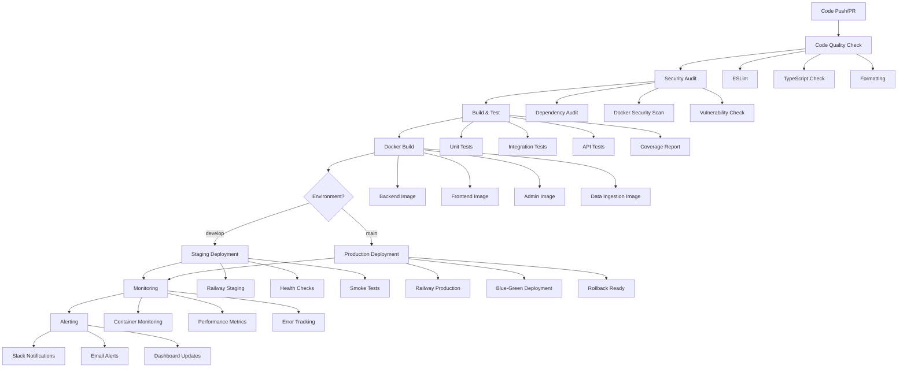
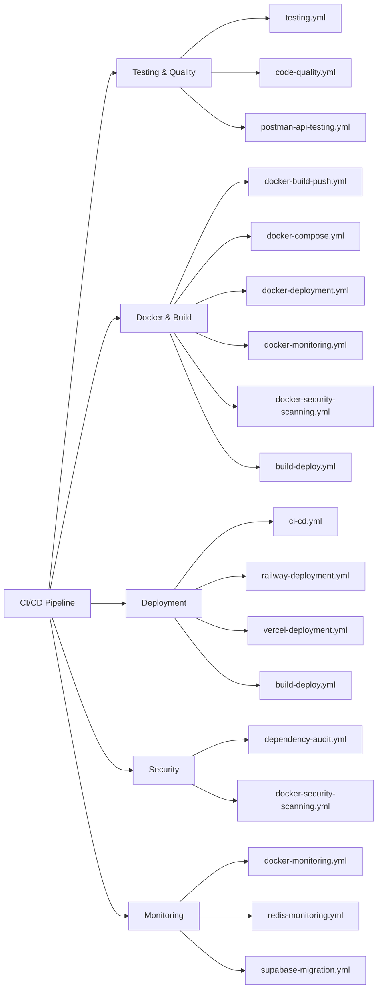
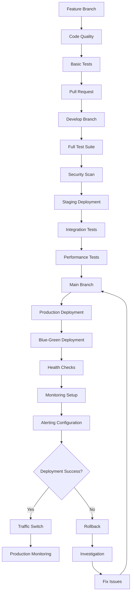
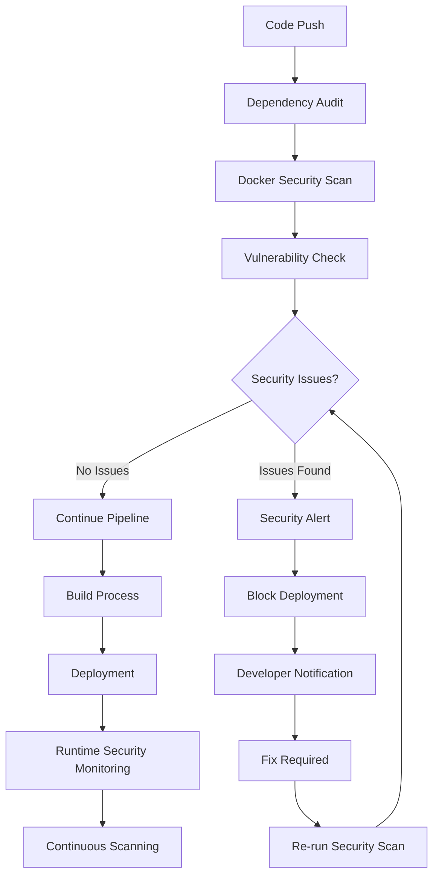
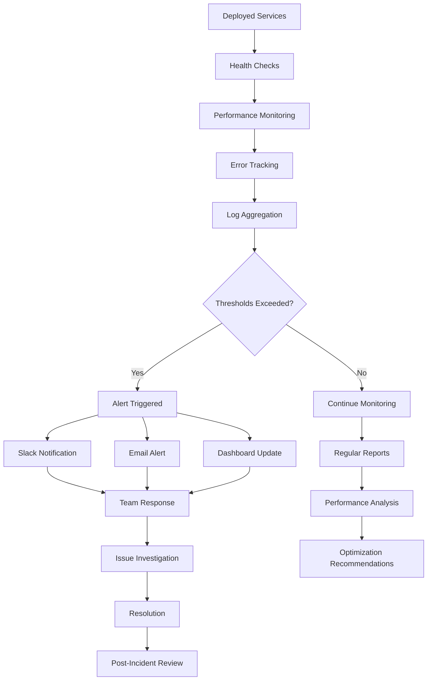
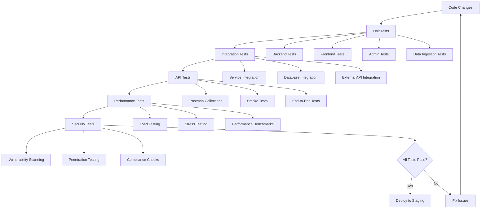
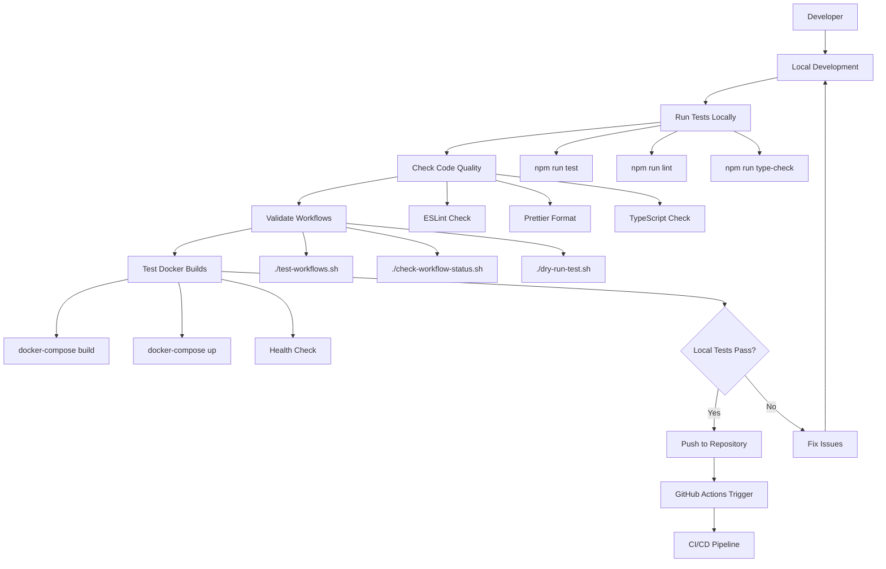
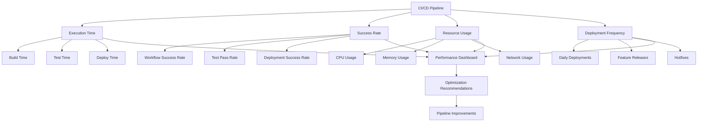
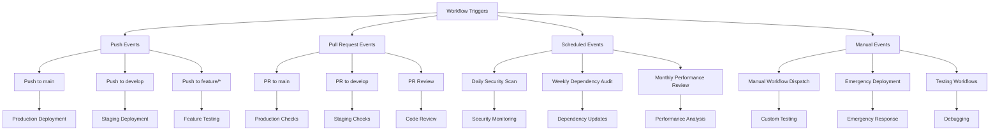

# 🎯 QuantDesk CI/CD Pipeline Architecture

## 📊 Pipeline Flow Diagram

## 🔄 Workflow Categories

## 🚀 Deployment Strategy

## 🔒 Security Pipeline

## 📊 Monitoring & Alerting

## 🧪 Testing Strategy

## 🔧 Local Testing Workflow

## 📈 Performance Metrics

## 🎯 Workflow Triggers

---

**📊 These diagrams provide a visual representation of the QuantDesk CI/CD pipeline architecture, helping you understand the flow, relationships, and decision points in the system.**
