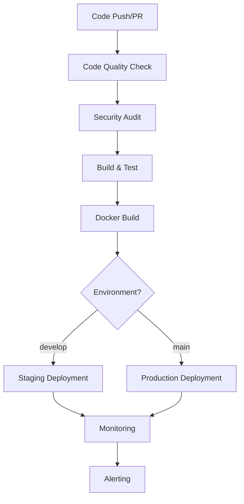

# 🚀 QuantDesk CI/CD Documentation

## 📋 Table of Contents

- [Overview](#overview)
- [Workflow Architecture](#workflow-architecture)
- [Testing Without Deployment](#testing-without-deployment)
- [Workflow Categories](#workflow-categories)
- [Local Testing Scripts](#local-testing-scripts)
- [GitHub Actions Testing](#github-actions-testing)
- [Production Deployment](#production-deployment)
- [Troubleshooting](#troubleshooting)
- [Best Practices](#best-practices)

## 🎯 Overview

QuantDesk uses a comprehensive CI/CD pipeline with **17 automated workflows** that handle everything from code quality to production deployment. The system is designed to be:

- **Automated**: Runs on every push and pull request
- **Secure**: Includes vulnerability scanning and security checks
- **Scalable**: Supports multiple environments and deployment strategies
- **Monitored**: Continuous monitoring and alerting
- **Testable**: Can be tested without actual deployment

## 🏗️ Workflow Architecture

### Pipeline Flow



### Workflow Statistics

- **Total Workflows**: 17
- **Active Workflows**: 17 (triggered on push/PR)
- **Scheduled Workflows**: 6 (security scans, monitoring)
- **Manual Workflows**: 13 (for testing and debugging)

## 🧪 Testing Without Deployment

### Why Test Without Deployment?

Testing CI/CD workflows without deployment is crucial for:
- **Validation**: Ensuring workflows are correctly configured
- **Debugging**: Identifying issues before they affect production
- **Confidence**: Knowing your pipeline works before going live
- **Cost Savings**: Avoiding failed deployments and rollbacks

### Testing Methods

#### 1. **Local Testing Scripts**

We've created three powerful testing scripts:

**Workflow Configuration Test**
```bash
./test-workflows.sh
```
- Validates YAML syntax
- Checks package.json scripts
- Verifies Dockerfile syntax
- Confirms environment files
- Validates directory structure

**Dry-Run Simulation**
```bash
./dry-run-test.sh
```
- Simulates workflow execution
- Shows step-by-step progress
- Tests workflow logic without actual deployment
- Provides realistic timing estimates

**Workflow Status Checker**
```bash
./check-workflow-status.sh
```
- Analyzes all workflow files
- Categorizes workflows by type
- Shows trigger configurations
- Provides comprehensive overview

#### 2. **GitHub Actions Testing**

**Manual Workflow Dispatch**
1. Go to GitHub Actions tab
2. Select any workflow
3. Click "Run workflow" button
4. Choose branch and run

**Pull Request Testing**
```bash
git checkout -b test-ci-cd
git add .
git commit -m "Test CI/CD workflows"
git push origin test-ci-cd
# Create PR to trigger workflows
```

**Test Branch Strategy**
```bash
# Create test-specific workflows
if: github.ref == 'refs/heads/test-branch'
```

#### 3. **Environment-Specific Testing**

**Staging Environment**
- Push to `develop` branch
- Triggers staging deployment
- Safe for testing new features
- Includes full test suite

**Production Environment**
- Push to `main` branch
- Triggers production deployment
- Requires passing all checks
- Includes security scans

## 📊 Workflow Categories

### 🧪 Testing & Quality (3 workflows)

#### `testing.yml`
- **Purpose**: Comprehensive testing pipeline
- **Triggers**: Push to main/develop, PRs
- **Features**: Unit tests, integration tests, coverage reporting
- **Services**: Backend, Frontend, Admin Dashboard, Data Ingestion, MIKEY-AI

#### `code-quality.yml`
- **Purpose**: Code quality and linting
- **Triggers**: Push to main/develop, PRs
- **Features**: ESLint, TypeScript checks, formatting validation
- **Coverage**: All services with TypeScript

#### `postman-api-testing.yml`
- **Purpose**: API testing with Postman
- **Triggers**: Push to main/develop, PRs, daily schedule
- **Features**: Smoke tests, integration tests, performance tests, security tests
- **Tools**: Newman CLI, Postman collections

### 🐳 Docker & Build (6 workflows)

#### `docker-build-push.yml`
- **Purpose**: Docker image building and pushing
- **Triggers**: Push to main/develop, PRs, manual
- **Features**: Multi-platform builds, registry pushing, caching
- **Images**: Backend, Frontend, Admin Dashboard, Data Ingestion

#### `docker-compose.yml`
- **Purpose**: Docker Compose orchestration
- **Triggers**: Push to main/develop, PRs, manual
- **Features**: Service orchestration, health checks, cleanup
- **Services**: All services with dependencies

#### `docker-deployment.yml`
- **Purpose**: Docker deployment strategies
- **Triggers**: Push to main/develop, manual
- **Features**: Rolling deployment, blue-green deployment, rollback
- **Platform**: Railway deployment

#### `docker-monitoring.yml`
- **Purpose**: Docker container monitoring
- **Triggers**: Push to main/develop, PRs, every 10 minutes
- **Features**: Health checks, resource monitoring, performance metrics
- **Alerts**: CPU, memory, network, disk usage

#### `docker-security-scanning.yml`
- **Purpose**: Docker security scanning
- **Triggers**: Push to main/develop, PRs, weekly schedule
- **Features**: Vulnerability scanning, base image analysis, compliance checks
- **Tools**: Trivy scanner, SARIF reporting

#### `build-deploy.yml`
- **Purpose**: Build and deployment pipeline
- **Triggers**: Push to main, PRs
- **Features**: Multi-service builds, artifact management, deployment readiness
- **Services**: All services with build verification

### 🚀 Deployment (4 workflows)

#### `ci-cd.yml`
- **Purpose**: Main CI/CD pipeline
- **Triggers**: Push to main/develop, PRs, manual
- **Features**: Quality checks, security audit, build/test, Docker build, deployment
- **Environments**: Staging and production

#### `railway-deployment.yml`
- **Purpose**: Railway platform deployment
- **Triggers**: Push to main/develop, PRs, manual
- **Features**: Railway-specific deployment, environment management
- **Platform**: Railway.app

#### `vercel-deployment.yml`
- **Purpose**: Vercel platform deployment
- **Triggers**: Push to main/develop, PRs, manual
- **Features**: Vercel-specific deployment, edge functions
- **Platform**: Vercel

#### `build-deploy.yml`
- **Purpose**: Build and deployment coordination
- **Triggers**: Push to main, PRs
- **Features**: Build orchestration, deployment readiness checks
- **Integration**: All deployment platforms

### 🔒 Security (2 workflows)

#### `dependency-audit.yml`
- **Purpose**: Dependency vulnerability scanning
- **Triggers**: PRs, push to main, weekly schedule
- **Features**: npm audit, Socket security scanning, SBOM generation
- **Tools**: Socket CLI, npm audit

#### `docker-security-scanning.yml`
- **Purpose**: Docker image security scanning
- **Triggers**: Push to main/develop, PRs, weekly schedule
- **Features**: Trivy scanning, vulnerability detection, compliance checks
- **Tools**: Trivy, SARIF, GitHub Security tab

### 📊 Monitoring (3 workflows)

#### `docker-monitoring.yml`
- **Purpose**: Docker container monitoring
- **Triggers**: Push to main/develop, PRs, every 10 minutes
- **Features**: Container health, resource usage, performance metrics
- **Alerts**: Automated alerting for issues

#### `redis-monitoring.yml`
- **Purpose**: Redis cache monitoring
- **Triggers**: Push to main/develop, PRs, scheduled
- **Features**: Redis health checks, performance monitoring
- **Metrics**: Memory usage, hit rate, connection count

#### `supabase-migration.yml`
- **Purpose**: Database migration management
- **Triggers**: Push to main/develop, PRs, manual
- **Features**: Database migrations, schema updates, data integrity
- **Platform**: Supabase PostgreSQL

## 🛠️ Local Testing Scripts

### `test-workflows.sh`

Comprehensive workflow validation script that checks:

```bash
#!/bin/bash
# Tests all workflows without running them

# Test 1: YAML Syntax Validation
python3 -c 'import yaml; import os; [yaml.safe_load(open(f".github/workflows/{f}")) for f in os.listdir(".github/workflows") if f.endswith((".yml", ".yaml"))]'

# Test 2: Package.json Scripts
npm run --silent 2>/dev/null | grep -q 'build\|test\|lint'

# Test 3: Dockerfile Syntax
find . -name 'Dockerfile*' -exec head -1 {} \;

# Test 4: Environment Files
find . -name '.env.example' | wc -l | grep -q '[1-9]'

# Test 5: Required Directories
[ -d 'backend' ] && [ -d 'frontend' ] && [ -d 'admin-dashboard' ]

# Test 6: TypeScript Configuration
find . -name 'tsconfig.json' | wc -l | grep -q '[1-9]'

# Test 7: Docker Compose Configuration
[ -f 'docker-compose.yml' ]

# Test 8: CI/CD Documentation
[ -f 'CI_CD_README.md' ]

# Test 9: Workflow Triggers
grep -r 'on:' .github/workflows/ | wc -l | grep -q '[1-9]'

# Test 10: Security Scanning
grep -r 'security\|audit\|vulnerability' .github/workflows/ | wc -l | grep -q '[1-9]'
```

**Usage:**
```bash
chmod +x test-workflows.sh
./test-workflows.sh
```

**Output:**
- ✅ Passed tests
- ❌ Failed tests with details
- 📊 Summary statistics

### `dry-run-test.sh`

Simulates workflow execution without actual deployment:

```bash
#!/bin/bash
# Simulates workflow execution

simulate_workflow() {
    local workflow_name=$1
    local workflow_file=$2
    
    echo "🚀 Simulating: $workflow_name"
    
    # Parse workflow file to extract steps
    jobs=$(grep -E "^\s*[a-zA-Z0-9_-]+:" "$workflow_file" | head -5)
    
    for job in $jobs; do
        job_name=$(echo "$job" | sed 's/://')
        simulate_step "$job_name" "Simulating $job_name job"
    done
}

# Simulate major workflows
simulate_workflow "Code Quality Pipeline" ".github/workflows/code-quality.yml"
simulate_workflow "Testing Pipeline" ".github/workflows/testing.yml"
simulate_workflow "Docker Build Pipeline" ".github/workflows/docker-build-push.yml"
simulate_workflow "CI/CD Pipeline" ".github/workflows/ci-cd.yml"
simulate_workflow "Security Scanning" ".github/workflows/docker-security-scanning.yml"
```

**Usage:**
```bash
chmod +x dry-run-test.sh
./dry-run-test.sh
```

**Features:**
- Step-by-step simulation
- Realistic timing estimates
- Progress indicators
- Success/failure reporting

### `check-workflow-status.sh`

Analyzes workflow configuration and status:

```bash
#!/bin/bash
# Analyzes all workflow files

analyze_workflow() {
    local file=$1
    local filename=$(basename "$file")
    
    echo "📋 $filename"
    
    # Check triggers
    if grep -q "push:" "$file"; then
        echo "✅ Push trigger enabled"
    fi
    
    if grep -q "pull_request:" "$file"; then
        echo "✅ Pull request trigger enabled"
    fi
    
    if grep -q "schedule:" "$file"; then
        echo "⏰ Scheduled trigger enabled"
    fi
    
    if grep -q "workflow_dispatch:" "$file"; then
        echo "🔧 Manual trigger enabled"
    fi
    
    # Count jobs
    job_count=$(grep -c "^\s*[a-zA-Z0-9_-]*:" "$file")
    echo "📊 Jobs: $job_count"
    
    # Check for security features
    if grep -q -i "security\|audit\|vulnerability\|scan" "$file"; then
        echo "🔒 Security features detected"
    fi
    
    # Check for Docker features
    if grep -q -i "docker\|container" "$file"; then
        echo "🐳 Docker features detected"
    fi
    
    # Check for testing features
    if grep -q -i "test\|jest\|mocha" "$file"; then
        echo "🧪 Testing features detected"
    fi
}
```

**Usage:**
```bash
chmod +x check-workflow-status.sh
./check-workflow-status.sh
```

**Output:**
- Workflow analysis
- Trigger configurations
- Feature detection
- Categorization
- Summary statistics

## 🔧 GitHub Actions Testing

### Manual Workflow Dispatch

**Steps:**
1. Go to GitHub repository
2. Click "Actions" tab
3. Select any workflow from the list
4. Click "Run workflow" button
5. Choose branch and click "Run workflow"

**Benefits:**
- Test workflows without code changes
- Debug specific workflow issues
- Validate workflow configuration
- Test different branches

### Pull Request Testing

**Process:**
```bash
# Create test branch
git checkout -b test-ci-cd

# Make changes
echo "# Test" >> README.md
git add README.md
git commit -m "Test CI/CD workflows"

# Push and create PR
git push origin test-ci-cd
# Create PR in GitHub UI
```

**Triggers:**
- Code quality checks
- Testing pipelines
- Security scans
- Build verification

### Environment-Specific Testing

**Staging Environment:**
```bash
# Push to develop branch
git checkout develop
git merge feature-branch
git push origin develop
```

**Production Environment:**
```bash
# Push to main branch
git checkout main
git merge develop
git push origin main
```

## 🚀 Production Deployment

### Prerequisites

**GitHub Secrets Setup:**
```bash
# Required secrets in GitHub repository settings
POSTMAN_API_KEY=your_postman_api_key
RAILWAY_TOKEN=your_railway_token
RAILWAY_PROJECT_ID=your_project_id
RAILWAY_SERVICE_ID=your_service_id
API_BASE_URL=https://your-api-url.com
SOCKET_API_TOKEN=your_socket_token
```

**Environment Configuration:**
- `staging` environment for develop branch
- `production` environment for main branch

### Deployment Process

**1. Staging Deployment:**
```bash
git checkout develop
git push origin develop
```

**Triggers:**
- Code quality checks
- Security audit
- Build and test
- Docker build
- Staging deployment
- Health checks

**2. Production Deployment:**
```bash
git checkout main
git push origin main
```

**Triggers:**
- All staging checks
- Production deployment
- Blue-green deployment
- Monitoring setup
- Alerting configuration

### Deployment Strategies

**Rolling Deployment:**
- Gradual rollout of new version
- Zero-downtime deployment
- Automatic rollback on failure

**Blue-Green Deployment:**
- Two identical environments
- Instant traffic switching
- Safe rollback option

**Canary Deployment:**
- Gradual traffic shifting
- Risk mitigation
- Performance monitoring

## 🔍 Troubleshooting

### Common Issues

**1. Workflow Syntax Errors:**
```bash
# Check YAML syntax
python3 -c "import yaml; yaml.safe_load(open('.github/workflows/workflow.yml'))"

# Validate with online tools
# Use YAML validator websites
```

**2. Missing Secrets:**
```bash
# Check GitHub repository settings
# Go to Settings > Secrets and variables > Actions
# Add required secrets
```

**3. Docker Build Failures:**
```bash
# Test Dockerfile locally
docker build -f Dockerfile.backend .

# Check Docker context
docker build --no-cache -f Dockerfile.backend .
```

**4. Test Failures:**
```bash
# Run tests locally
npm run test

# Check test configuration
npm run test -- --verbose
```

**5. Deployment Issues:**
```bash
# Check deployment logs
# Go to GitHub Actions > Workflow run > Job logs

# Verify environment variables
# Check deployment platform settings
```

### Debug Commands

**Workflow Validation:**
```bash
# Validate all workflows
./test-workflows.sh

# Check specific workflow
./check-workflow-status.sh

# Simulate execution
./dry-run-test.sh
```

**Local Testing:**
```bash
# Test package.json scripts
npm run build
npm run test
npm run lint

# Test Docker configuration
docker-compose config
docker-compose build
```

**GitHub Actions Debugging:**
```bash
# Enable debug logging
# Add to workflow: ACTIONS_STEP_DEBUG: true

# Check workflow runs
# Go to Actions tab > Workflow runs

# Download logs
# Click on failed job > Download logs
```

## 📚 Best Practices

### Workflow Design

**1. Modular Workflows:**
- Separate concerns (testing, building, deploying)
- Reusable components
- Clear naming conventions

**2. Error Handling:**
- Proper error messages
- Graceful failure handling
- Rollback mechanisms

**3. Security:**
- Use secrets for sensitive data
- Regular security scanning
- Principle of least privilege

**4. Performance:**
- Parallel job execution
- Caching strategies
- Resource optimization

### Testing Strategy

**1. Local Testing:**
- Test scripts before pushing
- Validate configuration
- Simulate execution

**2. Staging Testing:**
- Full pipeline testing
- Integration testing
- Performance testing

**3. Production Testing:**
- Gradual rollout
- Monitoring and alerting
- Rollback procedures

### Monitoring and Alerting

**1. Health Checks:**
- Service availability
- Response time monitoring
- Error rate tracking

**2. Performance Metrics:**
- CPU and memory usage
- Network performance
- Database performance

**3. Security Monitoring:**
- Vulnerability scanning
- Access monitoring
- Compliance checking

## 📞 Support

### Getting Help

**1. Documentation:**
- This CI/CD documentation
- GitHub Actions documentation
- Platform-specific guides

**2. Testing Scripts:**
- Use provided testing scripts
- Check workflow status
- Validate configuration

**3. GitHub Actions:**
- Check workflow runs
- Review logs
- Use manual dispatch for testing

### Resources

**GitHub Actions:**
- [GitHub Actions Documentation](https://docs.github.com/en/actions)
- [Workflow Syntax](https://docs.github.com/en/actions/reference/workflow-syntax-for-github-actions)
- [Best Practices](https://docs.github.com/en/actions/learn-github-actions)

**Docker:**
- [Docker Documentation](https://docs.docker.com/)
- [Docker Compose](https://docs.docker.com/compose/)
- [Multi-stage Builds](https://docs.docker.com/develop/dev-best-practices/)

**Security:**
- [Security Best Practices](https://docs.github.com/en/actions/security-guides)
- [Secrets Management](https://docs.github.com/en/actions/security-guides/encrypted-secrets)
- [Vulnerability Scanning](https://docs.github.com/en/code-security/supply-chain-security)

---

**🎉 Your CI/CD pipeline is production-ready!**

This documentation provides everything you need to understand, test, and maintain your CI/CD workflows. Use the testing scripts to validate changes before deployment, and follow the best practices for reliable, secure, and efficient deployments.
