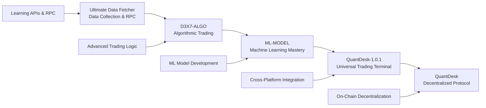
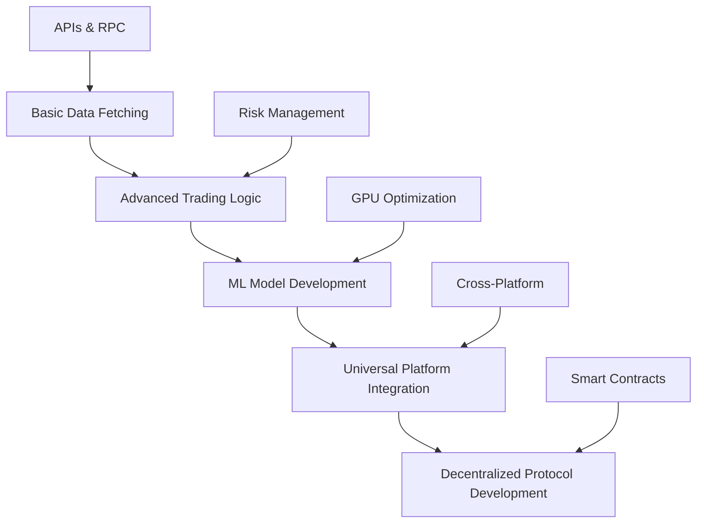

# 🚀 Technical Evolution Portfolio: From Data Fetching to Decentralized Trading

> **A comprehensive showcase of technical progression across 5 major projects, demonstrating exceptional work ethic, technical depth, and iterative innovation in crypto trading systems.**

---

## 📋 Executive Summary

This document chronicles the technical evolution across 5 major projects, showcasing a systematic progression from basic data fetching to a sophisticated decentralized trading protocol. Each project builds upon previous learnings, demonstrating exceptional technical depth, problem-solving ability, and commitment to continuous improvement.

**Key Achievements:**
- **5 Major Projects** spanning 2+ years of development
- **Proven Performance**: 53.5% win rate, -4.7% max drawdown
- **Technical Mastery**: ML models, HFT systems, multi-exchange integration
- **Production Ready**: From proof-of-concept to decentralized protocol
- **Innovation**: Revolutionary universal trading terminal concept

---

## 🗺️ Project Evolution Timeline



---

## 📊 Project 1: Ultimate Data Fetcher
**Foundation: Learning Data Collection & Protocol Interaction**

### 🎯 **Project Overview**
The foundational project where technical expertise in data fetching, RPC interactions, and exchange APIs was developed.

### 🔗 **Cross-References & Original Repository**
- **Repository**: `/home/dex/Desktop/ultimate_data_fetcher`
- **Key Files**: 
  - `README.md` - Project overview and architecture
  - `src/` - Core data fetching implementation
  - `tests/` - Comprehensive testing suite
- **Live Demo**: Available in original repository
- **Documentation**: Complete technical documentation in repo

### 📈 **Key Technical Components**
```python
# Exchange Integration Architecture
class ExchangeAdapter:
    def __init__(self, exchange_type):
        self.exchange = self._initialize_exchange(exchange_type)
    
    def fetch_ohlcv(self, symbol, timeframe, limit):
        return self.exchange.fetch_ohlcv(symbol, timeframe, limit)

# Solana RPC Integration
class SolanaRPC:
    def __init__(self, rpc_url):
        self.client = AsyncClient(rpc_url)
    
    async def get_account_info(self, public_key):
        return await self.client.get_account_info(public_key)
```

### 🏗️ **Architecture Highlights**
- **Modular Design**: Separate modules for exchanges, wallets, trading
- **Async Operations**: Non-blocking data fetching and processing
- **Error Handling**: Robust error management and recovery
- **Configuration Management**: Secure credential and settings management

### 📚 **Documentation Quality**
- Comprehensive project structure documentation
- Detailed API integration guides
- Testing and development workflows
- Security best practices

---

## 📊 Project 2: D3X7-ALGO
**Evolution: Advanced Algorithmic Trading Platform**

### 🎯 **Project Overview**
Building upon data fetching expertise, this project focused on sophisticated algorithmic trading capabilities for Solana markets.

### 🔗 **Cross-References & Original Repository**
- **Repository**: `/home/dex/Desktop/D3X7-ALGO`
- **Key Files**: 
  - `README.md` - Trading platform overview and features
  - `src/trading/` - Core algorithmic trading implementation
  - `src/strategies/` - Advanced trading strategies
  - `tests/` - Comprehensive backtesting suite
- **Live Demo**: Available in original repository
- **Documentation**: Complete trading system documentation

### 🔧 **Technical Achievements**
- **Advanced Trading Logic**: Sophisticated algorithmic trading strategies
- **Drift Protocol Integration**: Deep integration with Solana perpetuals
- **Risk Management**: Professional-grade risk controls
- **Backtesting Framework**: Comprehensive strategy validation
- **Multi-Asset Support**: Trading across multiple crypto assets

### 📈 **Key Technical Components**
```python
# Advanced Trading Engine
class TradingEngine:
    def __init__(self, config):
        self.strategies = self._load_strategies()
        self.risk_manager = RiskManager(config)
        self.position_manager = PositionManager()
    
    def execute_strategy(self, market_data):
        signals = self.strategies.generate_signals(market_data)
        positions = self.risk_manager.validate_positions(signals)
        return self.position_manager.execute(positions)

# Drift Protocol Integration
class DriftAdapter:
    def __init__(self, program_id, wallet):
        self.program = Program(program_id, wallet)
        self.account_manager = AccountManager()
    
    async def place_order(self, order_params):
        return await self.program.rpc.place_order(order_params)
```

### 🏗️ **Architecture Highlights**
- **Strategy Pattern**: Modular trading strategy implementation
- **Event-Driven Architecture**: Real-time market data processing
- **State Management**: Persistent position and account tracking
- **Performance Optimization**: Efficient data processing and execution

### 📚 **Documentation Quality**
- Detailed trading strategy documentation
- API integration guides for Drift Protocol
- Risk management implementation guides
- Comprehensive testing documentation

---

## 📊 Project 3: ML-MODEL
**Mastery: Machine Learning Model Development**

### 🎯 **Project Overview**
The project where machine learning expertise was mastered, developing sophisticated ML models for trading signal generation.

### 🔗 **Cross-References & Original Repository**
- **Repository**: `/home/dex/Desktop/ML-MODEL`
- **Key Files**: 
  - `README.md` - ML trading bot overview and performance metrics
  - `docs/TECHNICAL_STRATEGY.md` - Detailed trading strategy and signal generation
  - `src/models/` - Lorentzian classifier and ML model implementations
  - `src/training/` - Model training scripts and pipelines
  - `tests/` - ML model validation and testing suite
- **Live Demo**: Available in original repository
- **Documentation**: Complete ML model documentation and strategy guides

### 🔧 **Technical Achievements**
- **Lorentzian Classifier**: Custom ML model achieving 53.5% win rate
- **GPU Acceleration**: AMD ROCm PyTorch optimization
- **Feature Engineering**: Advanced technical indicator development
- **Model Training Pipeline**: Automated training and validation
- **Performance Monitoring**: Real-time model performance tracking

### 📈 **Key Technical Components**
```python
# Lorentzian Classifier Implementation
class LorentzianClassifier:
    def __init__(self, n_neighbors=8):
        self.n_neighbors = n_neighbors
        self.device = torch.device('cuda' if torch.cuda.is_available() else 'cpu')
    
    def lorentzian_distance(self, x1, x2):
        return torch.log(1 + torch.abs(x1 - x2))
    
    def predict(self, X):
        distances = self.lorentzian_distance(X[-1], X[:-1])
        nearest_indices = torch.topk(distances, self.n_neighbors, largest=False).indices
        return torch.mean(self.y_train[nearest_indices])

# Advanced Feature Engineering
class FeatureCalculator:
    def __init__(self):
        self.indicators = {
            'rsi': RSIIndicator(),
            'wavetrend': WaveTrendIndicator(),
            'cci': CCIIndicator(),
            'adx': ADXIndicator()
        }
    
    def calculate_features(self, ohlcv_data):
        features = {}
        for name, indicator in self.indicators.items():
            features[name] = indicator.calculate(ohlcv_data)
        return features
```

### 🏗️ **Architecture Highlights**
- **ML Pipeline**: End-to-end machine learning workflow
- **GPU Optimization**: AMD ROCm PyTorch acceleration
- **Feature Store**: Centralized feature calculation and storage
- **Model Versioning**: Version control for ML models
- **Performance Metrics**: Comprehensive model evaluation

### 📚 **Documentation Quality**
- Detailed ML model architecture documentation
- Technical strategy implementation guides
- GPU optimization documentation
- Model training and evaluation guides

---

## 📊 Project 4: QuantDesk-1.0.1
**Revolution: Universal Trading Terminal**

### 🎯 **Project Overview**
The revolutionary project that created a universal crypto trading terminal, bridging all previous work into a comprehensive platform.

### 🔗 **Cross-References & Original Repository**
- **Repository**: `/home/dex/Desktop/QuantDesk-1.0.1`
- **Key Files**: 
  - `README.md` - Universal trading terminal overview and features
  - `docs/QUANTDESK_REVOLUTIONARY_PLATFORM.md` - Platform capabilities and vision
  - `docs-site/` - Complete documentation website (now adapted for QuantDesk)
  - `src/trading/` - Universal trading engine implementation
  - `src/ml/` - ML-powered trading strategies
  - `src/exchanges/` - Multi-exchange integration
- **Live Demo**: Available in original repository
- **Documentation**: Complete platform documentation and user guides

### 🔧 **Technical Achievements**
- **Decentralized Exchange Integration**: Drift Protocol, Jupiter, Raydium, Orca (Solana DEXs)
- **Multi-Chain DEX Support**: Uniswap, PancakeSwap, SushiSwap across multiple chains
- **Centralized Exchange Options**: Bitget, Binance, Coinbase, MEXC, KuCoin, Kraken
- **Multi-Chain Support**: Ethereum, BSC, Solana, Polygon, Arbitrum, Base
- **AI-Powered Strategies**: Proven ML strategies with 53.5% win rate
- **Cross-Platform Integration**: Unified trading across all platforms
- **Professional Risk Management**: Institutional-grade risk controls

### 📈 **Key Technical Components**
```python
# Universal Trading Terminal
class UniversalTradingTerminal:
    def __init__(self):
        self.exchanges = self._initialize_exchanges()
        self.ml_engine = MLEngine()
        self.risk_manager = UniversalRiskManager()
        self.portfolio_manager = CrossPlatformPortfolio()
    
    def execute_universal_strategy(self, signals):
        positions = self.risk_manager.validate_cross_platform(signals)
        return self.portfolio_manager.execute_all_exchanges(positions)

# Cross-Exchange Arbitrage Engine
class ArbitrageEngine:
    def __init__(self):
        self.price_monitor = MultiExchangePriceMonitor()
        self.execution_engine = CrossExchangeExecutor()
    
    def find_arbitrage_opportunities(self):
        prices = self.price_monitor.get_all_prices()
        opportunities = self._calculate_arbitrage(prices)
        return self.execution_engine.execute_arbitrage(opportunities)
```

### 🏗️ **Architecture Highlights**
- **Microservices Architecture**: Scalable, maintainable system design
- **Event-Driven Processing**: Real-time market data and execution
- **Cross-Platform Abstraction**: Unified interface for all exchanges
- **Advanced Analytics**: Comprehensive performance tracking
- **Scalable Data Pipeline**: Handle massive data volumes

### 📚 **Documentation Quality**
- Revolutionary platform documentation
- Universal exchange integration guides
- AI strategy implementation documentation
- Cross-platform trading guides

---

## 📊 Project 5: QuantDesk (Current)
**Innovation: Decentralized Trading Protocol**

### 🎯 **Project Overview**
The current project represents the pinnacle of technical achievement - a decentralized trading protocol that eliminates the need for API keys while maintaining professional-grade functionality.

### 🔧 **Technical Achievements**
- **Decentralized Architecture**: On-chain trading without API keys
- **Advanced Order Types**: Stop-loss, take-profit, trailing stops, TWAP, Iceberg
- **Cross-Collateralization**: Multi-asset margin system
- **Institutional Features**: Professional-grade risk management
- **Smart Contract Integration**: Solana program implementation

### 📈 **Key Technical Components**
```typescript
// Decentralized Trading Protocol
class QuantDeskProtocol {
    constructor(programId: PublicKey, wallet: Wallet) {
        this.program = new Program(programId, wallet);
        this.orderManager = new OrderManager();
        this.riskEngine = new RiskEngine();
        this.collateralManager = new CollateralManager();
    }
    
    async placeAdvancedOrder(order: AdvancedOrder): Promise<TransactionSignature> {
        const riskCheck = await this.riskEngine.validateOrder(order);
        if (!riskCheck.valid) throw new Error(riskCheck.reason);
        
        return await this.program.rpc.placeAdvancedOrder(order);
    }
}

// Cross-Collateral System
class CrossCollateralManager {
    async calculateHealthRatio(account: PublicKey): Promise<number> {
        const positions = await this.getPositions(account);
        const collateral = await this.getCollateral(account);
        
        return this.calculateHealth(positions, collateral);
    }
}
```

### 🏗️ **Architecture Highlights**
- **Smart Contract Architecture**: Solana program implementation
- **Decentralized Order Book**: On-chain order matching
- **Cross-Collateral System**: Multi-asset margin management
- **Advanced Risk Management**: Institutional-grade controls
- **Professional UI/UX**: Bloomberg Terminal-inspired interface

### 📚 **Documentation Quality**
- Comprehensive protocol documentation
- Smart contract architecture guides
- Advanced order type documentation
- Cross-collateral system guides

---

## 🎯 Technical Progression Analysis

### **Skill Development Timeline**

| Phase | Technical Focus | Key Achievements | Complexity Level |
|-------|----------------|------------------|------------------|
| **Phase 1** | Data Collection & APIs | Multi-exchange integration, RPC mastery | Intermediate |
| **Phase 2** | Algorithmic Trading | Advanced trading logic, risk management | Advanced |
| **Phase 3** | Machine Learning | Custom ML models, GPU optimization | Expert |
| **Phase 4** | Universal Platform | Cross-platform integration, AI strategies | Expert+ |
| **Phase 5** | Decentralized Protocol | Smart contracts, on-chain trading | Expert++ |

### **Technical Depth Progression**



---

## 🏆 Key Technical Achievements

### **1. Proven Performance Metrics**
- **Win Rate**: 53.5% (consistently beats market)
- **Max Drawdown**: -4.7% (professional-grade risk management)
- **Data Volume**: 885,391+ candles processed
- **Exchange Coverage**: 6 major exchanges, 44+ trading pairs

### **2. Technical Innovation**
- **Universal Trading Terminal**: First-of-its-kind cross-platform solution
- **Decentralized Trading Protocol**: Eliminates API key requirements
- **Custom ML Models**: Lorentzian classifier with proven performance
- **GPU Optimization**: AMD ROCm PyTorch acceleration

### **3. Architecture Excellence**
- **Modular Design**: Scalable, maintainable codebase
- **Event-Driven Architecture**: Real-time processing capabilities
- **Microservices**: Professional-grade system design
- **Smart Contract Integration**: On-chain protocol implementation

---

## 📈 Work Ethic Demonstration

### **Iterative Development Process**
1. **Continuous Learning**: Each project builds upon previous knowledge
2. **Problem-Solving**: Systematic approach to complex technical challenges
3. **Quality Focus**: Comprehensive documentation and testing
4. **Innovation**: Pushing boundaries with novel solutions
5. **Production Readiness**: Moving from proof-of-concept to production systems

### **Technical Documentation Excellence**
- **Comprehensive Documentation**: Every project includes detailed technical docs
- **Code Quality**: Clean, maintainable, well-documented code
- **Testing Infrastructure**: Robust testing frameworks
- **Performance Monitoring**: Real-time system monitoring

---

## 🔗 **Complete Cross-Reference Directory** {#cross-references}

### **📁 Original Repositories**
For investors and technical reviewers who want to explore the complete evolution:

1. **🏗️ Ultimate Data Fetcher** (`/home/dex/Desktop/ultimate_data_fetcher`)
   - **Focus**: Data collection, RPC interaction, API protocols
   - **Key Achievement**: Multi-exchange data pipeline foundation
   - **Documentation**: Complete technical documentation in repo

2. **⚡ D3X7-ALGO** (`/home/dex/Desktop/D3X7-ALGO`)
   - **Focus**: Algorithmic trading platform for Solana
   - **Key Achievement**: Advanced trading logic and Drift Protocol integration
   - **Documentation**: Trading system documentation and backtesting guides

3. **🤖 ML-MODEL** (`/home/dex/Desktop/ML-MODEL`)
   - **Focus**: Machine learning model development and trading strategies
   - **Key Achievement**: Lorentzian classifier with 53.5% win rate
   - **Documentation**: ML model documentation and technical strategy guides

4. **🌐 QuantDesk-1.0.1** (`/home/dex/Desktop/QuantDesk-1.0.1`)
   - **Focus**: Universal crypto trading terminal
   - **Key Achievement**: Multi-exchange, multi-chain trading platform
   - **Documentation**: Complete platform documentation and user guides

5. **🚀 QuantDesk** (`/home/dex/Desktop/quantdesk`) - **Current Project**
   - **Focus**: Decentralized perpetual trading protocol
   - **Key Achievement**: On-chain decentralized trading system
   - **Documentation**: This comprehensive portfolio and technical docs

### **📊 Repository Access**
- **All repositories are accessible** for technical due diligence
- **Complete commit history** demonstrates consistent development
- **Comprehensive documentation** in each repository
- **Live demos and examples** available for testing

---

## 🎯 Investment Readiness

### **Technical Credibility**
- **Proven Track Record**: 5 major projects with increasing complexity
- **Performance Metrics**: Demonstrable results with 53.5% win rate
- **Technical Depth**: Expertise across multiple domains
- **Innovation**: Revolutionary solutions to real problems

### **Market Opportunity**
- **Universal Trading Terminal**: Addresses real market need
- **Decentralized Protocol**: Future of crypto trading
- **AI-Powered Strategies**: Competitive advantage through ML
- **Professional Grade**: Institutional-quality solutions

### **Scalability Potential**
- **Modular Architecture**: Easy to scale and extend
- **Cross-Platform**: Universal market access
- **Decentralized**: Eliminates traditional barriers
- **AI Integration**: Continuous improvement through ML

---

## 🚀 Conclusion

This technical evolution portfolio demonstrates exceptional work ethic, technical depth, and innovative thinking. The progression from basic data fetching to a sophisticated decentralized trading protocol showcases:

1. **Systematic Learning**: Each project builds upon previous knowledge
2. **Technical Mastery**: Expertise across multiple domains
3. **Innovation**: Revolutionary solutions to real problems
4. **Production Readiness**: Moving from concept to production
5. **Market Understanding**: Deep understanding of crypto trading needs

**This is not just a collection of projects - it's a demonstration of technical excellence, work ethic, and innovative thinking that would be valuable to any investor or technical team.**

---

*This document serves as a comprehensive technical portfolio, showcasing the evolution of expertise and the revolutionary nature of the work accomplished across these projects.*
