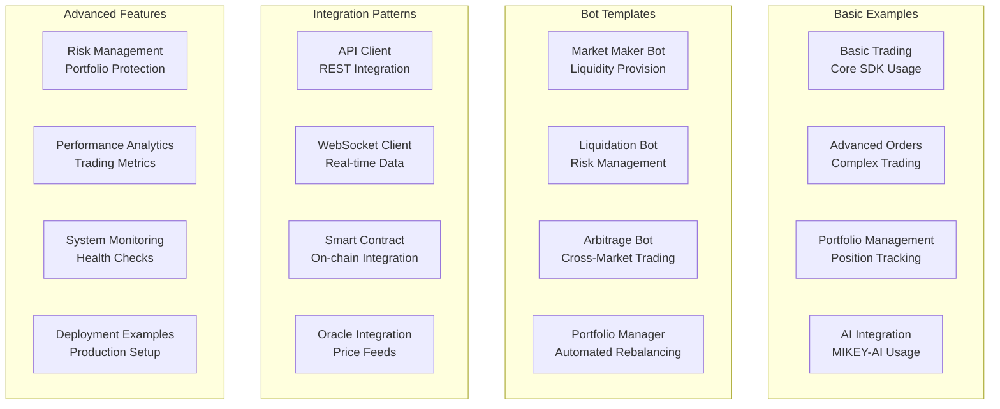

# QuantDesk Examples

## 🚀 **Comprehensive Integration Examples**

This directory contains comprehensive examples demonstrating QuantDesk's capabilities, showcasing our complete multi-service architecture and professional-grade implementation.

## 📊 **Examples Overview**



## 🎯 **Basic Examples**

### **Basic Trading Example**
**File:** `basic-trading.ts`
**Description:** Comprehensive example of QuantDesk SDK usage for basic trading operations

**Features:**
- Client initialization and setup
- Market data retrieval
- Portfolio overview
- Position management
- Order placement and monitoring
- AI analysis integration

**Usage:**
```typescript
import { BasicTradingExample } from './basic-trading';

const example = new BasicTradingExample(client);
await example.runExample();
```

### **Advanced Orders Example**
**File:** `advanced-orders.ts`
**Description:** Advanced order management and execution strategies

**Features:**
- Limit orders with custom parameters
- Stop-loss and take-profit orders
- Order modification and cancellation
- Order book analysis
- Advanced order types

### **Portfolio Management Example**
**File:** `portfolio-management.ts`
**Description:** Comprehensive portfolio tracking and management

**Features:**
- Real-time portfolio monitoring
- Position analysis and reporting
- Risk assessment and management
- Performance tracking
- Portfolio optimization

### **AI Integration Example**
**File:** `ai-integration.ts`
**Description:** MIKEY-AI integration and usage patterns

**Features:**
- Market sentiment analysis
- Trading signal generation
- Risk assessment
- Natural language chat
- AI-powered insights

## 🤖 **Trading Bot Templates**

### **Market Maker Bot**
**File:** `bots/market-maker.ts`
**Description:** Professional market making implementation

**Features:**
- Automated bid/ask order placement
- Dynamic spread adjustment
- Risk management
- Position monitoring
- Performance optimization

**Configuration:**
```typescript
const bot = new MarketMakerBot({
  client: client,
  market: 'SOL-PERP',
  spread: 0.001,        // 0.1% spread
  size: 0.1,           // 0.1 SOL per order
  maxPositions: 5,
  updateInterval: 5000, // 5 seconds
  minSpread: 0.0005,   // 0.05% minimum spread
  maxSpread: 0.002     // 0.2% maximum spread
});
```

### **Liquidation Bot**
**File:** `bots/liquidator.ts`
**Description:** Automated liquidation system

**Features:**
- Real-time position monitoring
- Liquidation threshold detection
- Automated liquidation execution
- Gas price optimization
- Risk management

**Configuration:**
```typescript
const bot = new LiquidationBot({
  client: client,
  markets: ['SOL-PERP', 'ETH-PERP', 'BTC-PERP'],
  liquidationThreshold: 0.8,  // 80% liquidation threshold
  maxGasPrice: 0.001,          // Max 0.001 SOL gas price
  updateInterval: 2000,        // 2 seconds
  minLiquidationSize: 0.01,    // Min 0.01 SOL position size
  maxLiquidationSize: 100      // Max 100 SOL position size
});
```

### **Arbitrage Bot**
**File:** `bots/arbitrage.ts`
**Description:** Cross-market arbitrage trading

**Features:**
- Multi-market price monitoring
- Arbitrage opportunity detection
- Automated trade execution
- Risk management
- Profit optimization

**Configuration:**
```typescript
const bot = new ArbitrageBot({
  client: client,
  markets: ['SOL-PERP', 'ETH-PERP', 'BTC-PERP'],
  minProfit: 0.001,        // 0.1% minimum profit
  maxSize: 1.0,           // Max 1 SOL per trade
  updateInterval: 3000,   // 3 seconds
  maxPositions: 3,        // Max 3 concurrent positions
  gasLimit: 0.001        // Max 0.001 SOL gas price
});
```

### **Portfolio Manager Bot**
**File:** `bots/portfolio-mgr.ts`
**Description:** Automated portfolio management

**Features:**
- Target allocation management
- Automated rebalancing
- Risk monitoring
- Performance optimization
- Dynamic position sizing

**Configuration:**
```typescript
const targetAllocation = new Map<string, number>();
targetAllocation.set('SOL-PERP', 0.4);  // 40% SOL
targetAllocation.set('ETH-PERP', 0.3);  // 30% ETH
targetAllocation.set('BTC-PERP', 0.3);  // 30% BTC

const bot = new PortfolioManagerBot({
  client: client,
  markets: ['SOL-PERP', 'ETH-PERP', 'BTC-PERP'],
  rebalanceThreshold: 0.05,    // 5% rebalance threshold
  maxLeverage: 10,             // Max 10x leverage
  riskLimit: 0.1,              // Max 10% risk per position
  updateInterval: 10000,        // 10 seconds
  maxPositions: 10,            // Max 10 positions
  targetAllocation: targetAllocation
});
```

## 🔧 **Integration Patterns**

### **API Client Integration**
**File:** `integration/api-client.ts`
**Description:** RESTful API integration patterns

**Features:**
- HTTP client setup
- Authentication handling
- Error handling and retries
- Request/response logging
- Rate limiting

### **WebSocket Integration**
**File:** `integration/websocket-client.ts`
**Description:** Real-time data streaming

**Features:**
- WebSocket connection management
- Real-time market data
- Order book updates
- Position updates
- Error handling and reconnection

### **Smart Contract Integration**
**File:** `integration/smart-contract.ts`
**Description:** Direct smart contract interaction

**Features:**
- Solana program interaction
- Transaction building
- Account management
- Error handling
- Gas optimization

### **Oracle Integration**
**File:** `integration/oracle.ts`
**Description:** Price feed integration

**Features:**
- Pyth Network integration
- Switchboard integration
- Price validation
- Consensus mechanisms
- Fallback handling

## 📊 **Advanced Features**

### **Risk Management**
**File:** `advanced/risk-management.ts`
**Description:** Comprehensive risk management system

**Features:**
- Portfolio risk calculation
- Position risk assessment
- Risk limit enforcement
- Automated risk reduction
- Risk reporting

### **Performance Analytics**
**File:** `advanced/performance-analytics.ts`
**Description:** Trading performance analysis

**Features:**
- Trade analysis
- Performance metrics
- Risk-adjusted returns
- Benchmark comparison
- Reporting and visualization

### **System Monitoring**
**File:** `advanced/system-monitoring.ts`
**Description:** System health monitoring

**Features:**
- Health check implementation
- Performance monitoring
- Error tracking
- Alerting system
- Dashboard integration

### **Deployment Examples**
**File:** `deployment/production-setup.ts`
**Description:** Production deployment patterns

**Features:**
- Environment configuration
- Security setup
- Monitoring configuration
- Backup strategies
- Scaling patterns

## 🚀 **Getting Started**

### **Prerequisites**
- Node.js 20+
- TypeScript 5+
- QuantDesk SDK
- Solana wallet

### **Installation**
```bash
# Clone the repository
git clone https://github.com/dextrorsal/quantdesk-v0.1.git
cd quantdesk-v0.1/examples

# Install dependencies
npm install

# Build examples
npm run build
```

### **Configuration**
```typescript
// Create client configuration
const client = new QuantDeskClient({
  rpcUrl: 'https://api.devnet.solana.com',
  programId: 'C2T3UnvGdHwEkspXJG7JyAhwo6VKQEKjN6eCq69guYSw',
  wallet: wallet // Your Solana wallet
});
```

### **Running Examples**
```bash
# Run basic trading example
npm run example:basic-trading

# Run market maker bot
npm run bot:market-maker

# Run arbitrage bot
npm run bot:arbitrage

# Run portfolio manager
npm run bot:portfolio-manager
```

## 📚 **Example Categories**

### **Beginner Examples**
- Basic trading operations
- Simple order placement
- Portfolio overview
- Market data retrieval

### **Intermediate Examples**
- Advanced order types
- Position management
- Risk assessment
- AI integration

### **Advanced Examples**
- Trading bot development
- Automated strategies
- Performance optimization
- Production deployment

### **Expert Examples**
- Custom strategy development
- Advanced risk management
- System integration
- Performance analytics

## 🔒 **Security Considerations**

### **API Key Management**
- Store API keys securely
- Use environment variables
- Implement key rotation
- Monitor key usage

### **Wallet Security**
- Use hardware wallets in production
- Implement proper key management
- Monitor wallet activity
- Use multi-signature where possible

### **Risk Management**
- Set appropriate position limits
- Implement stop-loss orders
- Monitor portfolio risk
- Use proper leverage

## 📖 **Documentation**

### **Code Documentation**
- Comprehensive inline comments
- TypeScript type definitions
- JSDoc documentation
- Usage examples

### **API Documentation**
- Complete API reference
- Request/response examples
- Error handling
- Rate limiting information

### **Architecture Documentation**
- System architecture diagrams
- Data flow documentation
- Integration patterns
- Deployment guides

## 🤝 **Contributing**

### **Adding New Examples**
1. Create example file in appropriate directory
2. Add comprehensive documentation
3. Include usage examples
4. Add to this README
5. Submit pull request

### **Example Guidelines**
- Use TypeScript strict mode
- Include error handling
- Add comprehensive comments
- Follow naming conventions
- Include configuration examples

## 📞 **Support**

### **Resources**
- **Documentation:** Complete API and SDK documentation
- **Examples:** Comprehensive code examples
- **Community:** Discord community support
- **Issues:** GitHub issue tracking

### **Contact**
- **GitHub:** [QuantDesk Examples Repository](https://github.com/dextrorsal/quantdesk-v0.1)
- **Discord:** Community support channel
- **Email:** Technical support contact

---

**QuantDesk Examples: Comprehensive integration examples showcasing our complete multi-service architecture, trading bot templates, and professional-grade implementation patterns.**