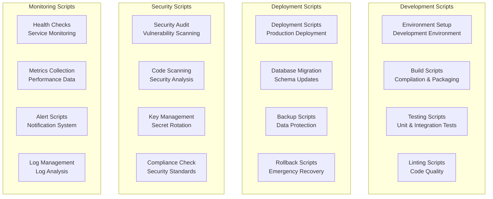

# QuantDesk Scripts

## 🚀 **Comprehensive Utility Scripts**

This directory contains comprehensive utility scripts for QuantDesk development, deployment, and maintenance, showcasing our professional-grade automation and tooling.

## 📊 **Scripts Overview**



## 🛠️ **Development Scripts**

### **Environment Setup**
**File:** `dev/setup-environment.sh`
**Description:** Complete development environment setup

**Features:**
- Node.js and pnpm installation
- Rust and Solana CLI setup
- Environment variable configuration
- Database initialization
- Service dependencies

**Usage:**
```bash
# Run environment setup
./scripts/dev/setup-environment.sh

# Setup specific service
./scripts/dev/setup-environment.sh --service=backend
```

### **Build Scripts**
**File:** `dev/build-all.sh`
**Description:** Comprehensive build system for all services

**Features:**
- Multi-service compilation
- TypeScript compilation
- Rust program building
- Asset optimization
- Dependency management

**Usage:**
```bash
# Build all services
./scripts/dev/build-all.sh

# Build specific service
./scripts/dev/build-all.sh --service=frontend
```

### **Testing Scripts**
**File:** `dev/run-tests.sh`
**Description:** Comprehensive testing suite

**Features:**
- Unit test execution
- Integration test running
- Smart contract testing
- Performance testing
- Coverage reporting

**Usage:**
```bash
# Run all tests
./scripts/dev/run-tests.sh

# Run specific test suite
./scripts/dev/run-tests.sh --suite=backend
```

### **Linting Scripts**
**File:** `dev/lint-code.sh`
**Description:** Code quality and style checking

**Features:**
- ESLint execution
- Prettier formatting
- TypeScript type checking
- Rust clippy checks
- Code quality metrics

**Usage:**
```bash
# Lint all code
./scripts/dev/lint-code.sh

# Lint and fix
./scripts/dev/lint-code.sh --fix
```

## 🚀 **Deployment Scripts**

### **Production Deployment**
**File:** `deploy/deploy-production.sh`
**Description:** Complete production deployment pipeline

**Features:**
- Environment validation
- Service deployment
- Database migration
- Health checks
- Rollback capability

**Usage:**
```bash
# Deploy to production
./scripts/deploy/deploy-production.sh

# Deploy specific service
./scripts/deploy/deploy-production.sh --service=backend
```

### **Database Migration**
**File:** `deploy/migrate-database.sh`
**Description:** Database schema migration system

**Features:**
- Schema version management
- Migration execution
- Rollback support
- Data validation
- Backup creation

**Usage:**
```bash
# Run migrations
./scripts/deploy/migrate-database.sh

# Rollback migration
./scripts/deploy/migrate-database.sh --rollback
```

### **Backup Scripts**
**File:** `deploy/backup-data.sh`
**Description:** Comprehensive data backup system

**Features:**
- Database backup
- File system backup
- Incremental backups
- Compression and encryption
- Cloud storage integration

**Usage:**
```bash
# Create backup
./scripts/deploy/backup-data.sh

# Restore from backup
./scripts/deploy/backup-data.sh --restore
```

### **Rollback Scripts**
**File:** `deploy/rollback-deployment.sh`
**Description:** Emergency rollback system

**Features:**
- Service rollback
- Database rollback
- Configuration rollback
- Health validation
- Notification system

**Usage:**
```bash
# Rollback deployment
./scripts/deploy/rollback-deployment.sh

# Rollback to specific version
./scripts/deploy/rollback-deployment.sh --version=v1.0.0
```

## 🔒 **Security Scripts**

### **Security Audit**
**File:** `security/audit-security.sh`
**Description:** Comprehensive security audit system

**Features:**
- Vulnerability scanning
- Dependency audit
- Code security analysis
- Configuration review
- Compliance checking

**Usage:**
```bash
# Run security audit
./scripts/security/audit-security.sh

# Audit specific component
./scripts/security/audit-security.sh --component=backend
```

### **Code Scanning**
**File:** `security/scan-code.sh`
**Description:** Static code analysis for security issues

**Features:**
- SAST analysis
- Secret detection
- Dependency scanning
- Configuration analysis
- Report generation

**Usage:**
```bash
# Scan all code
./scripts/security/scan-code.sh

# Scan with specific rules
./scripts/security/scan-code.sh --rules=high
```

### **Key Management**
**File:** `security/rotate-keys.sh`
**Description:** Automated key rotation system

**Features:**
- API key rotation
- Database key rotation
- Certificate renewal
- Secret rotation
- Audit logging

**Usage:**
```bash
# Rotate all keys
./scripts/security/rotate-keys.sh

# Rotate specific key type
./scripts/security/rotate-keys.sh --type=api
```

### **Compliance Check**
**File:** `security/compliance-check.sh`
**Description:** Security compliance validation

**Features:**
- Security standard compliance
- Policy validation
- Configuration compliance
- Audit trail validation
- Report generation

**Usage:**
```bash
# Run compliance check
./scripts/security/compliance-check.sh

# Check specific standard
./scripts/security/compliance-check.sh --standard=ISO27001
```

## 📊 **Monitoring Scripts**

### **Health Checks**
**File:** `monitoring/health-check.sh`
**Description:** Comprehensive service health monitoring

**Features:**
- Service availability checks
- Database connectivity
- External service checks
- Performance monitoring
- Alert generation

**Usage:**
```bash
# Run health check
./scripts/monitoring/health-check.sh

# Check specific service
./scripts/monitoring/health-check.sh --service=backend
```

### **Metrics Collection**
**File:** `monitoring/collect-metrics.sh`
**Description:** Performance metrics collection

**Features:**
- System metrics
- Application metrics
- Database metrics
- Network metrics
- Custom metrics

**Usage:**
```bash
# Collect all metrics
./scripts/monitoring/collect-metrics.sh

# Collect specific metrics
./scripts/monitoring/collect-metrics.sh --type=performance
```

### **Alert Scripts**
**File:** `monitoring/send-alerts.sh`
**Description:** Alert notification system

**Features:**
- Email notifications
- Slack integration
- SMS alerts
- PagerDuty integration
- Custom webhooks

**Usage:**
```bash
# Send alert
./scripts/monitoring/send-alerts.sh --level=critical --message="Service down"

# Test alert system
./scripts/monitoring/send-alerts.sh --test
```

### **Log Management**
**File:** `monitoring/manage-logs.sh`
**Description:** Log analysis and management

**Features:**
- Log aggregation
- Log analysis
- Log rotation
- Log compression
- Log archiving

**Usage:**
```bash
# Manage logs
./scripts/monitoring/manage-logs.sh

# Analyze specific logs
./scripts/monitoring/manage-logs.sh --analyze --type=error
```

## 🔧 **Utility Scripts**

### **Database Management**
**File:** `utils/database-manager.sh`
**Description:** Database administration utilities

**Features:**
- Database creation
- User management
- Permission management
- Performance tuning
- Maintenance tasks

**Usage:**
```bash
# Manage database
./scripts/utils/database-manager.sh

# Create new database
./scripts/utils/database-manager.sh --create --name=testdb
```

### **Configuration Management**
**File:** `utils/config-manager.sh`
**Description:** Configuration file management

**Features:**
- Configuration validation
- Environment-specific configs
- Configuration backup
- Configuration deployment
- Configuration comparison

**Usage:**
```bash
# Manage configuration
./scripts/utils/config-manager.sh

# Validate configuration
./scripts/utils/config-manager.sh --validate
```

### **Service Management**
**File:** `utils/service-manager.sh`
**Description:** Service lifecycle management

**Features:**
- Service start/stop
- Service restart
- Service status
- Service configuration
- Service monitoring

**Usage:**
```bash
# Manage services
./scripts/utils/service-manager.sh

# Start all services
./scripts/utils/service-manager.sh --start-all
```

### **Cleanup Scripts**
**File:** `utils/cleanup.sh`
**Description:** System cleanup utilities

**Features:**
- Temporary file cleanup
- Log file cleanup
- Cache cleanup
- Database cleanup
- Disk space management

**Usage:**
```bash
# Run cleanup
./scripts/utils/cleanup.sh

# Clean specific type
./scripts/utils/cleanup.sh --type=logs
```

## 📚 **Script Categories**

### **Development Scripts**
- Environment setup and configuration
- Build and compilation
- Testing and quality assurance
- Code formatting and linting

### **Deployment Scripts**
- Production deployment automation
- Database migration management
- Backup and recovery systems
- Rollback and emergency procedures

### **Security Scripts**
- Security audit and scanning
- Vulnerability assessment
- Key and secret management
- Compliance validation

### **Monitoring Scripts**
- Health check automation
- Metrics collection and analysis
- Alert and notification systems
- Log management and analysis

### **Utility Scripts**
- Database administration
- Configuration management
- Service lifecycle management
- System cleanup and maintenance

## 🚀 **Getting Started**

### **Prerequisites**
- Bash shell environment
- Node.js and pnpm
- Docker (for containerized services)
- Access to production environment

### **Installation**
```bash
# Clone the repository
git clone https://github.com/dextrorsal/quantdesk-v0.1.git
cd quantdesk-v0.1/scripts

# Make scripts executable
chmod +x *.sh

# Install dependencies
npm install
```

### **Configuration**
```bash
# Copy configuration template
cp config.template.sh config.sh

# Edit configuration
nano config.sh
```

### **Running Scripts**
```bash
# Run development setup
./dev/setup-environment.sh

# Run security audit
./security/audit-security.sh

# Run health check
./monitoring/health-check.sh
```

## 🔒 **Security Considerations**

### **Script Security**
- Validate all inputs
- Use secure file permissions
- Implement proper error handling
- Log all operations
- Use environment variables for secrets

### **Access Control**
- Implement proper authentication
- Use role-based access control
- Monitor script execution
- Audit all operations
- Implement least privilege principle

### **Data Protection**
- Encrypt sensitive data
- Use secure communication
- Implement data retention policies
- Regular backup procedures
- Secure data disposal

## 📖 **Documentation**

### **Script Documentation**
- Comprehensive inline comments
- Usage examples and parameters
- Error handling documentation
- Security considerations
- Maintenance procedures

### **Configuration Documentation**
- Configuration file formats
- Environment variable requirements
- Dependency documentation
- Setup procedures
- Troubleshooting guides

## 🤝 **Contributing**

### **Adding New Scripts**
1. Create script file in appropriate directory
2. Add comprehensive documentation
3. Include usage examples
4. Add to this README
5. Submit pull request

### **Script Guidelines**
- Use Bash best practices
- Include error handling
- Add comprehensive comments
- Follow naming conventions
- Include configuration examples

## 📞 **Support**

### **Resources**
- **Documentation:** Complete script documentation
- **Examples:** Usage examples and patterns
- **Community:** Discord community support
- **Issues:** GitHub issue tracking

### **Contact**
- **GitHub:** [QuantDesk Scripts Repository](https://github.com/dextrorsal/quantdesk-v0.1)
- **Discord:** Community support channel
- **Email:** Technical support contact

---

**QuantDesk Scripts: Comprehensive utility scripts for development, deployment, security, and monitoring, showcasing our professional-grade automation and tooling capabilities.**